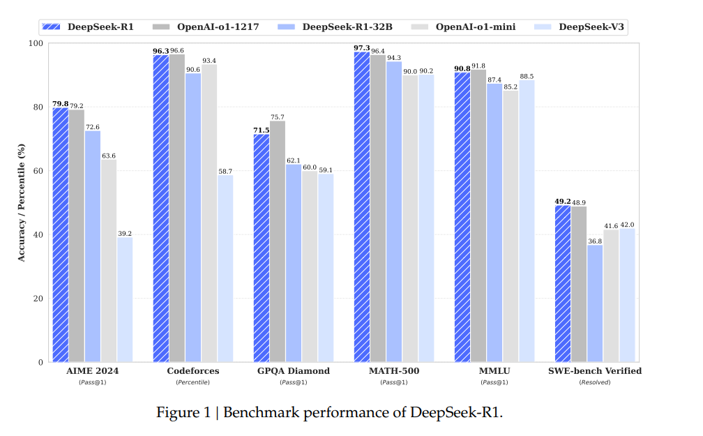
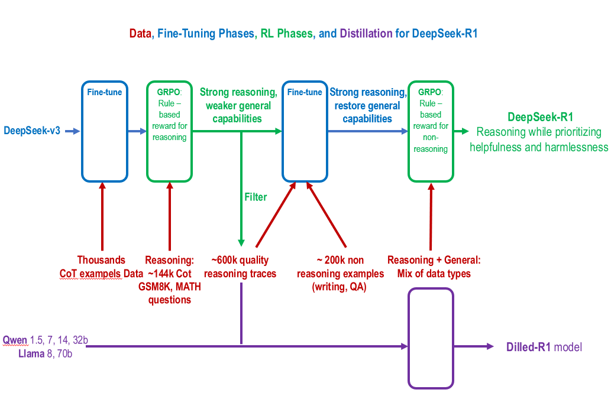

# DeepSeek-R1: Incentivizing Reasoning Capability in LLMs via Reinforcement Learning

## Intro 

MoE 아키텍처 기반의 Deepseek-R1-zero 모델은 Supervised Fine-Tuning 없이 Reinforcement Learning만으로 Deepseek-R1-zero 모델을 만들었고 이를 발전시켜 Deepseek-R1 모델을 만들었습니다. 해당 모델은 OpenAI-o1-1217의 Benchmark Performance와 유사하거나 더 높은 성능을 달성했습니다. 이에 대한 성능 향상의 원인을 분석하기 위해 논문을 검토하고 MoE 아키텍처를 분석하고 핵심 강확 학습 방법인 GRPO도 분석하려합니다.

## Deepseek-R1 Benchmark 

Figure1을 보면 Deepseek-R1은 OpenAI-o1-1217의 Benchmark Performance와 유사하거나 더 높은 성능을 달성했습니다. 해당 Figure은 유명하기에 설명을 생략하겠습니다. 

### 각 Benchmark 설명**  
- **AIME 2024 (Pass@1)**:  
  AIME(American Invitational Mathematics Examination)는 고급 수학 문제를 평가하는 시험입니다. 모델이 수학적 문제를 정확히 해결하는 능력을 평가하는 데 사용됩니다. Pass@1은 모델이 첫 시도에서 정답을 맞히는 비율을 나타냅니다.

- **Codeforces (Percentile)**:  
  Codeforces는 알고리즘 문제 해결 및 프로그래밍 대회를 위한 플랫폼입니다. Percentile은 모델의 성능이 참가자들 사이에서 몇 퍼센타 수준에 해당하는지를 나타냅니다.

- **GPQA Diamond (Pass@1)**:  
  GPQA(General Purpose Question Answering) Diamond는 고급 질의응답 태스크를 테스트하는 벤치마크입니다. Diamond는 난이도가 높은 질문들을 포함하며, Pass@1은 첫 번째 시도로 정확히 답을 맞힌 비율입니다.

- **MATH-500 (Pass@1)**:  
  MATH-500은 수학 문제 해결 능력을 테스트하는 데이터셋으로, 특히 고난도의 500개 문제를 포함합니다. Pass@1은 모델이 한 번에 정확히 답을 내는 성능을 측정합니다.

- **MMLU (Pass@1)**:  
  MMLU(Massive Multitask Language Understanding)는 여러 주제에 걸쳐 모델의 언어 이해 능력을 평가하는 벤치마크입니다. Pass@1은 첫 시도에서 정확히 답을 맞힌 비율입니다.

- **SWE-bench Verified (Resolved)**:  
  SWE-bench는 소프트웨어 엔지니어링 문제를 포함하는 벤치마크입니다. Resolved는 모델이 문제를 해결한 비율을 나타냅니다.

## Workflow (train-pipeLine)

**DeepSeek-R1 모델의 데이터 처리, 파인튜닝, RL(강화 학습) 단계, 그리고 디스틸레이션 과정**을 설명하는 훈련 파이프라인입니다. 해당 논문의 핵심 부분인 2.Approach를 요약하고 시각화 한 Workflow입니다.

### **1. 초기 모델 준비 (DeepSeek-v3)**
- **DeepSeek-v3** 모델은 초기 상태로 시작됩니다. (DeepSeek-v3는 Instruct 모델임)
- 이 모델은 **수천 개의 Chain of Thought(CoT) 예제**를 사용하여 파인튜닝됩니다.
  - CoT는 복잡한 문제 해결 과정을 단계별로 설명하는 데이터입니다.

---

### **2. 강화 학습(RL)을 위한 준비**
- 파인튜닝된 모델은 강화 학습(RL)을 시작하기에 적합한 상태로 만들어집니다.
- 여기서 두 가지 주요 데이터가 사용됩니다:  
  **약 14만 개의 CoT 추론 데이터 학습** (GSM8K, 수학 문제 등)

---

### **3. 강화 학습(RL) 단계**
- GRPO(규칙 기반 및 보상 모델)를 사용하여 강화 학습을 진행합니다.
  - 이 과정에서는 추론 능력을 강화하지만, 일반적인 언어 처리 능력은 약화될 수 있습니다.
  - **약 60만 개의 고품질 추론 데이터**를 생성합니다.
---

### **4. 일반적 언어 능력 복원**
- 약화된 일반적인 언어 처리 능력을 복구하기 위해 추가적인 파인튜닝을 수행합니다.
  - 약 **20만 개의 비추론 데이터(글쓰기, QA 등)** 를 활용합니다.
  - 다양한 데이터 유형을 혼합하여 추론과 일반적 능력을 동시에 개선합니다.

---

### **5. 최종 모델 생성 (DeepSeek-R1)**
- 최종적으로 DeepSeek-R1 모델이 생성됩니다.
  - 이 모델은 **추론 능력**, **도움이 되는 응답 생성**, 그리고 **무해성(harmlessness)**을 우선시하도록 설계되었습니다.

---

### **6. 디스틸레이션 (Dilled-R1 모델)**
- 마지막으로 DeepSeek-R1 모델을 디스틸레이션(distillation)하여 경량화된 Dilled-R1 모델을 만듭니다.
  - 이는 더 작은 크기의 모델에서도 유사한 성능을 유지하도록 하는 과정입니다.

