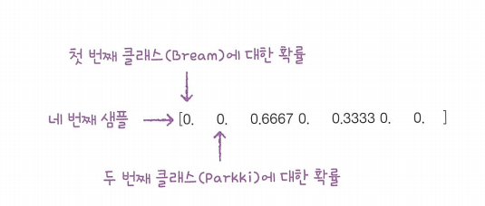
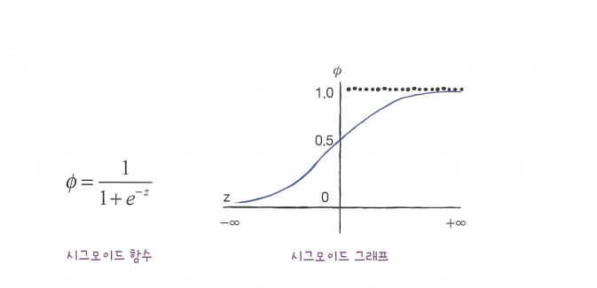
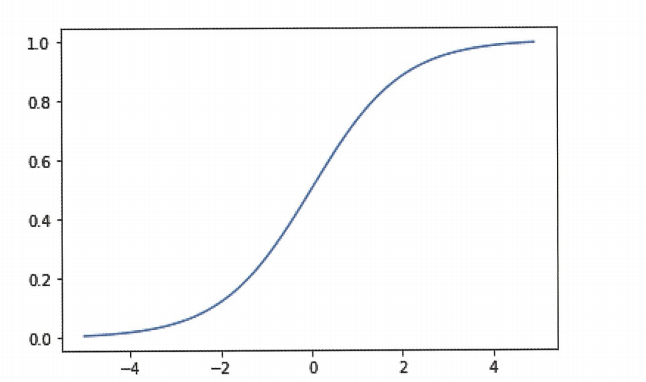
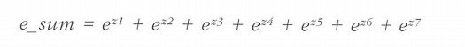
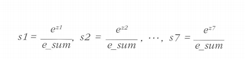
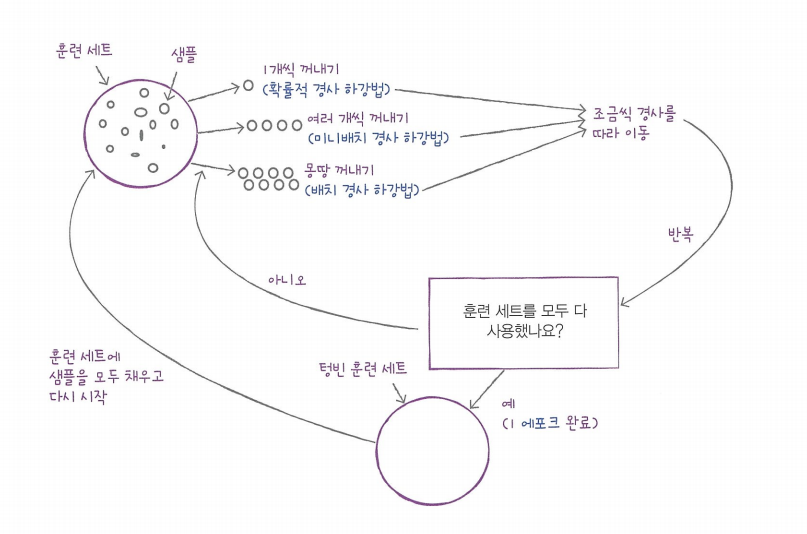
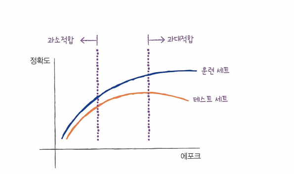
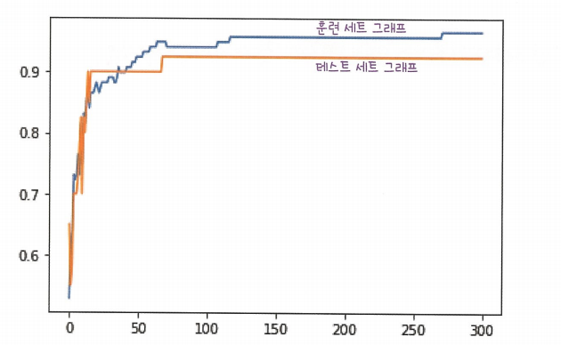

# Chapter4. 다양한 분류 알고리즘  


타깃 데이터에 2개 이상의 클래스가 포함된 문제를 **다중분류(multi-class classification)** 이라함
### 럭키백의 확률 
데이터 준비
```
import pandas as pd
fish = pd.read_csv("https://bit.ly/fish_csv")
fish.head()
```

데이터 전처리
```
print(pd.unique(fish['Species])) #Species열에서 고유한 값 추출
fish_input = fish[['Weight','Length','Diagonal','Height','Width']].to_numpy() #필요한 열 추출 
print(fish_input[:5])
fish_target=fish['Species'].to_numpy()
```

데이터 셋 표준화
```
from sklearn.model_selection impoty train_test_split
train_input,test_input,train_target,test_target =train_test_split(fish_input,fish_target,random_state=42) #데이터 분할과 섞기
from skleanr.preprocessing import StandardScaler
ss=StandarScaler()
ss.fit(train_input)
train_scaled = ss.transform(train_input)
test_scaled = ss.transform(test_input)
```

k-최근접 이웃 분류기의 확률 예측

```
from sklearn.neighbors import KNeighborsClassifier
kn=KNeighborsClassifier(n_neighbors=3)
kn.fit(train_scaled,train_target)
print(kn.score(train_scaled,train_target))
print(kn.score(test_scaled,test_target))
```

```
print(kn.classes_) #Kneighbors활용한 클래스 확인 
```

```
>['Bream' 'Parkki' 'Perch' 'Pike' 'Roach' 'Smelt' 'Whitefish']
```

```
print(kn.predict(test_scaled[:5])) #predict하면 타깃값 예측을 출력함
```

```
> ['Perch' 'Smelt' 'Pike' 'Perch' 'Perch']
```

확률로 변환 
```
import numpy as np
proba = kn.predict_proba(test_scaled[:5])
print(np.round(proba,decimals=4)) #decimals는 소수점 정함 
```


keighbors()메서드의 입력은 2차원 배열이어야 한다. 이를 위해 넘파이 배열의 슬라이싱 연산자를 사용. 슬라이싱 연산자는 하나의 샘플만 선택해도 항상 2차원 배열이 만들어진다. 

```
distances,indexes = kn.kneighbors(test_scaled[3:4])
print(train_target[indexes0])
```

```
> [['Roach' 'Perch'  'Perch']]
```
## 로지스틱 회귀 
**로지스틱 회귀**는 회귀이지만 **분류**모델이다. 선형 회귀와 동일하게 선형 방정식을 학습한다.
시그모이드(sigmoid functon)을 사용하여 0~1로 변환 


시그모이드 함수 그리기
```
import numpy as np
import matplotlib.pyplot as ply
z=np.arange(-5,5,0.1)
phi = 1/1+np.exp(-z)
plt.plot(z,phi)
plt.show
```



### 로지스틱 회귀로 이진 분류 수행하기

넘파이 배열은 booean indexing을 통해서 True or False 값을 전달 할 수 있다. 

- 예시

```
bream_smelt_indexes = (train_target=='Bream')|(train_target == 'Smelt')
train_bream_smelt = train_scaled[bream_smelt_indexes]
target_bream_smelt = train_target[bream_smelt_indexes]
```

훈련시키기

```
from sklearn.linear_model import LogisticRegrssion
lr=LogisticRegrssion()
lr.fit(train_bream_smelt,target_bream_smelt)
```

```
print(lr.predict(train_bream_smelt[:5])
```

```
>['Bream' 'Smelt' 'Bream' 'Bream' 'Bream']
```

```
print(lr.predict_proba(train_bream_smelt[:5]))#예측 확률은 predict_proba 사용)
```

```
>[[0.99759855 0.0024014
   0.02735183 0.97264817 
   0.99486072 0.00513928
   0.98584202 0.01415798
   0.99767269 0.00232731 ]] #첫번째는 열은 음성클래스(0에 대한 확률이고 ) 두번째 열은 양성 클래스(1)에 대한 확률이다.
```
그러면 어떤 것이 Bream이고 어떤 것이 Smelt 일까? 
알파벳 순이기 때문에 , 알파벳 순으로 생각하면 됨 

```
print(lr.classes_)
```

```
> ['Bream' 'Smelt']
```

로지스틱 회귀의 계수,절편 확인

```
print(lr.coef_,lr.intercept_)
```

```
[[-0.4037798 -0.57620209 -0.66280298 -1.01290277 -0.73168947 ]] [-2.16155132]
```
로지스틱 회귀분석 모델로 z값 계산 하는 방법 (decision_funtion())사용

```
decisions=lr.decision_funtion(train_bream_smelt[:5])
print(decisions)
```

```
[-6.02927744 3.5713907 -5.26568906 -4.24321775 -6.0607117]
```
이 값을 시그모이드 함수에 통과 시키면 확률을 얻을 수 있다. 파이썬에서는 사이파이(scipy)를 사용 

```
from scipy.special import expit
print(expit(decisions))
```

```
> [0.00240145 0.97264817 0.00513928 0.01415798 0.00232731]
```

### 로지스틱 회귀로 다중 분류 수행하기 

max_iter = 반복 횟수 지정 
로지스틱 회귀분석은 기본적으로 릿지 회귀와 같이 계수의 제곱을 규제한다. 이런 규제를 **L2규제**라고 한다.
릿지 회귀에서 alpha를 매개변수로 규제의 양을 조절 했다면 , 로지스틱 회귀 분석에서는 C라는 매개변수를 사용하여 조절한다. 차이점은 릿지는 alpha가 커지면 규제가 커졌다며, C는 반대로 커지면 규제가 작아지는 음의 관계를 갖는다. 

기본 C의 Default값은 1이다.  

다중분류는 이진분류와 달리 **소프트맥스(softmax)함수**를 사용하여 7개의 z값을 확률로 변환한다. 
시그모이드 함수는 하나의 선형 방정식의 출력값을 0~1 사이로 압축한다. 이와 달리 소프트맥스 함수는 여러개의 선형 방정식의 출력값을 0~1사이로 압축하고 전체 합이 1이 되도록 만든다. 이를 위해 지수 함수를 상요하기 떄문에 **정규화된 지수함수**라고도 부른다 
먼저 7개의 z값의 이름을 
z1에서 z7까지 붙인후, z1~z7까지 값을 사용해 지수 함수를 계산해 모두 더한 것을 e_sum이라고 부름 



```
#훈련시키기
lr=LogisticRegression (C=20 , max_iter =1000)
lr.fit(train_scaled , train_target)
print(lr.score(train_scaled, train_target))
print(lr.score(test_scaled,test_target))
```

```
> 0.9327731092436975
  0.925
```

```
print(lr.predict(test_scaled[:5]))
```

```
> ['Perch' 'Smelt' 'Pike' 'Roach' 'Perch']
```

z1~z7값을 구한 후 소프트 맥스 함수를 이용해 확률로 바꾸기 
```
decision = lr.decision_function(test_scaled[:5])
print(np.round(decision, decimals = 2))
from scipy.speical import softmax
proba = softmax(decision,axis=1)
print(np.round(proba,decimals=3))
```

axis=1로 지정하여 각 행, 즉 각 샘플에 대해 소프트 맥스를 계싼한다. 만약 axis를 지정하지 않으면 배열 전체에 대해 소프트맥스를 계산한다. 

## 확률적 경사 하강법
이전에 훈련한 모델을 버리지 않고 새로운 데이터에 대해서 조금씩 더 훈련할 때 사용하면 좋음  
이를 **점진적 학습** 또는 온라인 학습이라고 부른다.
대표적인 점진적 학습 알고리즘은 **확률적 경사 하강법**이다.

### 확률적 경사 하강법
확률적 경사 하강법에서 확률적이란 말은 **무작위하게** 혹은 **랜덤하게**의 기술적 표현이다.   
훈련 세트에서 랜덤하게 하나의 샘플을 고르는 것이 바로 **확률적 경사 하강법**이다. 자세히 말하자면, 훈련 데이터 셋에서 랜덤하게 하나의 샘플을 선택하여 가파른 경사를 조금 내려간다. 그다음 훈련 세트에서 랜덤하게 또 다른 샘플을 하나 선택하여 경사를 조금 내려간다. 이런식으로 반복하여 전체 샘플을 모두 사용할 때까지 계속한다. 만약에 산을 다 내려오지 못하면, 처음부터 시작한다. 훈련 세트에 모든 샘플을 다시 채워 넣는다. 그 후 다시 랜덤하게 샘플을 선택해 경사를 내려간다. 
**에포크(epoch)**는 확률적 경사 하강법에서 훈련 세트를 한번 모두 사용하는 과정을 말한다. 일반적으로 경사 하강법은 수십, 수백 번 이상 에포크를 수행한다.   
샘플을 1개씩 말고 무작위로 몇개의 샘플을 선택하여 경사를 따라 내려가는 방법을 미니배치 경사 하강법(minibatch gradient descent)이라 한다.  
**배치 경사 하강법**은 극단적으로 한 번 경사로를 따라 이동하기 위해 전체 샘플을 사용하는 것을 말한다. 전체 데이터를 사용하기 때문에 가장 안정적인 방법이다.  
하지만, 전체 데이터를 사용하면 그만큼 컴퓨터 자원을 많이 사용한다. 어떤 경우에는 데이터가 많으면 한 번에 전체 데이터를 모두 읽을 수 없을지도 모른다. 

- 정리 


### 손실함수

**손실함수(loss function)**은 어떤 문제에서 머신러닝 알고리즘이 얼마나 엉터리인지를 측정하는 기준이다. 손실함수의 값은 작을 수록 좋다. 그러나 어떤 값이 최솟값인지는 알지 못한다.  
가능한 많이 찾아보고 만족할만한 수준이라면 산을 다 내려왔다고 인정해야한다.  
손실함수와 비용함수는 다르다.  
**손실 함수**는 샘플 하나에 대한 손실을 정의하고  
**비용 함수**는 훈련 세트에 있는 모든 샘플에 대한 손실 함수의 합이다.  
보통 엄격하게 구분하지 않고 섞어서 사용한다. 
**손실함수**는 미분가능한 함수이어야 함 . 

### 로지스틱 손실함수
로지스틱 손실함수에서 주의할 점은 음수의 값이 높을 수록 낮은 손실이 된다.  
또한, 양성 클래스 예측이면, 음성 클래스를 $(1-음성예측 확률)$을 사용하여 1*양성예측으로 바꿔야한다.  
여기서 예측 확률에 로그 함수를 적용하면 좋다. 예측 확률의 범위는 0~1사이인데 로그 함수는 이 사이에서 음수가 되므로 최종 손실 값은 양수가 된다. 

이러한 **로지스틱 손실함수**를 **이진 크로스엔트로피 손실 함수**라고 부른다  
이진 분류는 **로지스틱 손실 함수**를 사용하고 다중 분류는 **크로스엔트로피 손실 함수**를 사용한다.
회귀에서는 손실함수로 MSE(평균 제곱 오차)를 사용한다. 이 값이 작아질수록 좋은 모델이다. 

### SGDClassifier
- 데이터준비
```
import pandas as pd 
fish = pd.read_csv('https://bit.ly/fish_csv)
```

- 데이터 전처리 

```
fish_input = fish[['Weight','Length','Diagonal','Height','Width']].to_numpy()
fish_target=fish['Species'].to_numpy() #Species 제외한 5개 열만 
입력 데이터로 사용 

from sklearn.model_selection import train_test_split
train_input,test_input,train_rarget,test_target = train_test_split(fish_input, fish_target , random_state=42) #훈련셋과 테스트 셋 나누기

from sklearn.preprocessing import StandardScaler
ss=StandardScaler()
ss.fit(train_input)
train_scaled = ss.transform(train_input)
test_scaled=ss.transform(test_input)
```

- 

```
from skleanr.linear_model import SGDClassifier
sc=SGDClassifier(loss='log',max_iter=10,random_state=42)
sc.fit(train_scaled,train_target)
print(sc.score(train_scaled,train_target))
print(sc.score(test_scaled,test_target))
```

```
> 0.773109243697479
  0.775
```
**ConvergenceWarning** 경고가 뜨면 모델이 충분히 수렴하지 않았다는 뜻이다. 이런 경고를 보았다면 max_iter 매개변수의 값을 늘려 주는 것이 좋다.  

확률적 경사 하강법은 점진적 학습이 가능하다. SGDClassifier 객체를 다시 만들지 않고 훈련한 모델 sc를 추가해 훈련이 가능하다. 모델을 이어서 훈련 할때는 `partial_fit()`메서드를 사용한다. 이 메서드는 fit() 메서드와 사용법이 같지만 호출할 때마다 1 에포크씩 이어서 훈련할 수 있다. partial_fit()메서드를 호출하고 다시 훈련 세트와 테스트 세트의 점수를 확인하는 코드 진행

```
sc.partial_fit(train_scaled,train_target)
print(sc.score(train_scaled,train_target))
print(sc.score(test_scaled, test_target))
```

```
> 0.8151260504201681
  0.825
```
결과를 보면, 아직 점수가 낮지만 에포크를 한번 더 실행하니 정확도가 향상되었다. 이 모델을 여러 에포크에서 더 훈련 해볼 필요가 있다.  
**이건 배치 경사 하강법 아닌가요?**
아님. SGDClassifier 객체에 한번에 훈련 세트 전체를 전달했지만 이 알고리즘은 전달한 훈련 세트에서 1개씩 샘플을 꺼내어 경사 하강법 단계를 수행한다. SGDClassifier은 미니배치 경사 하강법이나 배치 하강법을 제공하지 않는다. 

## 에포크와 과대/과소적합
**그러면 모델의 에폭을 얼마로 설정하여 훈련시켜야 할까요?**
확률적 경사 하강법은 에포크 횟수에 따라 과적합이 발생할 수 있다. 


- 이러한 그래프 그리는 코드 

```
import numpy as np
sc= SGDClassifier(loss='log' , random_state=42)
train_score = []
test_score = []
classes = np.unique(train_target)
```

-300번 에폭으로 훈련 반복

```
for _ in range(0,300)
sc.partial_fit(train_scaled,train_target,classes=classes)
train_score.append(sc.score(train_scaled,train_target))
test_score.append(sc.score(test_scaled,test_target))
```

```
import matplotlib.pyplot as plt 
plt.plot(train_score)
plt.plot(test_score)
plt.show()
```

plot을 보았을 때, 에폭이 100일 때가 좋아보임.

```
sc=SGDClassifier(loss='log',max_iter=100,tol=None,random_state=42) #tol=None으로 지정하면 자동으로 멈추지 않고 max_iter=100만큼 무조건 반복한다. 
sc.fit(train_scaled,train_target)
print(sc.score(train_scaled,train_target))
print(sc.score(test_sclaed,test_target))
```

```
> 0.957983193277311
  0.925
```

SGDRegressor도 확률적 경사 하강법을 사용한 회귀 알고리즘이다. 사용방법은 SGDClassifier과 같다. 

SGDClassifier의 loss 매개변수에 대해 알아보자  
loss 매개변수의 기본 값은 hinge이다.  
**힌지 손실**은 **서포트 벡터머신**이라 불리는 또 다른 머신러닝 알고리즘을 위한 손실함수이다. 
