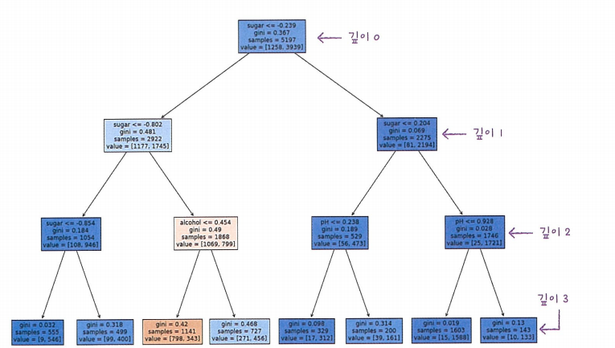
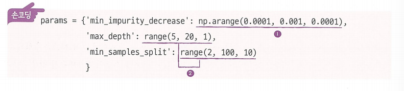

## Chapter5. 트리 알고리즘
### 4.1 결정 트리
**결정 트리**는 예/아니오에 대한 질문을 이어나가면서 정답을 찾아 학습하는 알고리즘임.  
비교적 예측 과정을 이해하기 쉽고 서능이 뛰어남. 
```
# 데이터 준비
import pandas as pd

wine = pd.read_csv('https://bit.ly/wine_csv_data')
data = wine[['alcohol', 'sugar', 'pH']].to_numpy() 
target = wine['class'].to_numpy()]

# 데이터 나누기
from sklearn.model_selection import train_test_split

train_input, test_input, train_target, test_target = train_test_split(
    data, target, test_size=0.2, random_state=42)

# 데이터 스케일링
from sklearn.preprocessing import StandardScaler

ss = StandardScaler()
ss.fit(train_input)

train_scaled = ss.transform(train_input)
test_scaled = ss.transform(test_input)

# 결정 트리 모델링
from sklearn.tree import DecisionTreeClassifier

dt = DecisionTreeClassifier(random_state=42)
dt.fit(train_scaled, train_target)

print(dt.score(train_scaled, train_target)) # 0.9969
print(dt.score(test_scaled, test_target)) # 0.8592
```
-분류 문제에 결정 트리 모델을 적용하기 위해 DecisionTreeClassifier 클래스를 사용함.
-fit() 메서드 호출 후 score() 메서드로 정확도 평가함
                  

#### 결정 트리 모델 시각화 및 해석
```
# 결정 트리 모델 시각화
import matplotlib.pyplot as plt
from sklearn.tree import plot_tree

plt.figure(figsize=(10,7))
plot_tree(dt, max_depth=1, filled=True, feature_names=['alcohol', 'sugar', 'pH']) #트리 그림 출력 
plt.show()
```
                          
노드(node): 결정 트리를 구성하는 핵심요소로 훈련 데이터의 특성에 대한 테스트를 표현함
>루트 노드(root node): 맨위 노드  
>리프 노드(leaf node): 맨아래 노드  
>부모 노드(parent node):상단 노드  
>자식 노드(child node): 하단 노드  
>가지(branch): 테스트 결과  

      

-**테스트 조건** : 샘플을 나누는 질문
불순도: 결정 트리가 최적의 질문을 찾기 위한 기준으로 결정 트리 모델은 부모 노드와 자식 노드의 불순도 차이(정보 이득)가 가능한 크도록 트리를 성장시킨다. 노드를 순수하게 나눌수록 정보 이득은 커진다.  
**정보 이득(information gain)**: 부모와 자식 노드 사이의 불순도 차이

**종류**: 지니 불순도, 엔트로피 불순도  

**지니 불순도(gini impurity) 계산**                                   
$지니 불순도 = 1-(음성클래스비율^2+양성 클래스 비율^2)$   

**정보 이득(부모와 자식 노드 사이의 불순도 차이) 계산**  
$정보 이익 = 부모의 불순도 - (왼쪽 노드 샘플 수/부모의 샘플 수) * 왼쪽 노드 불순도 - (오른쪽 노드 샘플수/부모의 샘플수)* 오른쪽 노드 불순도$

**엔트로피 불순도(entropy impurity) 계산**
$엔트로피 불순도 = -음성 클래스 비율 * log_2(음성클래스 비율) - 양성 클래스 비율 *log_2(양성 클래스 비율)$          
                           
       

#### 가지치기
- 결정 트리를 깊이 제한 없이 성장하면 과대적합되기 쉽다.  
- 결정 트리 모델은 트리의 최대 깊이(가지치기)를 미리 지정하여  통해 과적합을 방지할 수 있다.
-max_depth 매개변수를 이용해서 가지 수 통제.

```
dt = DecisionTreeClassifier(max_depth=3, random_state=42)
dt.fit(train_input, train_target)

print(dt.score(train_input, train_target)) # 0.8448
print(dt.score(test_input, test_target)) # 0.8415
```        

```
plot.figure(figsize=(20,15))
plot_tree(dt,filled=True , feature_names = ['alcohol','sugar','pH'])
```


- 마지막 깊이에 있는 노드가 최종노드인 **리프 노드**임 

- 결정 트리 모델은 표준화 전처리 과정이 필요가 없다.
왜냐하면, 불순도는 클래스별 비율을 가지고 계산하기 때문이다. 
                     
**결정 트리 모델의 특성 중요도**
```
print(dt.feature_importances_) #특성 중요도 출력 

> [0.12345626 0.86862934 0.0079114]
```

**결정 트리는 해당 모델에서의 각 특성의 중요도를 계산해줌 ** 
특성 중요도: 결정 트리에 사용된 특성이 불순도를 감소하는데 기여한 정도를 나타내는 값.  
특성 중요도는 각 노드의 정보 이득과 전체 샘플에 대한 비율을 곱한 후, 특성별로 더하여 계산.  
특성 중요도 활용을 통해 결정 트리 모델의 특성 선택에 활용 가능하다.  

- 결정트리는 어디에 쓰는가?  
결정트리는 많은 앙상블 학습 알고리즘의 기반이 됨. 앙상블 학습은 신경망과 함께 가장 높은 성을 내기 떄문에 인기가 높은 알고리즘이다. 

## 4.2 교차 검증과 그리드 서치

### 검증 세트(validation set)
**검증 세트**:   하이퍼파라미터 튜닝을 위해 모델을 평가할 때, 테스트셋을 사용하지 않기 위해 training set에서 다시 떼어 낸 dataset  
training set으로 모델을 훈련하고 validation set으로 모델을 평가한다.
이후, training dataset+ validation dataset 으로 모델을 다시 훈련한 뒤 test dataset으로 최종 점수를 평가한다  
          

``` 
#기존에 있던 wine데이터 활용 

from sklearn.model_selection import train_test_split

# training set과 test set 나누기
train_input, test_input, train_target, test_target = train_test_split(
    data, target, test_size=0.2, random_state=42)

# training set과 validation set 나누기
sub_input, val_input, sub_target, val_target = train_test_split(
    train_input, train_target, test_size=0.2, random_state=42)
```
1. train_test_split() 함수를 통해 training set과 test set으로 나눈다.
2. 두 번째 train_test_split() 함수를 통해 trainins set을 다시 training set과 validation set으로 나눈다.
3. dataset 비율: training set 64%, validation set 16%, test set 20%             
                   

### 교차 검증(cross validation)
**교차 검증**: 검증 세트를 떼어 내어 평가하는 과정을 여러 번 반복한 뒤, 각 점수의 평균을 내어 최종 검증 점수를 얻는 방법.


- trainin set을 여러 폴드로 나누고 그 중 한 폴드가 검증 세트의 역할을 하고 나머지 폴드는 모델을 훈련시킴.

- 각 폴드에서 계산한 검증 점수의 평균을 최종 검증 점수로 사용하므로 안정적인 검증 점수를 얻고 훈련에 더 많은 데이터를 사용할 수 있다. 이를 **K-폴드 교차 검증**이라 부르며
훈련 세트를 몇 부분으로 나누냐에 따라 드르레 부른다. k-겹 교차 검증이라고 부른다.   
5-폴드 교차 검증, 10-폴드 교차 검증을 많이 사용한다. ~
이렇게 하면, 데이터의 80~90%까지 훈련에 사용할 수 있다.검증 세트가 줄어들지만 각 폴드에서 계싼한 검증 점수를 평균으로 사용하기 떄문에 안정된 점수로 생각 할 수 있다. 

``` 
# 교차 검증
from sklearn.model_selection import cross_validate 

scores = cross_validate(dt, train_input, train_target)
print(scores)
```

```
>>> {'fit_time': array([0.00931716, 0.00749564, 0.00773239, 0.00731683, 0.00710797]), 'score_time': array([0.00109315, 0.00111032, 0.00101209, 0.00106931, 0.00115085]), 'test_score': array([0.86923077, 0.84615385, 0.87680462, 0.84889317, 0.83541867])}

import numpy as np

print(np.mean(scores['test_score'])) #5개 점수의 평균을 출력함 
>>> 0.8553
```

* cross_validate() 함수의 매개변수
  * scoring
    * 'accuracy': 분류 모델에서의 정확도를 의미한다.
    * 'r2': 회귀 모델에서의 결정계수를 의미한다.
  * cv: 교차 검증 폴드 수나 spliter 객체를 지정할 수 있다. (기본값 5)
  * n_jobs: 교차 검증 시 사용할 CPU 코어 수를 지정할 수 있다. (기본값 1)
    * -1로 지정하면 시스템에 있는 모든 코어를 사용한다.
  * retrun_train_score: True 지정 시, 훈련 세트의 점수도 반환한다. (기본값 False)
       

* cross_validate() 함수는 fit_time, score_time, test_score를 반환한다.
  * fit_time: 모델 훈련 시간
  * score_time: 모델 검증 시간
  * test_score: 검증 폴드의 점수(실제 test_score X)
* test_score의 평균(np.mean)을 통해 교차 검증의 최종 점수를 구할 수 있다.
* cross_validate() 함수는 training set을 섞어 폴드를 나누지 않는다. training set을 섞으려면 분할기(spliter) 지정이 필요하다.
  * 분할기는 교차 검증에서 폴드를 어떻게 나눌지 결정한다.
  * 분류 모델은 타깃 클래스를 골고루 나누기 위해 StratifiedKFold()를 사용한다.
  * 회귀 모델은 KFold 분할기를 사용한다.
      
``` 
# 분류기를 사용한 교차 검증(SHUFFLE가능 )
splitter = StratifiedKFold(n_splits=10, shuffle=True, random_state=42) #n_splits는 폴드 수 지정하는 매개변수 
scores = cross_validate(dt, train_input, train_target, cv=splitter)
print(np.mean(scores['test_score']))
```

```
> 0.8574
```
### 하이퍼파라미터 튜닝  

모델의 매개변수를 조정하면서 검증 세트의 점수나 교차 검증을 통해 최적의 파라미터를 찾는 것

- **그리드 서치(Grid Search)**: 하이퍼파라미터 탐색을 자동화해주는 도구로 탐색할 매개변수를 나열하면 교차 검증을 수행하여 가장 좋은 검증 점수의 매개변수 조합을 선택한다. 이후, 해당 조합으로 최종 모델을 훈련한다.  
하이퍼파라미터 탐색과 교차 검증을 한 번에 수행함.  
따라서, cross_validate() 함수를 호출하지 않아도 된다.


``` 
from sklearn.model_selection import GridSearchCV

params = {'min_impurity_decrease':[0.0001,0.0002,0.0003,0.0004,0.0005]}

# 그리드 서치 진행 
gs = GridSearchCV(DecisionTreeClassifier(random_state=42), params, n_jobs=-1) #n_jobs를 -1로 지정하면 시스템에 있는 모든 코어 사용 

# 그리드 서치 학습
gs.fit(train_input, train_target)

# 최적의 모델을 통해 평가
dt = gs.best_estimator_ #최종학습 모델은 여기에 담김 
print(dt.score(train_input, train_target))
# 최적의 모델 파라미터
print(gs.best_params_)
```

```
> {'min_impuriy_decrease':0.0001}
```

```
# 교차 검증 점수 
print(gs.cv_results_['mean_test_score'])
```

```
> [0.86819297 0.86453617 0.86492226 0.86780891 0.86761605]
```

```
# armax()함수를 사용한 가장 큰 값 인덱스 추출 
best_index= np.argmax(gs.cv_results_['mean_test_score'])
print(gs.cv_results['params'][best_index])
```
```
> {'min_impurity_decreas' : 0.0001}
```


**GridSearchCV 매개변수**
- scoring, cv, n_jobs, return_train_score 매개변수는 `cross_validate()` 함수와 동일함

- best_estimator_:속성을 통해 검증 점수가 가장 높은 매개변수 조합의 모델을 얻을 수 있음

- best_params_: 검증 점수가 가장 높은 매개변수 조합을 얻음
- cv_results_: mean_test_score에 교차 검증의 평균 점수가 저장되어 있음 .
         

**그리드 서치 과정**
  1. 탐색할 매개변수 지정
  2. training set에 대해 그리드 서치 수행 후, 최상의 평균 검증 점수가 나오는 매개변수 조합을 찾음. 이 조합은 그리드 서치 객체에 저장됨 
  3. 최상의 매개변수 조합과 전체 training set을 사용해 최종 모델을 훈련함. 이 모델도 그리드 서치 객체에 저장됨.               
                        


- 조금더 복잡한 params 튜닝  

**랜덤 서치(Random Search)**  
연속된 매개변수 값을 탐색할 때 유용함   탐색할 값을 직접 나열하는 것이 아닌 탐색 값을 샘플링할 수 있는 확률 분포 객체를 전달한다. 지정됫 횟수만큼 샘플림하여 교차 검증을 수행하기 때문에 시스템 자원이 허락하는 만큼 탐색량을 조절할 수 있다.  
랜덤 서치는  하이퍼파라미터 탐색과 교차 검증을 한 번에 수행한다.
**확률 분포 객체 종류**
- uniform: 지정된 범위에서 실숫값을 샘플링
- randint: 지정된 범위에서 정숫값을 샘플링

    
``` 
# 랜덤 서치
from scipy.stats import uniform, randint

# 파라미터 딕셔너리
params = {'min_impurity_decrease': uniform(0.0001, 0.001),
          'max_depth': randint(20, 50),
          'min_samples_split': randint(2, 25),
          'min_samples_leaf': randint(1, 25),
          }

# 랜덤 서치 진행
from sklearn.model_selection import RandomizedSearchCV
# 랜덤 서치 학습 
gs = RandomizedSearchCV(DecisionTreeClassifier(random_state=42), params,
                        n_iter=100, n_jobs=-1, random_state=42)
gs.fit(train_input, train_target)

# 최적의 모델 파라미터
print(gs.best_params_)
```

```
>>> {'max_depth': 39, 'min_impurity_decrease': 0.00034102546602601173, 'min_samples_leaf': 7, 'min_samples_split': 13}
```

```
# 교차 검증의 최대 점수
```

```
print(np.max(gs.cv_results_['mean_test_score']))
>>> 0.8695
```

```
# 최적의 모델을 통해 평가
dt = gs.best_estimator_
print(dt.score(test_input, test_target))
>>> 0.86
```

- n_iter:샘플링 횟수를 지정할 수 있는 매개변수.

## 4.3 트리의 앙상블

- 정형 데이터를 다루는데 가장 뛰어난 성과를 내는 알고리즘이 앙상블 학습(ensemble learning)이다.
- 앙상블 학습은 주로 트리 기반 알고리즘으로 여러 개의 모델 또는 트리를 결합하여 예측 성능을 향상시키는 기법이다.
- 앙상블 학습 기반 알고리즘 종류: 랜덤포레스트, 엑스트라트리, 그레이디언트 부스팅, 히스토그램 기반 그레이디언트 부스팅 등             

## 랜덤포레스트(Random Forest)
결정 트리를 랜덤하게 만들어 각 결정 트리의 예측을 사용해 최종 예측을 만든다.  
- 대표적인 결정 트리 기반의 앙상블 학습 방법으로 각 트리를 훈련하기 위한 데이터를 랜덤으로 만든다.(부트스트랩 샘플)    

- 부트스트랩 샘플: 복원 추출로 생성된 샘플로 중복된 샘플을 뽑을 수 있다.  

부트스트랩 샘플은 training set의 크기와 같게 만든다.
 

각 노드를 분할할 때 전체 특성 중에서 일부 특성을 무작위로 고른 다음 그 중에서 최선의 분할을 찾는다. 

- 분류 모델인 RandomForestClassifier는 전체 특성 개수의 제곱근만큼의 특성을 선택한다.


- 회귀 모델인 RandomForestRegressor는 전체 특성을 사용한다.
  

- 분류 모델은 각 트리의 클래스별 확률을 평균하여 가장 높은 확률을 가진 클래스를 예측으로 삼는다. 반면에, 회귀 모델은 각 트리의 예측을 평균값을 예측으로 삼는다.

- 랜덤 포레스트는 랜덤하게 선택한 샘플과 특성을 사용하기 때문에 training set에 대한 과적합을 막아주고 validation set과 test set에서 안정적인 성능을 얻을 수 있다.               
- RandomForestClassifier의 매개변수는 DecisionTreeClassifier와 동일함

**RandomForestClassifier의 매개변수**
`n_estimators`: 앙상블을 구성할 트리의 개수를 지정한다. (기본값 100)  
`criterion`: 불순도를 지정한다.  
`entropy`: 엔트로피 불순도를 의미.  
`max_depth`: 트리를 성장할 최대 깊이를 지정한다.  
`max_features`: 최적의 분할을 위해 탐색할 특성의 개수를 지정한다.  
`bootstrap`: 부트스트랩 샘플을 사용할지 지정한다. (기본값 True)  
`oob_score`: OOB 샘플을 사용하여 훈련한 모델을 평가할 지 지정한다. (기본값 False)  True로 지정해야함. 
`n_jobs`: 병렬 실행에 사용할 CPU 코어 수를 지정한다. (기본값 1)  -1 지정 시, 시스템에 있는 모든 코어를 사용한다.            
``` 
# 데이터 준비
import numpy as np
import pandas as pd
from sklearn.model_selection import train_test_split

wine = pd.read_csv('https://bit.ly/wine_csv_data')

data = wine[['alcohol', 'sugar', 'pH']].to_numpy()
target = wine['class'].to_numpy()

# 데이터 나누기
train_input, test_input, train_target, test_target = train_test_split(data, target, test_size=0.2, random_state=42)

# 랜덤 포레스트 모델링 및 교차검증
from sklearn.model_selection import cross_validate
from sklearn.ensemble import RandomForestClassifier

rf = RandomForestClassifier(n_jobs=-1, random_state=42)
scores = cross_validate(rf, train_input, train_target, return_train_score=True, n_jobs=-1)
```

```
# 교차 검증 점수
print(np.mean(scores['train_score']), np.mean(scores['test_score']))
>>> 0.9973 0.8905
```

           

``` 
# 특성 중요도 계산
rf.fit(train_input, train_target)
print(rf.feature_importances_)
```

```
>>> [0.23167441 0.50039841 0.26792718]
```
- 랜덤 포레스트의 특성 중요도는 각 결정 트리의 특성 중요도를 취한 것이다.
- 결정 트리의 특성 중요도와 비교해보면, 하나의 특성에 과도하게 집중하지 않고 좀 더 많은 특성이 훈련에 기여할 기회를 얻는다. 이는 과대적합을 줄이고 일반화 성능을 높이는 데 도움이 됨.   

``` 
# oob sample을 통한 평가
rf = RandomForestClassifier(oob_score=True, n_jobs=-1, random_state=42)

rf.fit(train_input, train_target)
```

```
print(rf.oob_score_)
>>> 0.8934
```
- 랜덤 포레스트는 자체적으로 모델을 평가하는 점수를 얻을 수 있다.
- 부트스트랩 샘플에 포함되지 않는 샘플인 OOB(Out Of Bag) 샘플을 통해 결정 트리를 평가할 수 있다.
- oob_score 매개변수를 True로 지정 시 각 결정 트리의 OOB 점수를 평균하여 출력한다. (기본값 False)
- OOB 점수를 사용하면 교차 검증을 대신할 수 있어 training set에 더 많은 샘플을 사용할 수 있다.
                  

## 엑스트라 트리(Extra Trees)
- 엑스트라 트리는 랜덤 포레스트와 비슷하게 결정 트리를 사용하여 앙상블을 만들지만 부트스트랩 샘플을 사용하지 않고 **전체 훈련 세트**를 사용함.  
또한, 노드를 분할할 때 가장 좋은 분할을 찾는 것이 아닌 무작위 분할을 진행한다.

- 엑스트라 트리는 DecisionTreeClassifier의 spliter 매개변수를 'random'으로 지정한 결정트리와 동일함.

- 엑스트라 트리는 무작위로 분할하기 때문에 성능이 낮아질 수 있지만, 랜덤 포레스트보다 많은 트리를 생성하여 앙상블하기 때문에 과대적합을 막고 검증 세트의 점수를 높이는 효과가 있음.

- 엑스트라 트리는 랜덤하게 노드를 분할하기 때문에 계산 속도가 빠르다.

- 엑스트라 트리 분류 모델은 ExtraTreesClassifier를 사용하고 회귀 모델은 ExtraTreesRegressor을 사용한다.


**ExtraTreesClassifier 매개변수**
  - n_estimators, criterion, max_depth, min_samples_split, max_feature, oob_score, n_jobs 매개변수는 랜덤 포레스트와 동일하다.  
  - bootstrap: 부트스트랩 샘플을 사용할지 지정한다. (기본값 False)


       

``` 
# 엑스트라 트리 모델링
from sklearn.ensemble import ExtraTreesClassifier

et = ExtraTreesClassifier(n_jobs=-1, random_state=42)
scores = cross_validate(et, train_input, train_target, return_train_score=True, n_jobs=-1)

# 교차검증 점수
print(np.mean(scores['train_score']), np.mean(scores['test_score']))
>>> 0.9974503966084433 0.8887848893166506

# 특성 중요도 계산
et.fit(train_input, train_target)
print(et.feature_importances_)
>>> [0.20183568 0.52242907 0.27573525]
```
            

## 그레이디언트 부스팅(Gradient Boosting)
깊이가 얕은 결정 트리를 사용하여 이전 트리의 오차를 보완하는 방식으로 앙상블하는 방법.
- 깊이가 얕은 결정 트리를 사용하기 때문에 과대적합에 강하고 일반적으로 높은 일반화 성능을 기대할 수 있다.

- 경사 하강법을 사용하여 트리를 앙상블 추가하므로 분류에서는 로지스틱 손실 함수를 사용하고 회귀에서는 평균 제곱 오차 함수(MSE)를 사용한다.

- 학습률 매개변수를 통해 속도를 조절한다.

- 결정 트리의 개수를 늘리더라도 학습률 조정을 통해 과대적합을 방지할 수 있다.

- 그레이디언트 부스팅 모델은 트리 훈련에 사용할 훈련 세트의 비율을 subsmaple 매개변수를 통해 지정할 수 있다.
    * Default: 1.0 (전체 training set 사용)
    * 1보다 작은 경우 training set의 일부 사용(확률적 경사 하강법 또는 미니 배치 경사 하강법과 비슷하다.)

- 그레이디언트 부스팅은 랜덤 포레스트보다 성능을 높아질 수 있지만 트리를 순서대로 추가하기 때문에 훈련 속도가 느리다. (n_jobs 매개변수 X)

- 분류 모델은 GradientBoostingClassifier 클래스를 사용하고, 회귀 모델은 GradientBoostingRegressor 클래스를 사용한다.
                

**GradientBoostingClassifier 매개변수**
- loss: 매개변수 손실 함수를 지정한다.
- (기본값) 'deviance': 로지스틱 손실 함수를 의미한다.
- learning_rate: 트리가 앙상블에 기여하는 정도를 조절한다. 
- n_estimators: 부스팅 단계를 수행하는 트리의 개수를 의미한다.
- subsample: 사용할 training set의 샘플 비율을 지정한다. 
- max_depth: 개별 회귀 트리의 최대 깊이를 의미한다. 
                   


``` 
# 그레이디언트 부스팅 모델링 및 교차 검증
from sklearn.ensemble import GradientBoostingClassifier

gb = GradientBoostingClassifier(n_estimators=500, learning_rate=0.2, random_state=42)
scores = cross_validate(gb, train_input, train_target, return_train_score=True, n_jobs=-1)

# 교차 검증 점수
print(np.mean(scores['train_score']), np.mean(scores['test_score']))
>>> 0.9464595437171814 0.8780082549788999

# 특성 중요도 계산
gb.fit(train_input, train_target)
print(gb.feature_importances_)
>>> [0.15872278 0.68010884 0.16116839]
```
<br>                 

#### 히스토그램 기반 그레이디언트 부스팅(Histogram-based Gradient Boosting)
그레이디언트 부스팅의 속도를 개선한 것으로 입력 특성을 256개의 구간으로 나누어 학습함.

- 입력 특성을 256개의 구간으로 나누기 때문에 노드를 분할할 때 최적의 분할을 매우 빠르게 찾을 수 있다.  

- 256개의 구간 중에서 하나를 떼어 놓고 누락된 값을 위해서 사용한다. 따라서 입력에 누락된 특성이 있어도 전치리할 필요가 없다.  

- 트리 개수 지정 매개변수는 n_estimators가 아닌 max_iter를 사용한다.  

- 분류모델은 HistGradientBoostingClassifier 클래스를 사용하고, 회귀모델은 HistGradientBoostingRegressor 클래스를 사용한다.  

- 'XGBoost' 라이브러리를 통해 tree_method='hist'로 지정하여 히스토그램 기반 그레이디언트 부스팅을 사용할 수 있다.  

- 'LightGBM' 라이브러리를 통해서도 히스토그램 기반 그레이디언트 부스팅을 사용할 수 있다.  

          

**HistGradientBoostingClassifier 매개변수**
- learning_rate: 학습률 또는 감쇠율  
- 1.0은 감쇠가 전혀 없음을 의미한다.  
- max_iter: 부스팅 단계를 수행하는 트리의 개수를 의미한다. 
- max_bins: 입력 데이터를 나눌 구간의 개수를 의미한다.  
- 255보다 크게 지정할 수 없으며 여기에 1개의 구간이 누락된 값을 위해 추가된다.  
               

``` 
# 히스토그램 기반 그레이디언트 부스팅 모델링 및 교차검증
from sklearn.ensemble import HistGradientBoostingClassifier

hgb = HistGradientBoostingClassifier(random_state=42)
scores = cross_validate(hgb, train_input, train_target, return_train_score=True, n_jobs=-1)

# 교차검증 점수
print(np.mean(scores['train_score']), np.mean(scores['test_score']))
```

```
>>> 0.9321723946453317 0.8801241948619236
```

```
# 특성 중요도 계산
hgb.fit(train_input, train_target)
result = permutation_importance(hgb, train_input, train_target, n_repeats=10,
                                random_state=42, n_jobs=-1)
print(result.importances_mean)

```

```
>>> [0.08876275 0.23438522 0.08027708]
```

result = permutation_importance(hgb, test_input, test_target, n_repeats=10,
                                random_state=42, n_jobs=-1)

```
print(result.importances_mean)
>>> [0.05969231 0.20238462 0.049]
```

```
* 히스토그램 기반 그레이디언트 부스팅은 다양한 특성을 골고루 잘 평가해 반영한다.
* permutation_importance() 함수를 통해 특성 중요도를 계산한다.
        

``` 
# XGBoost 모델링 및 교차검증
from xgboost import XGBClassifier

xgb = XGBClassifier(tree_method='hist', random_state=42)
scores = cross_validate(xgb, train_input, train_target, return_train_score=True, n_jobs=-1)

print(np.mean(scores['train_score']), np.mean(scores['test_score']))
>>> 0.9555033709953124 0.8799326275264677
```
# LightGBM 모델링 및 교차검증
```
from lightgbm import LGBMClassifier

lgb = LGBMClassifier(random_state=42)
scores = cross_validate(lgb, train_input, train_target, return_train_score=True, n_jobs=-1)

print(np.mean(scores['train_score']), np.mean(scores['test_score']))
>>> 0.935828414851749 0.8801251203079884

