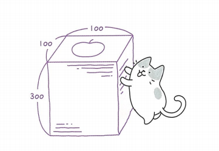
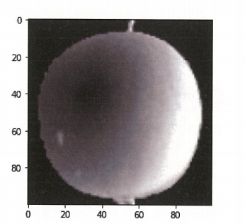
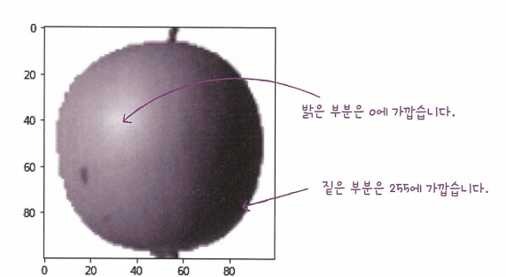
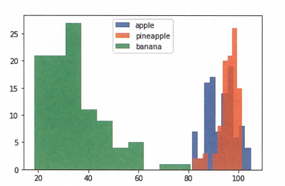
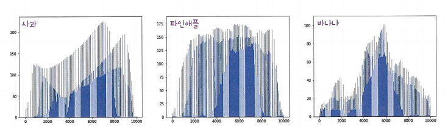
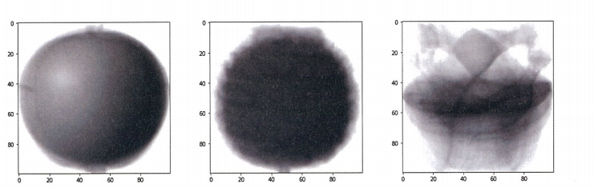
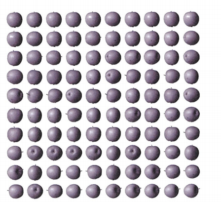

# Chapter6 비지도 학습 
 * 비지도 학습은 타깃이 없을 때 사용하는 머신러닝 알고리즘이다. 
## 군집 알고리즘 

``` python 
# 데이터 로드 
import numpy as np
import matplotlib.pyplot as plt
fruits = np.load('fruits_300.npy)
print(fruits.shape)
>>>  (300 , 100 , 100) #의미는 300개의 샘플이 100높이로 100 너비의 크기를 갖는다. 
```




``` python 
# 첫번째 이미지의 첫 번째 행 출력 
print(fruits[0,0,:]) 

#numpy 배열로 저장된 이미지 그리기
plt.imshow(fruits[0]),cmap='gray'
plt.show()
```



``` python
# 색 반전 시키기
plt.imshow(fruits[0],cmap='gray_r')
plt.show()
```



왜 색을 반전 시키는가? 0은 행렬의 곱셈,덧셈에서 의미가 없기에 사과를 식별하기 위해 색을 반전시키는 것이 좋다. 

``` python
#파인애플, 바나나 이미지 출력 
fig,axs = plt.subplots(1,2)
axs[0].imshow(fruits[100]),cmap='gray_r)
axs[1].imshow(fruits[200]),cmap='gray_r)
plt.show()
```

### 픽셀값 분석하기 
픽셀값을 분석하기 위해서는 1차원 배열로 바꾸는 것이 계산에 용이하다. 


``` python
# 사과 1차원 배열로 바꾸기 
apple = fruits[0:100].reshape(-1,100*100)
pineapple  =fruits[100:200].reshape(-1,100*100)
banana = fruits[200:300].reshape(-1,100*100)
print(apple.shape)
>>>(100,10000)
```

``` python
# axis1은 열 단위를 의미 
print(apple.mean(axis=1)) #열 단위로 평균을 냄 
```

``` python
# 히스토그램 그려보기 
plt.hist(np.mean(apple,axis=1),alpha=0.8)
plt.hist(np.mean(pineapple,axis=1),alpha=0.8)
plt.hist(np.mean(banana,axis=1),alpha=0.8)
plt.legend(['apple','pineapple','banana'])
plt.show()
```


위의 히스토그램은 샘플의 평균값을 구한 것이다. 픽셀별 평균값을 비교하는 코드는 밑에 있다. 

``` python
#픽셀의 평균값 비교 
fig,axs=plt.subplots(1,3,figsize=(20,5))
axs[0].bar(range(10000)),np.mean(apple,axis=0))
axs[1].bar(range(10000)),np.mean(pineapple,axis=0))
axs[2].bar(range(10000)),np.mean(banana,axis=0))
plt.show()
```




픽셀 평균값을 100*100으로 바꿔서 이미지로 출력 한 후 그래프와 비교하면 좋다 

``` python

#픽셀 평균값 100*100 배열로 전환

apple_mean = np.mean(apple,axis=0).reshape(100,100)
pineapple_mean = np.mean(pineapple,axis=0).reshape(100,100)
banana_mean =np.mean(banana,axis=0).reshape(100,100)
fig,axs=plt.subplots(1,3,figsize=(20,5))
axs[0].imshow(apple_mean,cmap='gray_r)
axs[1].imshow(pineapple_mean,cmap='gray_r)
axs[2].imshow(banana_mean,cmap='gray_r)
plt.show()
```



### 평균값과 가까운 사진 고르기

``` python
#절댓값 오차를 사용한 평균값과 가까운 사진 고르기 

abs_diff = np.abs(fruits-apple_mean)
abs_mean= np.mean(abs_diff,axis(1,2))
print(abs_mean.shape)
>>>(300,)


# 절댓값 오차가 작은 100개 선택
apple_index =np.argsort(abs_mean)[:100]
fig, as =plt.subplots(10,10,figsize=(10,10))
for i in range(10):
    for j in range(10):
        axs[i,j].imshow(fruits[apple_index[i*10+j]],cmap='gray_r')
        axs[i,j].axis('off')
plt.show()
```



이처럼 비슷한 샘플끼리 그룹으로 모으는 작업을 군집이라고 한다. 군집은 대표적인 비지도 학습 작업 중 하나이다. 군집 알고리즘에서 만든 그룹을 클러스터라고 부른다. 

