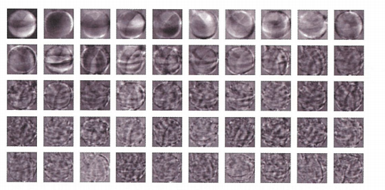
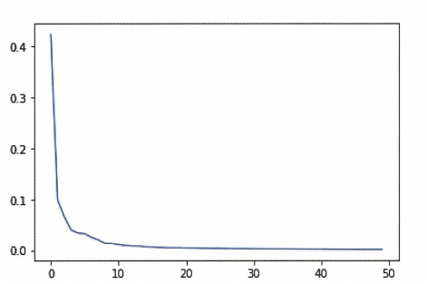

# Chapter6 비지도 학습 
 * 비지도 학습은 타깃이 없을 때 사용하는 머신러닝 알고리즘이다. 
## 군집 알고리즘 

``` python 
# 데이터 로드 
import numpy as np
import matplotlib.pyplot as plt
fruits = np.load('fruits_300.npy)
print(fruits.shape)
>>>  (300 , 100 , 100) #의미는 300개의 샘플이 100높이로 100 너비의 크기를 갖는다. 
```


``` python 
# 첫번째 이미지의 첫 번째 행 출력 
print(fruits[0,0,:]) 

#numpy 배열로 저장된 이미지 그리기
plt.imshow(fruits[0]),cmap='gray'
plt.show()
```


``` python
# 색 반전 시키기
plt.imshow(fruits[0],cmap='gray_r')
plt.show()
```


왜 색을 반전 시키는가? 0은 행렬의 곱셈,덧셈에서 의미가 없기에 사과를 식별하기 위해 색을 반전시키는 것이 좋다. 

``` python
#파인애플, 바나나 이미지 출력 
fig,axs = plt.subplots(1,2)
axs[0].imshow(fruits[100]),cmap='gray_r)
axs[1].imshow(fruits[200]),cmap='gray_r)
plt.show()
```

### 픽셀값 분석하기 
픽셀값을 분석하기 위해서는 1차원 배열로 바꾸는 것이 계산에 용이하다. 


``` python
# 사과 1차원 배열로 바꾸기 
apple = fruits[0:100].reshape(-1,100*100)
pineapple  =fruits[100:200].reshape(-1,100*100)
banana = fruits[200:300].reshape(-1,100*100)
print(apple.shape)
>>>(100,10000)
```

``` python
# axis1은 열 단위를 의미 
print(apple.mean(axis=1)) #열 단위로 평균을 냄 
```

``` python
# 히스토그램 그려보기 
plt.hist(np.mean(apple,axis=1),alpha=0.8)
plt.hist(np.mean(pineapple,axis=1),alpha=0.8)
plt.hist(np.mean(banana,axis=1),alpha=0.8)
plt.legend(['apple','pineapple','banana'])
plt.show()
```


위의 히스토그램은 샘플의 평균값을 구한 것이다. 픽셀별 평균값을 비교하는 코드는 밑에 있다. 

``` python
#픽셀의 평균값 비교 
fig,axs=plt.subplots(1,3,figsize=(20,5))
axs[0].bar(range(10000)),np.mean(apple,axis=0))
axs[1].bar(range(10000)),np.mean(pineapple,axis=0))
axs[2].bar(range(10000)),np.mean(banana,axis=0))
plt.show()
```


픽셀 평균값을 100*100으로 바꿔서 이미지로 출력 한 후 그래프와 비교하면 좋다 

``` python

#픽셀 평균값 100*100 배열로 전환

apple_mean = np.mean(apple,axis=0).reshape(100,100)
pineapple_mean = np.mean(pineapple,axis=0).reshape(100,100)
banana_mean =np.mean(banana,axis=0).reshape(100,100)
fig,axs=plt.subplots(1,3,figsize=(20,5))
axs[0].imshow(apple_mean,cmap='gray_r)
axs[1].imshow(pineapple_mean,cmap='gray_r)
axs[2].imshow(banana_mean,cmap='gray_r)
plt.show()
```


### 평균값과 가까운 사진 고르기

``` python
#절댓값 오차를 사용한 평균값과 가까운 사진 고르기 

abs_diff = np.abs(fruits-apple_mean)
abs_mean= np.mean(abs_diff,axis(1,2))
print(abs_mean.shape)
>>>(300,)


# 절댓값 오차가 작은 100개 선택
apple_index =np.argsort(abs_mean)[:100]
fig, as =plt.subplots(10,10,figsize=(10,10))
for i in range(10):
    for j in range(10):
        axs[i,j].imshow(fruits[apple_index[i*10+j]],cmap='gray_r')
        axs[i,j].axis('off')
plt.show()
```


이처럼 비슷한 샘플끼리 그룹으로 모으는 작업을 군집이라고 한다. 군집은 대표적인 비지도 학습 작업 중 하나이다. 군집 알고리즘에서 만든 그룹을 클러스터라고 부른다. 

## K-Means

k-means 군집 알고리즘은 평균값을 자동으로 찾아준다.  
이 평균값이 클러스터의 중심에 위치하기 때문에 **클러스터링 중심(cluster center)**또는 **센트로이드(centroid)**라고 부른다. 

### k-means algorithm

>작동방식  
>1.무작위로 k개의 클러스터 중심을 정한다.  
>2.각 샘플에서 가장 가까운 클러스터 중심을 찾아 해당 클러스터의 샘플로 지정한다.  
>3.클러스터에 속한 샘플의 평균값으로 클러스터 중심을 변경한다.
>4.클러스터 중심에 변화가 없을 때까지 2번으로 돌아가 반복한다 


``` python 
import numpy as np
fruits = np.load('fruits_30.npy)
furits_2d = fruits.reshape(-1,100*100)
```

``` python
from skleanr.cluster import KMeans
km = KMeans(n_clusters=3,random_state = 42)
km.fit(fruits_2d)
print(km.labels_)
print(np.unique(km.lables_,return_counts=True))
```

``` python
>>> (array([0,1,2],dtype =int32)) , array([91 , 98 , 111])
```
결과를 보면 라벨0 =91개 라벨 1=98개 라벨2 =111개의 결과를 알 수 있다  

``` python
# 시각화 해보기 
import matplotlib.pyplot as plt
def draw_fruits(arr,ratio=1):
    n= len(arr) #n은 샘플 수 
    # 한 줄에 10개씩 이미지 그리기. 샘플 개수를 10으로 나누어 전체 행 개수 계산
    rows = int(np.ceil(n/10))
    cols=n if rows <2 else 10
    fig, axs = plt.subplots(rows , cols , figsize = (cols*ratio, rows*ratio), squeeze =False)
    for i in range (rows):
        for j in range(cols):
            if i*10 +j<n:
                axs[i,j].imshow(arr[i*10j]),cmap='gray_r')
            axs[i,j].axis('off')
        plt.show()
```

``` python
draw_fruits(fruits(fruits[km.labels_==0]))
```


이와 마찬가지로 다른 클러스터도 확인 할 수 있다.


### 클러스터 중심

KMeans 클래스가 최종적으로 찾는 클러스터 중심은 cluster_centers_속성에 저장되어 있다. 이를 출력하기 위해서는 100*100 크기의 2차원 배열로 바꿔야 함. 

 
``` python
draw_fruits(km.cluster_centers_.reshape(-1,100,100),ratio=3)
```


```python

# 훈련 데이터 샘플에서 클러스트 중심까지 거리 변환 
print(km.transform(fruits_2d[100,101]))

>>> [[5267.70439881  8837.37750892  3393.8136117]]
```


``` python
print(km.predict(fruits_2d[100:101]))

>>> [2]
```


``` python
draw_fruits(fruits[100:101])
```


``` python
#최적의 클러스터를 위한 반복 횟수 출력  
print(km.n_iter_)

>>> 3
```

### 최적의 k 찾기 

k-means의 단점은 사전에 클러스터 개수를 지정해야한다는 것이다.  
**이너셔(inertia)**는 k-means 알고리즘에서 클러스터 중심과 클러스터에 속한 샘플 사이의 거리를 잴 수 있다.   
따라서 엘보우 방법은 클러스터 개수를 늘려가면서 이너셔의 변화를 관찰하여 최적의 클러스터 개수를 찾는 방법이다.   


``` py
# 이너셔와 엘보우의 관계 시각화 
inertia = []
for k in range(2,7):
    km = KMeans(n_clusters=k , random_state=42)
    km.fit(fruits_2d)
    inertia.append(km.inertia_)
    plt.plot(range(2,7),inertia)
    plt.show() 
```


## 주성분 분석 

### 차원과 차원 숙소 

**차원 축소**는 데이터를 가장 잘 나타내는 일부 특성을 선택하여 데이터 크기를 줄이고 지도 학습 모델의 성능을 향상시킬 수 있는 방법이다.

### 주성분 분석 소개 

주성분은 원본 차원과 같고 주성분으로 바꾼 데이터는 차원이 줄어든다.   
주성분이 가장 분산이 큰 방향이기 떄문에 주성분에 투영하여 바꾼 데이터는 원본이 가지고 있는 특성을 가장 잘 나타내고 있을 것이다. 


``` py
import numpy as np
from sklearn.decomposition import PCA
fruits = np.load('fruits_300.npy')
#PCA 진행 
fruits_2d = fruits.reshape(-1,100*100)
pca = PCA(n_components=50) #components는 정해줘야함
pca.fit(fruits_2d)
```

```py
print(pca.compoents_.shape)

>>> (50,10000)

```py
draw_fruits(pca.components_.reshape(-1,100,100))
```





``` py
#기존 배열 
print(fruits_2d.shape)

>>> (300,10000)
```

```
fruits_pca = pca.transform(fruits_2d)
print(fruits_pca.shape)

>>> (300,50)

```

### 원본 데이터 재구성 

데이터의 특성을 줄이면 특성의 손실이 발생할 수 밖에 없다. 하지만 최대한 분산이 큰 방향으로 데이터를 투영했기 떄문에 원본 데이터를 상당 부분 재구성할 수있다. 

``` py
# 원본 데이터 재구성

fruits_inverse = pca.inverse_transform(fruits_pca)
print(fruits_invers.shape)

>>> (300,10000)
```

### 설명된 분산 
**설명된 분산(explained variance)**는 주성분이 원본 데이터의 분산을 얼마나 잘 나타내는지 기록한 값이다


``` py
#주성분의 설명된 분산 비율 출력
print(np.sum(pca.explained_variance_ratio_))

>>>0.9215651897863715

# 설명된 분산 그래프로 출력 
plt.plot(pca.explained_variance_ratio)
```



결과를 해석하자면, 처음 10개의 주성분이 대부분의 분산을 표현하고 있다. 

### 다른 알고리즘과 함께 사용하기 

```py

from sklearn.linear_model import LogisticRegression

lr = LogisticRegression()

target = np.array([0] * 100 + [1] * 100 + [2] * 100)

```
``` py 
#PCA 제외 예측 결과 
from sklearn.model_selection import cross_validate

scores = cross_validate(lr, fruits_2d, target)
print(np.mean(scores['test_score']))
print(np.mean(scores['fit_time']))

>>>
0.9966666666666667
1.819899892807007
```

```py
#PCA 예측 결과 
scores = cross_validate(lr, fruits_pca, target)
print(np.mean(scores['test_score']))
print(np.mean(scores['fit_time']))

>>>
1.0
0.032833099365234375
```
두 결과가 비슷함 그러나 시간적인 측면에서 pca분석이 이익이다. 


```py

fruits_pca = pca.transform(fruits_2d)
print(fruits_pca.shape)

>>> (300, 2)
```

```py
#2개의 주성분만 가지고 분석 
scores = cross_validate(lr, fruits_pca, target)
print(np.mean(scores['test_score']))
print(np.mean(scores['fit_time']))

>>> 0.9933333333333334
0.03713240623474121
```
### 주성분 분석으로 차원 축소

차원 축소를 사용하면 데이터 셋의 크기를 줄일 수 있고 시각화하기 쉽다는 장점이 있다. 똫차원 축소된 데이터를 지도 학습 알고리즘이나 다른 비지도 학습 알고리즘에 재사용하여 성능을 높이거나 훈련속도를 빠르게 만들 수 있다. 
