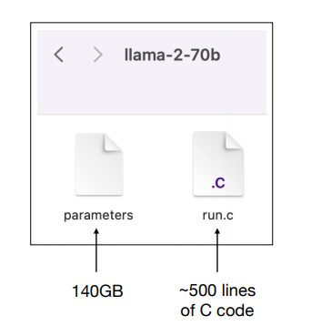
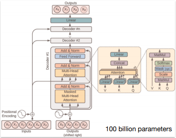
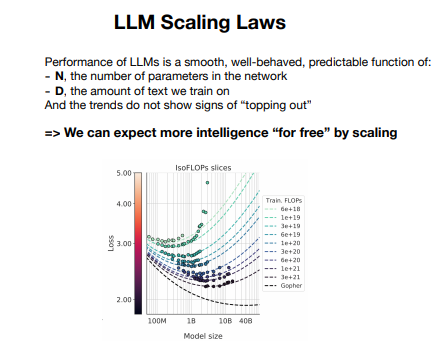

# LLM (Large Langudage Model)

## Youtube Link 
https://www.youtube.com/watch?v=zjkBMFhNj_g (Intro to LLM)

## LLM Inference

- 대형 언어 모델은 기본적으로 두 개의 파일로 구성됩니다. 하나는 매개변수 파일이고, 다른 하나는 이 매개변수를 실행하는 코드 파일입니다.
- 예로 든 Llama 2 모델은 Meta AI가 개발한 것으로, 70억 개의 매개변수를 갖춘 모델입니다. 매개변수 파일은 140GB 크기(2b*70b)이며, 이는 모델이 압축한 대규모 데이터를 포함합니다
- LLM은 데이터를 기반으로 다음 단어를 예측하는 방식으로 학습된 모델이며, 인터넷의 대규모 텍스트 데이터를 압축해 학습합니다. 이 과정을 일종의 ‘손실 압축’으로 비유할 수 있습니다.

다음과 같이 매개변수에 대한 파일과, 그것을 실행할 수 있는 파일 2개만 있으면 실행가능하다!
보통 매개변수는 1개는 2비트이다. 따라서, 매개변수 70억개는 140GB가 필요함을 알 수 있다. 

## LLM Training 

### 모델 추론 VS 모델 학습 

>**모델 추론**  
모델 추론은 기본적으로 우리가 성하는 매우 간단한 프로세스이다. 무엇이 다음에 무슨 단어가 올지 예측하고 생성한다. 우리는 모델에서 샘플링하여 다시 넣는 반복 작업을 수행한다.훈련세트에서 문서의 구조를 정확히 모방하지만 내용이 정확하지 않을 수도 있다. 이와 같은 훈련세트에 없는 구조이거나, 없는 내용은 환각효과가 일어날 수 있다.

>**모델 학습**  
LLM 훈련은 대규모 데이터 세트를 통해 모델을 학습시키는 과정입니다. 이 과정에서 모델은 텍스트 데이터를 압축하여 그 패턴을 학습하고, 다음 단어를 예측하는 능력을 갖추게 됩니다. 훈련 과정은 매우 자원 집약적이며, 많은 계산 능력과 시간이 필요합니다.

### LLM dreams

- LLM이 학습한 데이터에서 패턴을 찾아 이를 기반으로 텍스트를 생성할 때, 마치 "꿈꾸듯" 학습 데이터의 일부를 재구성하거나 변형된 형태로 생성합니다. 이 과정에서 생성된 텍스트는 실제로 학습된 것과는 다를 수 있으며, 이를 모델의 "환각(hallucination)"이라고 부르기도 합니다.

## How do they work?

- LLM은 기본적으로 대규모 데이터를 통해 다음 단어를 예측하는 확률 기반 모델입니다. 입력된 단어들의 순서를 바탕으로 가장 가능성이 높은 다음 단어를 예측하며, 이러한 반복적인 과정을 통해 문장과 문단을 생성합니다. 이때 각 단어는 매개변수화된 가중치에 의해 결정됩니다.

다음 그림은 신경망의 다이어그램이다. 우리는 이것을 Transforemr Neural Architecture라고 부른다. 수백억개의 매개변수가 신경망 전체에 존재한다. 우리는 이러한 매개변수를 조정하는 방법만 알고 있다.
다음 단어 예측 작업에서 네트워크 전체를 더 좋게 만들기 위해 반복적으로 행하면서다. 그러나, 우리는 실제로 이 수백억개의 매개변수가 무엇인지 모른다. 또한 어떻게 Collaborate 해야할지도 모른다.  

## Finetuning into an Assistant
- LLM을 특정한 질문에 답변할 수 있는 보조 도구로 만들기 위해서는 추가적인 미세 조정이 필요합니다. 미세 조정 과정에서는 고품질 질문-답변 데이터 세트를 사용해 모델을 재훈련시켜, 단순한 텍스트 생성기에서 유용한 질문 응답 도구로 변모시킵니다.
**pretrained-Model**은 인터넷의 대량의 텍스트에 관한 것이라 품질이 높지 않다.  
**Finetuning**은 양보다 품질을 선호하며,소량의 데이터로 사전학습된 모델의 데이터를 바꾸고 학습 시킨다.

**여기까지 정리하자면, 1.사전학습을 한다 2.미세조정을 한다.**

## Appendix:Comparisons , Labeling docs , RLHF , Synthetic data, Leaderboard
- 비교(Comparisons): 여러 모델의 성능을 서로 비교해 우수한 모델을 찾는 과정.
- 문서 레이블링(Labeling docs): 훈련 데이터에 올바른 레이블을 부여해 모델이 더 정확한 출력을 생성할 수 있도록 돕는 작업.
- RLHF: 인간 피드백을 통해 강화 학습(RLHF)을 적용, 더 나은 응답을 제공하도록 모델을 개선하는 기법.
- 합성 데이터(Synthetic data): 실제 데이터가 부족할 경우, 인공적으로 생성한 데이터를 사용해 모델을 훈련하는 방법.
- 리더보드(Leaderboard): 다양한 LLM의 성능을 평가하고 순위를 매기는 시스템. (ChatbotArena)

## LLM Scaling Laws 

다음 그림에서 알 수 있듯이, LLM의 성능은 모델의 크기(매개변수 수), 학습 데이터의 양, 그리고 사용된 계산 자원에 비례해 향상됩니다. 더 큰 모델은 더 많은 데이터를 학습할 수 있으며, 더 복잡한 문제를 해결할 수 있습니다. 이러한 확장 법칙이 LLM의 성능을 극대화하는 핵심 요소입니다

## Tool Use(Browswer , Calculator , Interpreter , DALL-E)

- LLM은 다양한 도구와 통합되어 더욱 유연한 문제 해결을 지원할 수 있습니다. 예를 들어, 브라우저를 통해 정보를 검색하거나 계산기를 이용해 수학 문제를 해결할 수 있으며, DALL-E와 같은 이미지 생성 도구도 활용할 수 있습니다.

## Multimodality(Vision,Audio)
- LLM은 텍스트뿐만 아니라 이미지(비전)와 오디오 데이터를 처리하는 능력도 갖출 수 있습니다. 이러한 멀티모달 기능을 통해 다양한 유형의 입력 데이터를 결합하여 더 복잡한 작업을 수행할 수 있습니다

## Thinking, System
- 현재의 LLM은 주로 직관적인 사고(시스템 1)만을 수행하며, 복잡한 논리적 사고(시스템 2)를 잘 하지 못합니다. 향후 모델들은 더 발전된 사고 능력을 갖추어, 복잡한 문제를 체계적으로 해결할 수 있을 것으로 기대됩니다.

## Self-imporvement, LLM AlphaGo

- LLM의 미래 발전 방향 중 하나는 자가 개선입니다. 이는 AlphaGo와 유사한 방식으로, 인간의 데이터를 모방하는 1단계 훈련을 넘어, 스스로 학습하고 성능을 개선하는 2단계로의 발전을 목표로 합니다.

## LLM Customization,GPTs store

- 미래에는 LLM을 사용자가 더 쉽게 맞춤화할 수 있는 기능이 제공될 것입니다. 예를 들어, 개인적인 데이터를 업로드해 특정한 작업에 맞게 모델을 훈련시키거나, GPT 스토어에서 다양한 모델을 선택하고 구매하는 방식이 가능해질 수 있습니다.

## LLM OS 

- LLM은 기존의 컴퓨터 운영체제처럼 다양한 도구와 기능을 통합하여 자연어 인터페이스를 통해 문제를 해결하는 새로운 형태의 운영체제로 발전할 수 있습니다. 이는 현재의 컴퓨터 아키텍처와 유사한 방식으로, 메모리와 저장 공간, 처리 능력을 효율적으로 활용할 수 있습니다.

## LLM Security 

### JailBreaks

- 탈옥은 특정한 입력을 통해 모델이 원래 의도한 제한을 우회하고, 사용자에게 원하지 않는 결과를 출력하게 만드는 공격 방식입니다.

### Prompt injection

- 프롬프트 인젝션은 악성 입력을 통해 모델이 잘못된 지시어를 수행하도록 유도하는 공격입니다. 이를 통해 모델은 악의적인 출력을 생성할 수 있습니다.

### Data poisoning

-데이터 중독은 모델의 훈련 데이터에 악의적인 데이터를 주입해, 모델이 잘못된 정보를 학습하도록 만드는 공격입니다. 이로 인해 모델이 신뢰할 수 없는 결과를 생성하게 됩니다.

### LLM Security  conclusions

- LLM의 보안은 매우 중요한 문제로, 다양한 공격을 방지하기 위한 연구와 방어 기법이 지속적으로 개발되고 있습니다. 사용자와 시스템 모두를 보호하기 위한 철저한 보안 체계가 필요합니다

