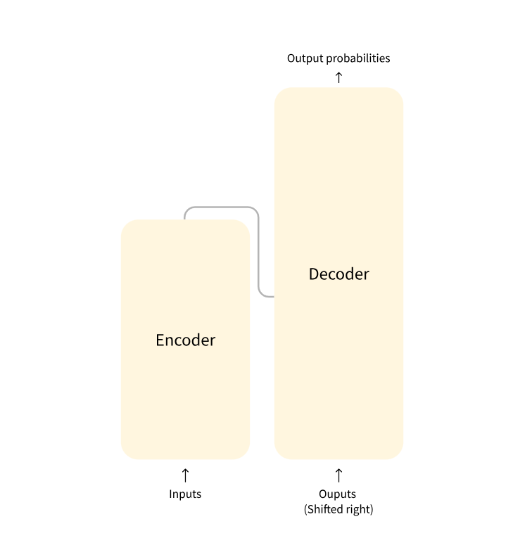
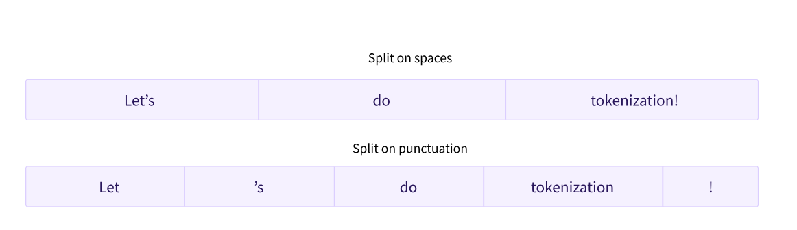

# Hugging face Tutorial NLP 정리 
https://huggingface.co/learn/nlp-course/ko/chapter1/1 (tutorial URL)

## Chapter1. Transformer Models

### Natural Language Processing
**NLP란?**
> NLP(Natural Language Processing)란 사람의 언어와 관련된 모든 것을 이해하는 데에 중점을 둔 언어학 및 기계 학습(머신 러닝) 분야를 말합니다. NLP의 목적은 단순히 하나의 개별 단어를 이해하는 것을 넘어, 해당 단어들의 **문맥**을 이해하는 것입니다.또한 NLP에서는 오디오 샘플의 스크립트 생성 및 이미지의 설명문 생성과 같이 음성 인식과 컴퓨터 비전 분야에서의 까다로운 문제 또한 다룹니다.
### Transforemrs,what can they do? 
https://github.com/huggingface/transformers (transformers github 주소)
Transformers는 분류, 정보 추출, 질문 답변, 요약, 번역, 문장 생성 등을 100개 이상의 언어로 수행할 수 있는 수천개의 사전학습된 모델을 제공한다.

```
from transforemres import pipeline
classifier = pipeline('sentimet-analysis') 
#pipeline을 'question-answering'등 여러가지로 바꿀 수 있음. #

classifier('We are very happy to introduce pipeline to the transformers repository.')
[{'label': 'POSITIVE', 'score': 0.9996980428695679}]
```
많은 NLP 과제들을 `pipeline`으로 바로 수행할 수 있다.  
>pipeline의 매개변수로 쓸 수 있는 것  
feature-extraction : 특징 추출 (텍스트에 대한 벡터 표현 추출)  
fill-mask : 마스크 채우기  
ner : 개체명 인식 (named entity recognition)  (모델이 입력 텍스트의 어느 부분이 사람, 장소, 기관 등과 같은 개체에 해당하는지 찾는 작업을 개체명 인식(NER)이라고 함)
question-answering : 질의 응답  
sentiment-analysis : 감정 분석  
summarization : 요약  
text-generation : 텍스트 생성  
translation : 번역  
zero-shot-classification : 제로샷 분류(레이블이 없는 텍스트를 분류)
- 제로샷 분류예시(zero-shot classificaition)
```
from transformers import pipeline
classifier = pipeline("zero-shot-classification")
classifier(
    "This is a course about the Transformers library",
    candidate_labels=["education", "politics", "business"],
)
```
```
{'sequence': 'This is a course about the Transformers library',
 'labels': ['education', 'business', 'politics'],
 'scores': [0.8445963859558105, 0.111976258456707, 0.043427448719739914]}
```
- Q&A 예시
```
from transformers import pipeline
question_answerer = pipeline('question-answering')
question_answerer({
...     'question': 'What is the name of the repository ?',
...     'context': 'Pipeline has been included in the huggingface/transformers repository'
... })
{'score': 0.30970096588134766, 'start': 34, 'end': 58, 'answer': 'huggingface/transformers'} # 여기에 사용된 사전학습 모델은 확신도와 토크나이징된 문장 속 답변의 시작점, 끝점까지 반환합니다. 
```
classifier ,question_answer객체를 생성할 때 모델이 다운로드 되며 `캐싱(caching)`이 이루어지때문에, 재실행 시에는 캐싱된 모델을 사용하게 되어 모델을 다시 다운로드 하지 않는다.  

>텍스트를 파이프라인에 넣을 때 다음과 같은 세 가지 주요 과정을 거친다:  
1.텍스트가 모델이 이해할 수 있는 형태로 `전처리 과정`을 거친다.  
2.전처리된 입력이 `모델 입력`으로 들어갑니다.  
3.모델의 예측값이 후처리를 거쳐, `사람이 이해할 수 있는 형태로 반환`됩니다.  

#### 사전학습 모델 다운 받는 법 (Tokenizer,Model)
```
#Pytorch 버전
from transformers import AutoTokenizer, AutoModel
tokenizer = AutoTokenizer.from_pretrained("google-bert/bert-base-uncased")
model = AutoModel.from_pretrained("google-bert/bert-base-uncased")
inputs = tokenizer("Hello world!", return_tensors="pt")
outputs = model(**inputs)

#TensorFloew 버전
from transformers import AutoTokenizer, TFAutoModel
tokenizer = AutoTokenizer.from_pretrained("google-bert/bert-base-uncased")
model = TFAutoModel.from_pretrained("google-bert/bert-base-uncased")
inputs = tokenizer("Hello world!", return_tensors="tf")
outputs = model(**inputs) #**를 사용하면 바로 모델에 전달할 수 있음. 
```
여기서 Tokenizer는 사전학습 모델의 모든 전처리를 책임진다. 즉, AutoTozkenizer는 자동으로 토큰나이징을 하는 것이 아닌, `pretrain된` 모델로 토크나이징 하는 것이다.


#### 왜 transformers를 사용해야할까? 
>**1.손쉽게 사용할 수 있는 최첨단 모델:**  
NLU와 NLG 과제에서 뛰어난 성능을 보인다.  
교육자 실무자에게 진입 장벽이 낮다.  
3개의 클래스만 배우면 바로 사용할 수 있다.  
하나의 API로 모든 사전학습 모델을 사용할 수 있다.  
**2.더 적은 계산 비용, 더 적은 탄소 발자국:**  
연구자들은 모델을 계속 다시 학습시키는 대신 학습된 모델을 공유할 수 있다.  
실무자들은 학습에 필요한 시간과 비용을 절약할 수 있다.  
수십개의 모델 구조, 2,000개 이상의 사전학습 모델, 100개 이상의 언어로 학습된 모델 등.  
**3.모델의 각 생애주기에 적합한 프레임워크:**  
코드 3줄로 최첨단 모델을 학습하세요.  
자유롭게 모델을 TF2.0나 PyTorch 프레임워크로 변환하세요.  
학습, 평가, 공개 등 각 단계에 맞는 프레임워크를 원하는대로 선택하세요.  
**4.필요한 대로 모델이나 예시를 커스터마이징 가능:**  
우리는 저자가 공개한 결과를 재현하기 위해 각 모델 구조의 예시를 제공.  
모델 내부 구조는 가능한 일관적으로 공개되어 있다.  
빠른 실험을 위해 모델 파일은 라이브러리와 독립적으로 사용될 수 있다.  

### How do Transformers work?
#### Transformer 종류
넓은 관점에서 트랜스포머 모델은 아래와 같이 세 개의 카테고리로 묶을 수 있습니다:

> - GPT-계열 (Auto-regressive 트랜스포머 모델로도 불림)
>- BERT-계열 (Auto-encoding 트랜스포머 모델로도 불림)
>- BART/T5-계열 (Sequence-to-sequence 트랜스포머 모델로도 불림)  
>이모델들은 자가 지도학습으로 학습된 모델이다. 사람이 데이터에 레이블을 달지 않아도 학습이 가능. 

이러한 종류의 모델은 학습한 언어에 대해 통계 기반의 방식으로 이해를 하지만, 이는 몇몇 실생활 문제에 적합하지 않다. 그렇기 때문에 사전 학습된 모델은 전이 학습(transfer learning)이라 불리는 과정을 거침. 이 과정에서 모델은 특정 작업에 맞춰 지도적(supervised)인 방법, 즉 사람이 레이블을 추가한 데이터를 사용하는 방법으로 미세 조정(fine-tune)이 이루어지는 단계를 거침

-**인과적 언어 모델링**다음에 올 단어를 예측

-**마스크 언어 모델링**은  문장 내에 마스킹 된 단어를 예측

**미세 조정(Fine-tuning)**`이란 모델이 모두 사전 학습을 마친 이후에 하는 학습을 의미한다. 미세 조정을 하기 위해서 우선 사전 학습된 언어 모델을 가져오고, 우리가 할 작업에 특화된 데이터셋을 이용해 추가 학습을 수행함. 그냥 한번에 최종 태스크에 맞춰 학습시키면 안될까?

>사전 학습된 모델은 이미 미세 조정 데이터셋과 유사한 데이터셋으로 학습이 이루어진 상태입니다. 결국 모델이 사전 학습시에 얻은 지식(이를테면, NLP 문제에서 사전 학습된 모델이 얻게 되는 언어의 통계적 이해)을 십분 활용해 미세 조정에 활용할 수 있게 됩니다.  
사전 학습된 모델은 이미 방대한 데이터로 학습되었기 떄문에 미세 조정에서는 원하는 성능을 얻기까지 **적은 양의 데이터만 필요**로 하게 됩니다.  
위와 같은 이유로, 원하는 성능을 얻기까지 적은 시간과 리소스만 필요하게 됩니다.
예시로, 영어로 사전 학습된 모델을 활용해 arXiv 코퍼스로 미세 조정하여 과학/연구 기반 모델을 만들 수 있습니다. 이 때 미세 조정에는 적은 양의 데이터만 필요할 것입니다. 여기서 사전 학습 과정에서 얻은 지식이 “전이”되었다고 하여 전이 학습(transfer learning=FineTuning)이라 부른다.  

#### Transformer 구조 

**인코더 (왼쪽)**: 인코더는 입력을 받아 입력(혹은 입력의 특징)을 구축. 이는 인코더 모델이 입력을 이해하는 데에 최적화되어 있음을 의미.  
문장 분류, 개체명 인식과 같이 입력에 대한 높은 이해를 요구하는 작업에 특화  
**디코더 (오른쪽)**: 디코더는 인코더의 (특징) 표현과 또 다른 입력을 활용해 타겟 시퀀스를 생성. 이는 디코더 모델이 출력을 생성하는 데에 최적화되어 있음을 의미.  
텍스트 생성과 같이 생성 관련 작업에 특화  
**인코더-디코더(Encoder-decoder) 모델 또는 시퀀스-투-시퀀스 (Sequence-to-sequence) 모델**: 번역, 요약과 같이 입력을 필요로 하는 생성 관련 작업에 특화

**어텐션 레이어(Attentiom layers)**  
어텐션 레이어는 단어의 표현을 다룰 떄 입력으로 넣어준 문장의 특정 단어에 어텐션을 기울이고 특정 단어는 무시하도록 알려준다.


디코더 블럭의 첫 번째 어텐션 레이어는 모든 이전의 디코더 입력에 대해 주의를 기울이지만, 두 번째 어텐션 레이어는 인코더의 출력만 사용하는 점을 주목하세요. 이로써 디코더는 전체 입력 문장에 액세스하여 현재 올 단어를 잘 예측하게 되는 것입니다. 이는 서로 다른 언어는 서로 다른 어순을 갖거나 문장의 뒷부분에 등장하는 문맥이 주어진 단어의 가장 적합한 번역을 결정할 수 있기 때문에 매우 유용합니다.

**어텐션 마스크(attention mask)**는 또한 모델이 몇몇 특수 단어들에 어텐션을 주는 것을 막는 데에 사용됩니다. 그 예로, 여러 다른 길이의 문장들을 모아 배치를 구성할 때, 패딩이라고 불리는 특수한 단어를 넣어 문장들의 길이를 맞춰주는데 사용하는 경우 있습니다.

**구조(Architecture)**: 모델의 뼈대를 의미하는 용어로, 모델 내부의 각 레이어와 각 연산 작용들을 의미합니다.  
**체크포인트(Checkpoints)**: 주어진 구조(architecture)에 적용될 가중치들을 의미합니다.  
**모델(Model)**: 사실 모델은 “구조”나 “가중치”만큼 구체적이지 않은, 다소 뭉뚱그려 사용되는 용어입니다. 이 강의에서는 모호함을 피하기 위해 구조(architecture)와 체크포인트(checkpoint)를 구분해서 사용하도록 하겠습니다.  
예를 들면, BERT는 구조에 해당하고, Google 팀이 최초 공개에서 내놓은 학습 가중치 셋인 bert-base-cased는 체크포인트에 해당합니다. 그렇지만 “BERT 모델”, “bert-base-cased 모델” 등과 같이 구분하지 않고 사용하기도 합니다.

### Encoder models
**인코더 모델(Encoder models)** 은 트랜스포머 모델의 인코더만 사용
각의 단계에서 어텐션 레이어는 초기 문장의 모든 단어에 액세스 할 수 있습니다. 이러한 모델은 `“양방향성(bi-directional)” 어텐션`을 지닌 특성이 있다고도 하며 `자동 인코딩(auto-enoding) 모델`이라고 부릅니다.

이러한 모델은 주어진 문장을 훼손시킨 후(랜덤으로 단어에 마스킹을 하는 방식 등으로) 모델이 원본 문장을 찾아 재구성하게끔 하는 과정을 반복시키는 방식으로 사전 학습을 진행
문장 분류, 개체명 인식(더 넓은 범위에서 단어 분류), 추출 질의 응답 등과 같이 전체 문장에 대한 이해를 요구하는 작업에 특화

### Decoder models
**디코더 모델(Decoder models)** 은 트랜스포머 모델의 디코더만 사용합니다. 각각의 단계마다, 어텐션 레이어는 주어진 단어에 대해 문장 내에서 해당 단어 앞에 위치한 단어들에 대해서만 액세스 할 수 있습니다. 이러한 모델을 자동 회귀(auto-regressive) 모델이라고 부릅니다.
텍스트 생성에 특화
### Sequence-to-sequence models 
**인코더-디코더 모델(Encoder-decoder models)**(시퀀스-투-시퀀스 모델(sequence-to-sequence models)로 부르기도 합니다)은 트랜스포머 구조의 인코더, 디코더 둘을 모두 사용합니다. 각 단계마다, 인코더의 어텐션 레이어는 초기 문장의 모든 단어에 액세스 할 수 있는 반면, 디코더의 어텐션 레이어는 주어진 단어 앞에 위치한 단어들에만 액세스 할 수 있습니다.
요약, 번역, 생성 질의 응답에 용이
### Bias and limitations
사전 학습된 혹은 미세 조정된 모델을 프로덕션 단계에서 사용하실 계획이라면, 이러한 모델들은 강력한 툴이지만 한계가 있음  
가장 큰 한계점은 리서처들이 무수히 많은 양의 데이터를 사전 학습에 사용하기 위해, 인터넷상에서 모을 수 있는 양질의 데이터와 함께 그렇지 않은 데이터까지 수집했을 가능성이 있다
```
from transformers import pipeline

unmasker = pipeline("fill-mask", model="bert-base-uncased")
result = unmasker("This man works as a [MASK].")
print([r["token_str"] for r in result])

result = unmasker("This woman works as a [MASK].")
print([r["token_str"] for r in result])
```
```
['lawyer', 'carpenter', 'doctor', 'waiter', 'mechanic']
['nurse', 'waitress', 'teacher', 'maid', 'prostitute']
```
다음의 예시와 답변을 봤을 때, 성별만 바뀌었지만 대답이 달라짐. 내제된 편향성이 존재함. 이는 미세조정을 거쳐도 없애지 못함.

### 단원 정리 

Transformer model에 대해 더 공부하고 싶으면 https://wikidocs.net/31695


## Chapter 2. TRANSFORMERS 사용하기 

### 단원소개
Transformers 라이브러리는 Transformer 모델을 가져온 후, 훈련시킨 후 저장할 수 있는 단일 api를 제공하는 것이 목표이다.   
**모델은 파일 간에 공유되는 모듈로 만들어지지 않고, 모델마다 자체적인 레이어를 쌓습니다.** 

### 파이프라인 내부 동작 과정

```
from transformers import pipeline

classifier = pipeline("sentiment-analysis")
classifier(
    [
        "I've been waiting for a HuggingFace course my whole life.",
        "I hate this so much!",
    ]
)
```
```
>[{'label': 'POSITIVE', 'score': 0.9598047137260437},
 {'label': 'NEGATIVE', 'score': 0.9994558095932007}]
 ```
 - model에 대한 pipeline
 > 이 파이프라인 그룹은 세 단계(전처리, 입력을 모델에 넘겨주는 것, 후처리)를 함께 수행합니다. 
 
 #### 토크나이저를 이용한 전처리  
>-입력을 토큰이라고 부르는 단어나 하위 단어, 또는 심볼(예-구두점)로 분할  
>-각 토큰을 하나의 정수에 매핑  
>-모델에 유용할 수 있는 부가적인 입력 추가  

**이 모든 전처리 과정은 모델이 사전학습될 때와 완전히 동일한 방식으로 진행** 따라서,전처리를 위해 `AutoTokenizer 클래스`와 AutoTokenizer의 `from_pretrained()` 메서드를 사용  
모델의 **체크포인트(checkpoint)** 이름을 사용하여 모델의 토크나이저와 연관된 데이터를 자동으로 가져와 저장
- 예시 
```
from transformers import AutoTokenizer

checkpoint = "distilbert-base-uncased-finetuned-sst-2-english"
tokenizer = AutoTokenizer.from_pretrained(checkpoint)
```
transformer 모델은 tensor만을 입력으로 받음. 만약 tensor에 대해 처음 들어봤다면, NumPy 배열을 생각하면 됨. NumPy 배열은 스칼라(0D), 벡터(1D), 행렬(2D) 또는 더 많은 차원을 가질 수 있습니다. 이것은 사실상 텐서. ML 프레임워크의 텐서도 유사하게 동작하며, NumPy 배열처럼 인스턴스화가 쉬움.  
얻고자 하는 tensor의 타입(PyTorch, TensorFlow, 일반 NumPy)을 지정하기 위해, return_tensors 전달인자를 사용
```
raw_inputs = [
    "I've been waiting for a HuggingFace course my whole life.",
    "I hate this so much!",
]
inputs = tokenizer(raw_inputs, padding=True, truncation=True, return_tensors="pt")
print(inputs) #return_tesonrs=pt를 통해 텐서 유형으로 지정. 만약 텐서 유형으로 지정하지 않으면 이중 리스트로 결과를 얻게 됨.
```
```
> {
    'input_ids': tensor([
        [  101,  1045,  1005,  2310,  2042,  3403,  2005,  1037, 17662, 12172, 2607,  2026,  2878,  2166,  1012,   102],
        [  101,  1045,  5223,  2023,  2061,  2172,   999,   102,     0,     0,     0,     0,     0,     0,     0,     0]
    ]), 
    'attention_mask': tensor([
        [1, 1, 1, 1, 1, 1, 1, 1, 1, 1, 1, 1, 1, 1, 1, 1],
        [1, 1, 1, 1, 1, 1, 1, 1, 0, 0, 0, 0, 0, 0, 0, 0]
    ])
}
```
#### - 모델 살펴보기 
토크나이저를 다운받은 방식과 동일하게 `AutoModel` 클래스를 이용한다.

```
from transformers import AutoModel

checkpoint = "distilbert-base-uncased-finetuned-sst-2-english"
model = AutoModel.from_pretrained(checkpoint)
```
해당 아키텍처는 기본 Transformer 모듈만 포함하고 있습니다. 입력이 주어지면 features라고도 불리는 `hidden states`를 출력함. 각 모델의 입력에 대해 Transformer 모델에 의해 수행된 입력의 문맥적 이해로 표현할 수 있는 고차원 벡터를 가져옵니다.

**고차원 벡터란?**
Transformer 모듈에 의한 출력 벡터는 일반적으로 크며 보통 3개의 차원을 가짐  
>- Batch size: 한 번에 처리되는 시퀀스의 수 
>- Sequence length: 시퀀스의 숫자 표현 길이 
>- Hidden size: 각 모델 입력 벡터 차원

전처리 과정을 거친 입력을 모델로 넘기면 아래 결과를 확인할 수 있다
```
outputs = model(**inputs)
print(outputs.last_hidden_state.shape)
```
```
torch.Size([2, 16, 768])
```
이는 batchsize가 2 , sequence length가 16 , hiddensize가 768임을 의미함  

각각의 의미를 설명하면,   
batchsize(2)라는 값은 한 번의 모델 입력으로 두 개의 문장이나 시퀀스가 처리되었음을 의미

Sequence Length(16)은  16개의 토큰으로 구성 , 토큰은 주로 문장을 단어 단위로 쪼갠 것이나 BPE(Byte Pair Encoding) 또는 다른 토크나이저를 통해 생성된 기본 단위

Hidden Size(768)은 각 토큰이 768차원의 벡터로 표현됨.이는 모델의 숨겨진 상태(hidden state) 크기로, 주로 BERT 같은 변환기 모델에서 사용하는 크기

 Transformers 모델의 출력은 namedtuple 또는 딕셔너리 형태임. 속성이나 키(outputs["last_hidden_state"])를 이용해 요소에 접근할 수 있고 찾고자 하는 것의 정확한 위치를 안다면 인덱스(outputs[0])도 사용할 수 있다.

#### - 모델헤드:숫자로 이해하기 
-**모델 헤드**는 hidden state의 고차원 벡터를 입력으로 받아 다른 차원으로 투영  
-모델 헤드는 보통 하나 이상의 선형 레이어로 이루어져 있다


- 이 다이어그램에서, 모델은 모델의 임베딩 레이어와 후속 레이어로 표현됨. **임베딩 레이어**는 토큰화된 각각의 입력 ID를 연관된 토큰을 나타내는 벡터로 변환. **후속 레이어**는 문장의 최종 표현을 만들기 위해 **어텐션 메커니즘**을 이용해 이 벡터들을 처리함.

-Transformer에는 다양한 아키텍처가 있으며, 각각의 아키텍처는 특정 작업을 처리하도록 설계되었습니다. 아래는 일부 아키텍처이다.
-*Model (retrieve the hidden states)
>- *ForCausalLM
>- *ForMaskedLM
>- *ForMultipleChoice
>- *ForQuestionAnswering
>- *ForSequenceClassification
>- *ForTokenClassification

- 아키텍처 사용 예시
```
from transformers import AutoModelForSequenceClassification

checkpoint = "distilbert-base-uncased-finetuned-sst-2-english"
model = AutoModelForSequenceClassification.from_pretrained(checkpoint)
outputs = model(**inputs)
print(outputs.logits.shape)
```
```
>torch.Size([2, 2])
```
출력 형태를 보면 차원이 훨씬 적은 것을 알 수 있다. 모델 헤드는 이전에 봤던 고차원 벡터를 입력으로 받아 2개의 값(레이블 당 하나)으로 이루어진 벡터를 출력함

#### - 출력 후처리
모델의 출력 값이 그 자체로 의미있는 것은 아님
```
print(outputs.logits)
```
```
tensor([[-1.5607,  1.6123],
        [ 4.1692, -3.3464]], grad_fn=<AddmmBackward>)
```
모델은 첫 번째 문장에 대해 [-1.5607, 1.6123]으로 예측했고 두 번째 문장에 대해 [ 4.1692, -3.3464]으로 예측했습니다. 이 값들은 확률이 아니라 모델의 마지막 층에 의해 출력된 정규화되지 않은 점수인 **logits**입니다. 확률로 변환되기 위해 logits은 **SoftMax** 층을 거쳐야 합니다. 학습을 위한 손실 함수가 일반적으로 SoftMax와 같은 마지막 활성함수와 교차 엔트로피와 같은 실제 손실 함수를 모두 사용하기 때문에 모든 Transformers 모델의 출력은 logit이다.
- 결과값을 softmax에 넣음
```
import torch

predictions = torch.nn.functional.softmax(outputs.logits, dim=-1)
print(predictions)
```
```
> tensor([[4.0195e-02, 9.5980e-01],
        [9.9946e-01, 5.4418e-04]], grad_fn=<SoftmaxBackward>)
```
각 위치에 해당하는 레이블을 얻기 위해, 모델 config의 id2label 속성봄 살펴봄
```
model.config.id2label
```
```
>{0: 'NEGATIVE', 1: 'POSITIVE'}
```
#### 최종정리
파이프라인 세 단계-토크나이저를 이용한 전처리, 모델에 입력 넣어주기, 후처리로 이루어짐. 
### 모델
 **AutoModel** 클래스와 관련 클래스들은 실제로 라이브러리에 있는 다양한 모델들을 감싸고 있는 간단한 래퍼입니다. 이 래퍼는 체크포인트에 적합한 모델 아키텍처를 자동으로 추측하고, 이 아키텍처를 가진 모델을 인스턴스화하는 것도 똑똑하게 처리합니다.
하지만, 만약 모델의 아키텍처를 직접 정의하고 싶다면, 해당 모델의 클래스를 사용할 수 있다
- Bert모델의 예시 
```
from transformers import BertConig,BertModel
config = Bertconfig()
model=BertModel(config)
print(config)
```
```
> BertConfig {
  [...]
  "hidden_size": 768,
  "intermediate_size": 3072,
  "max_position_embeddings": 512,
  "num_attention_heads": 12,
  "num_hidden_layers": 12,
  [...]
}
```
**hidden_size** 속성은 **hidden_states 벡터의 크기**를 정의하고, num_hidden_layers는 Transformer 모델이 가지고 있는 레이어의 수를 정의

#### - Different Loading methods(다른 로딩 방법)
```
from transformers import BertConfig, BertModel

config = BertConfig()
model = BertModel(config)

# Model is randomly initialized!
```
훈련된 Transformer 모델을 불러오는 법 `from_pretrained`메소드 사용
```
from transformers import BertModel

model = BertModel.from_pretrained("bert-base-cased")#이 모델은 체크포인트의 모든 가중치로 초기화됨
```
이 모델은 체크포인트에서 훈련된 작업에 대해 직접 추론에 사용할 수 있으며, 새로운 작업에 대해 미세 조정할 수도 있다  
전 훈련된 가중치로부터 학습을 진행하면, 빈 상태에서 훈련을 시작하는 것보다 빠르게 좋은 결과를 얻을 수 있음 


#### - Saving method(저장방법)
```
model.save_pretrained("directory_on_my_computer")
```
이렇게 하면 2가지 파일을 저장하게 됨 
```
> ls directory_on_my_computer

config.json pytorch_model.bin
```
config.json 파일은 모델 아키텍처를 구축하는 데 필요한 속성을 알려줍니다. 이 파일에는 체크포인트가 어디에서 생성되었는지, 마지막으로 체크포인트를 저장할 때 사용한 Transformers 버전 등의 메타데이터도 포함되어 있다.
#### - Using a Transformer model for inference(Transformer 모델을 추론에 사용하기)  
Transformer 모델은 토크나이저가 생성하는 숫자만 처리할 수 있다. 먼저 토크나이저에 논의하기 전에 모델이 받는 입력에 대해 알아보겠다.  
**토크나이저**는 입력을 적절한 프레임워크의 텐서로 변환할 수 있지만, 이해도를 높이기 위해 **모델에 입력을 보내기 전** 무엇을 반드시 해야 하는지 간단히 살펴보겠다.
- 예시 
```
sequences = ["Hello!", "Cool.", "Nice!"] #시퀀스들이 있다고 가정함 
#토크나이저는 이를 단어 인덱스로 변환 이를 input IDs라고 함     

#각 시퀀스는 이제 숫자 목록 결과
encoded_sequences = [
    [101, 7592, 999, 102],
    [101, 4658, 1012, 102],
    [101, 3835, 999, 102],
] # 인코딩된 시퀀스의 목록
```
텐서는 정사각형 모양만 받을 수 있다.이 “배열”은 이미 정사각형 모양이므로 텐서로 변환하는 것은 쉽다
#### - Using the tensors as inputs to the model (텐서를 모델의 입력으로 사용하기)
```
import torch
model_inputs = torch.tensor(encoded_sequences)
output = model(model_inputs)
```
모델이 다양한 어규먼트를 받는 중에, 입력은 **input IDs** 만 필요
### 토크나이저
`토큰화 파이프라인`에서 정확히 어떤 일이 일어나고 있는지 알아볼 것
우리는 원시 텍스트를 숫자로 바꿀 방법을 찾아야함  
목표는 모델에 가장 적합하면서 간결한 표현을 찾는 것
- 단어기반 토큰화 


파이썬의 split() 함수를 이용해 공백 기준으로 텍스트를 나눌 수 있다
```
tokenized_text = "Jim Henson was a puppeteer".split()
print(tokenized_text)
```
```
['Jim', 'Henson', 'was', 'a', 'puppeteer']
```
구두점을 위한 규칙이 추가된 토크나이저도 있다   
이러한 종류의 토크나이저를 사용하면 꽤 큰 “단어 사전”을 얻을 수 있다  
이 때 단어 사전은 우리가 가진 말뭉치(corpus) 내 존재하는 고유한 토큰 수에 의해 정의됨  
각 단어에는 0부터 시작해서 단어 사전 크기까지의 ID가 할당됩니다. 모델은 각 단어를 구별하기 위해 이 ID들을 사용
단어 사전을 생성할 때의 목표는 토크나이저가 단어를 unknown 토큰으로 가능한 한 적게 토큰화하는 것이다  
Unknown 토큰 수를 줄이기 위한 한 가지 방법은 한 단계 더 들어가   
**문자 기반 토크나이저**를 사용하는 것

**문자 기반 토크나이저**는 텍스트를 단어가 아닌 문자 단위로 나눈다
이 방법은 두 가지 장점이 있습니다.  
>- 단어 사전이 간결해진다.
>- 모든 단어는 문자로 이루어졌기 때문에 out-of-vocabulary (unknown) 토큰의 수가 훨씬 적다.

단점은 다음과 같다
>- 모델이 처리해야 하는 매우 많은 양의 토큰이 생기게 된다는 것
>- 단어 기반 토크나이저에서 단어는 단 하나의 토큰인 반면, 문자로 변환하면 10개 이상의 토큰으로 쉽게 바뀔 수 있습니다.
장점만을 최대한 활용하기 위해 두 가지 방법을 결합한 세 번째 기법인 **서브워드 토큰화**를 사용할 것입니다.  

**서브워드 토큰화 알고리즘**은 자주 사용되는 단어는 더 작은 서브워드로 나누면 안되지만, 희귀한 단어는 의미 있는 서브워드로 나눠야 한다는 규칙에 기반한다.

예를 들면 “annoyingly”는 흔하지 않은 단어로 여겨질 수 있고 “annoying”과 “ly”로 분해할 수 있을 것. 둘다 독립적인 서브워드로 자주 등장할 가능성이 있는 반면에 “annoyingly”는 “annoying”과 “ly”의 합성으로만 의미가 유지된다.

서브워드는 많은 양의 의미론적 정보를 제공한다. 위의 예시에서 “tokenization”은 의미론적인 정보를 갖는 두 개의 토큰 “token”과 “ization”으로 분할되었고 긴 단어를 두 단어만으로 표현할 수 있어 공간 효율적이다. 이 방식을 통해 크기가 작은 단어 사전으로도 많은 토큰을 표현할 수 있고 unknown 토큰도 거의 없다

#### 불러오기 및 저장 
모델과 동일하기 토크나이저도 `from_pretrained()`와 `save_pretrained()`두 메서드에 기반한다. 메서드들은 토크나이저가 사용하는 알고리즘(모델의 구조와 약간 유사)과 단어 사전(모델 가중치와 약간 유사)을 불러오거나 저장 
- 예시 코드 
```
from trainsforemers import BertTokenizer
tokenizer =BertTokenizer.from_pretrained("bert-base-cased)
```
`AutoTokenizer`클래스 사용 코드 
```
from transformers import AutoTokenizer

tokenizer = AutoTokenizer.from_pretrained("bert-base-cased")
tokenizer("Using a Transformer network is simple")
```
```
>{'input_ids': [101, 7993, 170, 11303, 1200, 2443, 1110, 3014, 102],
 'token_type_ids': [0, 0, 0, 0, 0, 0, 0, 0, 0],
 'attention_mask': [1, 1, 1, 1, 1, 1, 1, 1, 1]}
 ```
```
tokenizer.save_pretrained("directory_on_my_computer")#토크나이저 저장 
```
텍스트를 숫자로 바꾸는 것은 **인코딩**으로 알려져 있습니다. 인코딩은 **토큰화**, **토큰을 입력 ID로 바꾸는** 두 단계에 걸쳐 수행
> - 1. 첫 번째 단계는 이미 봤던 것처럼 텍스트를 흔히 토큰이라고 부르는 단어(또는 단어의 일부, 구두점 기호 등)로 나누는 것
> - 2. 두 번째 단계는 생성된 토큰들을 숫자로 변환해 **텐서**로 만들고 모델로 넘겨주는 것. 이 과정을 위해 토크나이저는 from_pretrained() 메서드로 인스턴스화할 때 다운로드한 단어 사전을 가지고 있다. 여기서도 모델이 사전학습될 때 사용한 것과 동일한 단어 사전을 사용해야 함
#### 토큰화 
위의 2단계를 코드로 보여주는 예시 
```
from transformers import AutoTokenizer

tokenizer = AutoTokenizer.from_pretrained("bert-base-cased")

sequence = "Using a Transformer network is simple"
tokens = tokenizer.tokenize(sequence)

print(tokens)
```
```
['Using', 'a', 'transform', '##er', 'network', 'is', 'simple']
```
#### 토큰에서 입력 id까지 
```
ids = tokenizer.convert_tokens_to_ids(tokens)

print(ids)
```
```
[7993, 170, 11303, 1200, 2443, 1110, 3014]
```

#### 디코딩
단어 사전의 인덱스로부터 문자열을 얻고 싶을 떄 사용 
`decode()` 메소드 이용
```
decoded_string = tokenizer.decode([7993, 170, 11303, 1200, 2443, 1110, 3014])
print(decoded_string)
```
```
'Using a Transformer network is simple'
```
-decode 메서드는 인덱스를 토큰으로 바꿀 뿐만 아니라, 읽기 좋은 문장을 만들기 위해 같은 단어의 일부인 토큰을 그룹화 함  
이 과정은 새 텍스트(프롬프트에서 생성된 텍스트 또는 번역이나 요약과 같은 시퀀스 간 문제)를 예측하는 모델을 쓸 때 매우 유용

### 다중 시쿼스 처리
>여러 개의 시퀀스는 어떻게 처리하나요?
>서로 다른 길이를 갖는 다중 시퀀스를 어떻게 처리하나요?
>단어 사전의 인덱스가 모델이 잘 작동하게 하는 유일한 입력인가요?
>엄청 긴 시퀀스를 처리하는 방법이 있나요?  

에 대한 해답을 해주는 파트이다. 

#### 모델은 배치 입력을 기대한다
우리는 이전 실습에서 시퀀스가 숫자 리스트로 어떻게 바뀌는지 확인했다. 이 숫자 **리스트를 텐서로 바꾸고 모델**로 보내보자
```
import torch
from transformers import AutoTokenizer, AutoModelForSequenceClassification

checkpoint = "distilbert-base-uncased-finetuned-sst-2-english"
tokenizer = AutoTokenizer.from_pretrained(checkpoint)
model = AutoModelForSequenceClassification.from_pretrained(checkpoint)

sequence = "I've been waiting for a HuggingFace course my whole life."

tokens = tokenizer.tokenize(sequence)
ids = tokenizer.convert_tokens_to_ids(tokens)
input_ids = torch.tensor(ids)
# 이 코드는 실행되지 않을 것.
model(input_ids)
```
```
IndexError: Dimension out of range (expected to be in range of [-1, 0], but got 1)
```
**오류가 뜹니다 왜?**  
Transformers 모델은 기본적으로 여러 개의 문장을 입력으로 받는데 하나의 시퀀스만을 모델에 넘겨줬기 때문에 발생하는 문제 여기서 우리는 토크나이저를 시퀀스에 적용했을 때 뒤에서 일어나고 있는 모든 일을 수행하려고 했다. 하지만 자세히 보면, 토크나이저가 입력 ID 리스트를 텐서로 바꿨을 뿐만 아니라 차원도 추가한 것을 알 수 있다.
```
tokenized_inputs = tokenizer(sequence, return_tensors="pt")
print(tokenized_inputs["input_ids"])
```
```
>tensor([[  101,  1045,  1005,  2310,  2042,  3403,  2005,  1037, 17662, 12172, 2607,  2026,  2878,  2166,  1012,   102]])
```
새로운 차원을 추가해서 다시 시도
```
import torch
from transformers import AutoTokenizer, AutoModelForSequenceClassification

checkpoint = "distilbert-base-uncased-finetuned-sst-2-english"
tokenizer = AutoTokenizer.from_pretrained(checkpoint)
model = AutoModelForSequenceClassification.from_pretrained(checkpoint)

sequence = "I've been waiting for a HuggingFace course my whole life."

tokens = tokenizer.tokenize(sequence)
ids = tokenizer.convert_tokens_to_ids(tokens)

input_ids = torch.tensor([ids])# 추가됨
print("Input IDs:", input_ids)#추가됨 

output = model(input_ids) #추가됨 
print("Logits:", output.logits) #추가됨
```
```
Input IDs: [[ 1045,  1005,  2310,  2042,  3403,  2005,  1037, 17662, 12172,  2607, 2026,  2878,  2166,  1012]]
Logits: [[-2.7276,  2.8789]] #logits은 소프트 맥스 함수에 입력되기 전의 값들
```
배치는 한 번에 여러 개의 문장을 모델로 보내는 방법입니다. 만약 단 한 개의 문장을 가지고 있다면 한 문장을 위한 배치를 만들 수 있다
```
batched_ids = [ids, ids]
```

다중 시퀀스를 사용하는 것은 단일 시퀀스로 배치를 만드는 것만큼 간단. 그러나 문제가 존재함. **2개 이상의 문장을 배치로 만드려고 할 때, 그 문장들은 아마 다른 길이를 가지고 있을 것** 문장 길이가 다르면 입력 ID 리스트를 텐서로 바로 변환할 수 없다 왜냐하면 텐서의 형태가 직사각형이어야 하기 때문이다. 이 문제를 해결하기 위해, 일반적으로 입력에 패드를 추가한다. 이 과정을 **패딩(padding)**이라고 부름

- 패딩 문제 풀기 
```
batched_ids = [
    [200, 200, 200],
    [200, 200]
]
```
패딩은 길이가 짧은 문장에 패딩 토큰이라고 불리는 특별한 토큰을 추가함으로써 모든 문장이 같은 길이를 갖게 함.
```
padding_id = 100

batched_ids = [
    [200, 200, 200],
    [200, 200, padding_id],
]
```
패딩 토큰의 ID는 **tokenizer.pad_token_id** 를 통해 확인할 수 있다
```
model = AutoModelForSequenceClassification.from_pretrained(checkpoint)

sequence1_ids = [[200, 200, 200]]
sequence2_ids = [[200, 200]]
batched_ids = [
    [200, 200, 200],
    [200, 200, tokenizer.pad_token_id],
]

print(model(torch.tensor(sequence1_ids)).logits)
print(model(torch.tensor(sequence2_ids)).logits)
print(model(torch.tensor(batched_ids)).logits)
```
```
tensor([[ 1.5694, -1.3895]], grad_fn=<AddmmBackward>)
tensor([[ 0.5803, -0.4125]], grad_fn=<AddmmBackward>)
tensor([[ 1.5694, -1.3895],
        [ 1.3373, -1.2163]], grad_fn=<AddmmBackward>)
```
배치되어 있는 예측 결과의 로짓이 뭔가 잘못된 것 같다. 두 번째 행은 두 번째 문장의 로짓과 값이 같아야 하는데 완전히 다른 값을 얻었다.  
이것은 Transformer 모델의 핵심 기능이 각 토큰을 **문맥화**하는 **어텐션 레이어**이기 때문입니다. 어텐션 레이어는 시퀀스 내 모든 토큰을 처리하기 때문에 패딩 토큰도 고려합니다. 서로 다른 길이를 가지는 문장 각각을 모델로 전달했을 때와 패딩이 추가되어 길이가 같아진 문장들을 배치로 전달했을 때의 결과가 같기 위해서는 이 어텐션 레이어들에게 패딩 토큰을 무시하라고 알려주어야 합니다. 이 역할을 어텐션 마스크가 수행한다. 

#### 어텐션 마스크 (Attension Masek)
어텐션 마스크는 입력 ID 텐서와 같은 크기를 같는 텐서로, 0과 1로 이루어져 있다.  
은 해당 토큰을 주의 깊게 봐야한다는 것을 의미하고 0은 해당 토큰을 신경 쓰지 않아도 된다는 의미임
```
batched_ids = [
    [200, 200, 200],
    [200, 200, tokenizer.pad_token_id],
]

attention_mask = [
    [1, 1, 1],
    [1, 1, 0],
]

outputs = model(torch.tensor(batched_ids), attention_mask=torch.tensor(attention_mask))
print(outputs.logits)
```
```
> tensor([[ 1.5694, -1.3895],
        [ 0.5803, -0.4125]], grad_fn=<AddmmBackward>)
```
이제 배치 내 두 번째 문장과 동일한 로짓을 얻었다. 따라서, 패딩을 할 때, attention mask를 사용해야함. 
#### 길이가 긴 시퀀스 
Transformer 모델을 사용할 때, 모델에 넘겨줄 수 있는 시퀀스 길이에 제한이 있다. 대부분의 모델은 최대 512개나 1024개의 토큰으로 이루어진 시퀀스를 처리할 수 있으며 더 긴 길이의 시퀀스를 처리해달라는 요청을 받으면 작동하지 않는다.
해결방법은 
>- 긴 시퀀스를 처리할 수 있는 모델을 사용
>- 시퀀스 길이를 최대 길이에 맞게 잘라냄

```
sequence = sequence[:max_sequence_length] #시퀀스 길이 최대에 맞게 잘라냄
```

### 한 번에 실행하기 
- 토크나이징 
```
from transformers import AutoTokenizer

checkpoint = "distilbert-base-uncased-finetuned-sst-2-english"
tokenizer = AutoTokenizer.from_pretrained(checkpoint)

sequence = "I've been waiting for a HuggingFace course my whole life."

model_inputs = tokenizer(sequence) #토크나이징

sequence = "I've been waiting for a HuggingFace course my whole life."

model_inputs = tokenizer(sequence)

#api 변경없이 여러개 시퀀스 처리 가능 
sequences = ["I've been waiting for a HuggingFace course my whole life.", "So have I!"]

model_inputs = tokenizer(sequences)
```

- 패딩 추가 
```
# 가장 긴 시퀀스의 길이에 맞게 패딩을 추가합니다.
model_inputs = tokenizer(sequences, padding="longest")

# 모델이 지원하는 최대 시퀀스 길이에 맞게 패딩을 추가합니다.
# (BERT나 DistilBERT의 최대 길이는 512)
model_inputs = tokenizer(sequences, padding="max_length")

# 지정한 길이에 맞게 패딩을 추가합니다.
model_inputs = tokenizer(sequences, padding="max_length", max_length=8)
```

- 시퀀스 길이 잘라내기
```
sequences = ["I've been waiting for a HuggingFace course my whole life.", "So have I!"]

# 모델이 지원하는 최대 시퀀스 길이에 맞게 시퀀스 길이를 잘라냅니다.
# (BERT나 DistilBERT의 최대 길이는 512)
model_inputs = tokenizer(sequences, truncation=True)

# 지정한 최대 길이에 맞게 시퀀스 길이를 잘라냅니다.
model_inputs = tokenizer(sequences, max_length=8, truncation=True) 
```
**truncation=True 옵션**은 토크나이저가 입력 시퀀스를 지정된 최대 길이로 잘라내도록 지시하는 기능
**max_length**는 입력 시퀀스를 모델에 제공할 때 허용되는 최대 길이를 설정하는 매개변수입니다. 토크나이저는 이 길이를 기준으로 입력 시퀀스를 조정하며, 주어진 max_length를 초과하는 부분은 잘라내고, 모자란 부분은 패딩을 추가하여 맞춥니다

- tokenizer결과를 return함
```
sequences = ["I've been waiting for a HuggingFace course my whole life.", "So have I!"]

# PyTorch 텐서를 반환합니다.
model_inputs = tokenizer(sequences, padding=True, return_tensors="pt")

# TensorFlow 텐서를 반환합니다.
model_inputs = tokenizer(sequences, padding=True, return_tensors="tf")

# NumPy 배열을 반환합니다.
model_inputs = tokenizer(sequences, padding=True, return_tensors="np")
```

#### 특수 토큰
반환한 입력 ID를 자세히 살펴보면 이전에 봤던 결과와 조금 다름
```
sequence = "I've been waiting for a HuggingFace course my whole life."

model_inputs = tokenizer(sequence)
print(model_inputs["input_ids"])

tokens = tokenizer.tokenize(sequence)
ids = tokenizer.convert_tokens_to_ids(tokens)
print(ids)
```
```
> [101, 1045, 1005, 2310, 2042, 3403, 2005, 1037, 17662, 12172, 2607, 2026, 2878, 2166, 1012, 102]
[1045, 1005, 2310, 2042, 3403, 2005, 1037, 17662, 12172, 2607, 2026, 2878, 2166, 1012]
```
시작과 끝에 추가된 토큰 ID가 다. 두 시퀀스의 ID가 무엇을 의미하는지 확인하기 위해 디코딩
```
print(tokenizer.decode(model_inputs["input_ids"]))
print(tokenizer.decode(ids))
```
```
"[CLS] i've been waiting for a huggingface course my whole life. [SEP]"
"i've been waiting for a huggingface course my whole life."
```
토크나이저는 문장이 시작할 떄 [CLS]라는 특별한 토큰을 붙이고, 끝날 때는 [SEP] 토큰을 붙인다. 이런 특별한 토큰을 사용하는 이유는 모델이 사전학습될 때 이 토큰들을 사용했기 때문에 추론 시 동일한 결과를 얻기 위함

#### 토크나이저에서 모델까지 
```
import torch
from transformers import AutoTokenizer, AutoModelForSequenceClassification

checkpoint = "distilbert-base-uncased-finetuned-sst-2-english"
tokenizer = AutoTokenizer.from_pretrained(checkpoint)
model = AutoModelForSequenceClassification.from_pretrained(checkpoint)
sequences = ["I've been waiting for a HuggingFace course my whole life.", "So have I!"]

tokens = tokenizer(sequences, padding=True, truncation=True, return_tensors="pt")
output = model(**tokens)
```

## Chapter3. Fine-Tuning a pretrained Model
사전 학습된 모델을 자신의 데이터 세트에 맞게 미세 조정하고 싶다면 어떨까?
이 Chapter를 통해서 다음과 같은 것을 배울 수 있다.

>-허브에서 대규모 데이터 세트를 준비하는 방법  
-고급 TrainerAPI를 사용하여 모델을 미세 조정하는 방법  
-사용자 정의 훈련 루프를 사용하는 방법  
-Accelerate 라이브러리를 활용하여 분산 설정에서 사용자 정의 교육 루프를 쉽게 실행하는 방법  

### 데이터 전처리 
```
import torch
from transformers import AdamW, AutoTokenizer, AutoModelForSequenceClassification

# chapter2와 같음
checkpoint = "bert-base-uncased"
tokenizer = AutoTokenizer.from_pretrained(checkpoint)
model = AutoModelForSequenceClassification.from_pretrained(checkpoint)
sequences = [
    "I've been waiting for a HuggingFace course my whole life.",
    "This course is amazing!",
]
batch = tokenizer(sequences, padding=True, truncation=True, return_tensors="pt")
```
```
# 새로운 것 여기서 딥러닝 모델 훈련
batch["labels"] = torch.tensor([1, 1])
optimizer = AdamW(model.parameters())
loss = model(**batch).loss
loss.backward() #역전파 
optimizer.step() #
```
- 코드 설명 


-라벨링된 데이터 셋 이용 
```
#데이터셋 불러오기 
from datasets import load_dataset

raw_datasets = load_dataset("glue", "mrpc")
raw_datasets
```
```
>DatasetDict({
    train: Dataset({
        features: ['sentence1', 'sentence2', 'label', 'idx'],
        num_rows: 3668
    })
    validation: Dataset({
        features: ['sentence1', 'sentence2', 'label', 'idx'],
        num_rows: 408
    })
    test: Dataset({
        features: ['sentence1', 'sentence2', 'label', 'idx'],
        num_rows: 1725
    })
}) #데이터셋 결과 train,validation,test로 나뉨
```

- `raw_datasets`에 사전처럼 인덱싱을 ㅗㅌㅇ해 객체의 각 문장 쌍에 접근 가능
```
raw_train_dataset = raw_datasets["train"]
raw_train_dataset[0]
```
```
> {'idx': 0,
 'label': 1,
 'sentence1': 'Amrozi accused his brother , whom he called " the witness " , of deliberately distorting his evidence .',
 'sentence2': 'Referring to him as only " the witness " , Amrozi accused his brother of deliberately distorting his evidence .'}
 ```
- 어떤 정수가 어떤 레이블에 해당하는지 알아보는 코드 
```
raw_train_dataset.features
```
```
{'sentence1': Value(dtype='string', id=None),
 'sentence2': Value(dtype='string', id=None),
 'label': ClassLabel(num_classes=2, names=['not_equivalent', 'equivalent'], names_file=None, id=None),
 'idx': Value(dtype='int32', id=None)}
 ```
 정수를 레이블 이름으로 매핑하는 작업은 namesClassLabel 폴더 에 저장됨
 ```
 from transformers import AutoTokenizer

checkpoint = "bert-base-uncased"
tokenizer = AutoTokenizer.from_pretrained(checkpoint)
tokenized_sentences_1 = tokenizer(raw_datasets["train"]["sentence1"])
tokenized_sentences_2 = tokenizer(raw_datasets["train"]["sentence2"])
inputs = tokenizer("This is the first sentence.", "This is the second one.")
inputs
```
```
> { 
  'input_ids': [101, 2023, 2003, 1996, 2034, 6251, 1012, 102, 2023, 2003, 1996, 2117, 2028, 1012, 102],
  'token_type_ids': [0, 0, 0, 0, 0, 0, 0, 0, 1, 1, 1, 1, 1, 1, 1],
  'attention_mask': [1, 1, 1, 1, 1, 1, 1, 1, 1, 1, 1, 1, 1, 1, 1]
}
```

`token_type_id`s는 모델에게 입력의 어느 부분이 첫번째 문장이고 어느 부분이 두번째 문장인지 알려준다. 
```
tokenizer.convert_ids_to_tokens(inputs["input_ids"]) #input_ids를 디코딩함
```
```
> ['[CLS]', 'this', 'is', 'the', 'first', 'sentence', '.', '[SEP]', 'this', 'is', 'the', 'second', 'one', '.', '[SEP]']
```
이때, token_type_id는 다음과 같이 문장을 라벨링 함 
```
['[CLS]', 'this', 'is', 'the', 'first', 'sentence', '.', '[SEP]', 'this', 'is', 'the', 'second', 'one', '.', '[SEP]']
[      0,      0,    0,     0,       0,          0,   0,       0,      1,    1,     1,        1,     1,   1,       1]
```

```
#전체 데이터셋에 토크나이징 적용
tokenized_dataset = tokenizer(
    raw_datasets["train"]["sentence1"],
    raw_datasets["train"]["sentence2"],
    padding=True,
    truncation=True,
)
```
이 방법은 잘 작동하지만, 사전(키, input_ids, attention_mask, , token_type_ids, 그리고 리스트의 리스트인 값)을 반환한다는 단점이 있다  
또한,  또한 토큰화 중에 전체 데이터 세트를 저장할 수 있는 충분한 **RAM**이 있는 경우에만 작동 반면에 Datasets 라이브러리의 데이터 세트는 디스크에 저장된 Apache Arrow 파일이므로 요청한 샘플만 메모리에 로드된 상태로 유지  

데이터를 데이터세트로 유지하기 위해 이 Dataset.map()방법을 사용.이는  토큰화 외에 더 많은 전처리가 필요한 경우 약간의 유연성을 제공 

```
def tokenize_function(example):
    return tokenizer(example["sentence1"], example["sentence2"], truncation=True)
```
- 이 함수는 사전을 가져와 `input_ids`,`attention_mask`,`token_type_ids`인 사전을 반환함. 

batch=True를 하면 ap함수가 데이터세트의 여러 요소에 한 번에 적용되고 각 요소에 개별적으로 적용되지 않습니다. 이렇게 하면 전처리가 더 빨라진다.
```
tokenized_datasets = raw_datasets.map(tokenize_function, batched=True)
tokenized_datasets
```
```
> DatasetDict({
    train: Dataset({
        features: ['attention_mask', 'idx', 'input_ids', 'label', 'sentence1', 'sentence2', 'token_type_ids'],
        num_rows: 3668
    })
    validation: Dataset({
        features: ['attention_mask', 'idx', 'input_ids', 'label', 'sentence1', 'sentence2', 'token_type_ids'],
        num_rows: 408
    })
    test: Dataset({
        features: ['attention_mask', 'idx', 'input_ids', 'label', 'sentence1', 'sentence2', 'token_type_ids'],
        num_rows: 1725
    })
})
```
마지막으로 해야 할 일은 요소를 함께 배치할 때 **가장 긴 요소의 길이**로 모든 예제를 패딩하는 것입니다. 이 기법을 동적 패딩(dynamic padding) 이라고 한다.

### 동적 패딩(dynamic padding )
`collate function`: 배치 내에서 샘플을 모으는 역할을 하는 함수. 기본은 샘플을 tf.Tensor로 변환하고(요소가 목록, 튜플 또는 dictionary인 경우 재귀적으로) 연결하는 기능.  
이렇게 하면 훈련 속도가 상당히 빨라지지만 TPU에서 훈련하는 경우 문제가 발생할 수 있습니다.  
TPU는 추가 패딩이 필요한 경우에도 고정된 모양을 선호함.  
실제로 이를 수행하려면 일괄 처리하려는 데이터 세트의 항목에 올바른 양의 패딩을 적용하는 collate 함수를 정의해야 함. 
Transformers라이브러리에서는 `DataCollatorWithPadding`을 사용함. 
이는 인스턴스화할 때 토크나이저를 사용하여(어떤 패딩 토큰을 사용할지, 모델이 패딩을 입력의 왼쪽에 두는지 오른쪽에 두는지 알기 위해) 필요한 모든 작업을 수행

```
from transformers import DataCollatorWithPadding

data_collator = DataCollatorWithPadding(tokenizer=tokenizer, return_tensors="tf")
```
우리는 필요하지 않고 문자열을 포함하고(그리고 문자열로 텐서를 생성할 수 없음) 배치의 각 항목의 길이를 살펴보기 위해 열 `idx`, `sentence1`, `sentence2`를 제거
```
#제거 코드
samples = tokenized_datasets["train"][:8]
samples = {k: v for k, v in samples.items() if k not in ["idx", "sentence1", "sentence2"]}
[len(x) for x in samples["input_ids"]]
```
```
> [50, 59, 47, 67, 59, 50, 62, 32]
```
```
batch = data_collator(samples)
{k: v.shape for k, v in batch.items()}
```
```
>
{'attention_mask': TensorShape([8, 67]),
 'input_ids': TensorShape([8, 67]),
 'token_type_ids': TensorShape([8, 67]),
 'labels': TensorShape([8])}
 ```
대신, 이 문제에 대한 효율적인 해결책을 제공하는 간단한 방법이 있다.
`to_tf_dataset()` 이 메서드는 데이터셋을 `tf.data.Dataset`으로 래핑하며, 선택적으로 콜레이트 함수(collation function)를 사용할 수 있습니다. `tf.data.Dataset`은 Keras에서   
`model.fit()` 메서드와 함께 사용할 수 있는 `TensorFlow`의 기본 형식
```
tf_train_dataset = tokenized_datasets["train"].to_tf_dataset(
    columns=["attention_mask", "input_ids", "token_type_ids"],
    label_cols=["labels"],
    shuffle=True,
    collate_fn=data_collator,
    batch_size=8,
)

tf_validation_dataset = tokenized_datasets["validation"].to_tf_dataset(
    columns=["attention_mask", "input_ids", "token_type_ids"],
    label_cols=["labels"],
    shuffle=False,
    collate_fn=data_collator,
    batch_size=8,
)
```


