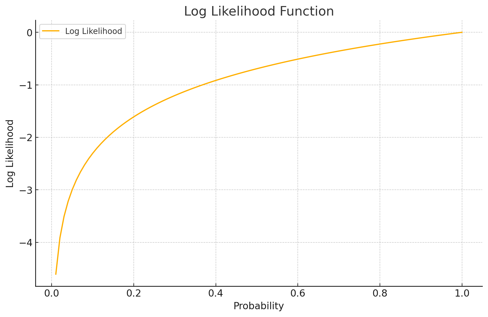
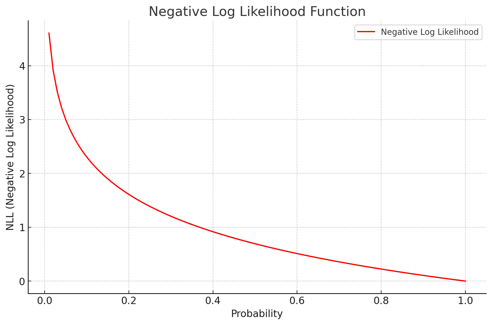

# The spelled-out intro to language modeling: building makemore

## Link
youtube: https://www.youtube.com/watch?v=PaCmpygFfXo  `

github: https://github.com/karpathy/makemore  
          https://github.com/karpathy/nn-zero-to-hero/blob/master/lectures/makemore/makemore_part1_bigrams.ipynb

## Intro

`Makemore`는 **캐릭터 레벨 언어 모델(character-level language model)** 을 기반으로 입력된 데이터를 학습하고, 그 데이터를 바탕으로 새로운 데이터를 생성하는 모델입니다. 이 모델은 특히 이름과 같은 문자열 데이터를 학습하고, 새로운 "이름"처럼 보이는 텍스트를 생성하는 데 사용됩니다

## Reading and exploring the dataset 

`bigram`은 문자열에서 연속된 두 개의 요소(문자 또는 단어)를 나타내는 용어입니다.  
예를 들어 문장을 단어 단위로 나누었을 때, 서로 붙어 있는 두 단어를 하나의 쌍으로 보는 것입니다. Bigram은 문장의 흐름이나 문맥을 이해할 때 유용하게 쓰이며, 특히 언어 모델에서 다음에 나올 단어를 예측하는 등의 작업에 활용됩니다.  
문장: "오늘 날씨가 좋다"  
단어 바이그램: "오늘 날씨", "날씨가 좋다"  

> 1. 데이터셋 로딩:  
'names.txt' 파일을 읽어 words 리스트에 저장합니다.  
파일의 각 줄은 하나의 이름을 나타냅니다.  
> 2. 데이터 탐색(EDA):  
데이터셋의 크기를 확인합니다 (32,033개의 이름).  
무작위로 선택된 이름들을 출력하여 데이터의 특성을 파악합니다.  
> 3. 문자 집합 분석:  
모든 이름에 사용된 고유한 문자들을 추출합니다.  
총 26개의 소문자와 1개의 마침표(.)로 구성된 것을 확인합니다.  
> 4. 문자 빈도 분석:  
각 문자의 출현 빈도를 계산합니다.  
가장 흔한 문자와 가장 드문 문자를 식별합니다.  
> 5. 이름 길이 분석:  
각 이름의 길이를 계산하고 평균 길이를 구합니다.  
이름 길이의 분포를 히스토그램으로 시각화합니다.  

## Counting bigrams in a python dictionary 

### 1. 초기 설정

```python
b = {}  # 빈 딕셔너리 생성
```

### 2. 특수 문자 추가

- 'S','E' 문자를 이름의 시작과 끝에 추가
- 예: 'emma' → '.emma.'

### 3. 바이그램 카운팅

```python
# words 리스트에 있는 각 단어에 대해 반복
for w in words:
    # 각 단어에 '<S>'(시작) 토큰을 앞에, '<E>'(끝) 토큰을 뒤에 붙여줌
    # 예를 들어, "emma"라는 단어는 ['<S>', 'e', 'm', 'm', 'a', '<E>']로 변환됨
    chs = ['<S>'] + list(w) + ['<E>']

    # 두 개의 연속된 문자를 묶어 빅그램(bigram)을 생성
    # zip(chs, chs[1:])는 두 문자씩 슬라이딩 창을 만들어 빅그램으로 묶음
    # chs[1:]는 첫 번째 요소를 제외한 나머지 리스트
    for ch1, ch2 in zip(chs, chs[1:]):
        bigram = (ch1, ch2)  # 빅그램은 (현재 문자, 다음 문자)의 튜플로 생성

        # 빅그램이 b 딕셔너리에 이미 존재하는 경우 그 값을 1 증가
        # 존재하지 않으면 0으로 초기화한 후 1로 설정
        b[bigram] = b.get(bigram, 0) + 1  # 빅그램의 빈도수를 증가

```

- `zip` 함수: 연속된 문자 쌍 생성
- `dict.get()`: 키가 없을 경우 기본값 0 반환

### 4. 결과 확인

- `b[('e', 'm')]`: 'e' 다음에 'm'이 나오는 횟수
- `b[('.', 'r')]`: 'r'로 시작하는 이름의 수

## Regularization Bigram

### 1. 목적

각 문자 다음에 올 수 있는 문자들의 확률 분포 계산

### 2. 구현

```python
N = {}  # 정규화된 바이그램 확률을 저장할 딕셔너리

# 기존 빅그램 빈도수를 담은 딕셔너리 b의 모든 항목에 대해 반복
for bigram, count in b.items():
    ch1, ch2 = bigram  # 빅그램에서 첫 번째 문자(ch1)와 두 번째 문자(ch2)를 추출
    
    # 빅그램 빈도를 정규화하여 N에 저장
    # 특정 문자(ch1)가 주어졌을 때, 다음 문자가 나올 확률을 계산하기 위해
    # 해당 문자(ch1)로 시작하는 모든 빅그램의 빈도 합을 구함
    # count는 (ch1, ch2) 빅그램의 발생 횟수
    # sum(b.get((ch1, c), 0) for c in chars)은 ch1으로 시작하는 모든 빅그램의 빈도 합
    
    N[bigram] = count / sum(b.get((ch1, c), 0) for c in chars)  
    # 빅그램 (ch1, ch2)의 빈도(count)를 ch1으로 시작하는 모든 빅그램의 빈도 합으로 나누어 확률로 정규화

```
- `items()`: 딕셔너리의 모든 (키, 값) 쌍을 튜플로 반환하는 메소드

### 3. 결과 해석

- `N[('e', 'm')]`: 'e' 다음에 'm'이 올 확률
- 모든 가능한 다음 문자에 대한 확률의 합은 1

### 시각화 및 분석

### 1. 바이그램 행렬 생성

```python
import torch  # PyTorch 라이브러리 임포트

# 27x27 크기의 0으로 채워진 텐서 생성 (각 문자의 빅그램 확률을 저장할 텐서)
# dtype=torch.float32로 텐서의 데이터 타입을 32비트 실수로 지정
P = torch.zeros((27, 27), dtype=torch.float32)

# enumerate(chars)를 사용해 chars 리스트의 각 문자를 인덱스와 함께 순회
for i, c1 in enumerate(chars):  # 첫 번째 문자 c1에 대한 반복문
    for j, c2 in enumerate(chars):  # 두 번째 문자 c2에 대한 중첩 반복문
        # N 딕셔너리에서 (c1, c2) 빅그램의 확률을 가져와 P[i, j]에 저장
        # N.get((c1, c2), 0)는 N 딕셔너리에서 해당 빅그램이 존재하지 않으면 0을 반환
        P[i, j] = N.get((c1, c2), 0)  # (c1, c2) 빅그램의 확률 값을 P[i, j]에 할당

```
- `enumerate()`: 시퀀스의 인덱스와 요소를 쌍으로 반환하는 함수.

``` py
# enumerate() 예시 코드

# 문자열 리스트
fruits = ['apple', 'banana', 'cherry']

# enumerate()를 사용하여 리스트의 인덱스와 값을 동시에 가져오기
for index, fruit in enumerate(fruits):
    print(f"Index: {index}, Fruit: {fruit}")

# enumerate()는 인덱스와 요소를 함께 반환하는 반복자를 생성합니다.
```

``` python
# 출력 
Index: 0, Fruit: apple
Index: 1, Fruit: banana
Index: 2, Fruit: cherry
```

### 2. 히트맵 시각화

- `plt.figure(figsize=(16,16))`
- `plt.imshow(P, cmap='Blues')`
- x축과 y축에 문자 레이블 추가

### 3. 분석

- 대각선: 같은 문자가 연속으로 나타나는 빈도
- 첫 번째 행: 이름의 시작 문자 분포
- 마지막 열: 이름의 끝 문자 분포

### 학습 포인트

- 딕셔너리를 사용한 효율적인 데이터 구조 활용
- 문자열 처리 및 리스트 조작 기술
- 확률 분포 계산 및 정규화 방법
- 데이터 시각화 기법 (matplotlib 사용)
- 텐서 조작 (PyTorch 사용)

## counting bigrams in a 2D torch tensor ("training the model")

Python 딕셔너리로 수행했던 바이그램 카운팅을 PyTorch 텐서를 사용하여 구현합니다. 이는 모델 "학습"의 첫 단계로 볼 수 있습니다.

### 1. 초기 설정

```python
import torch

N = torch.zeros((27, 27), dtype=torch.int32)
```

- 27x27 크기의 2D 텐서 생성 (26개 알파벳 + 특수문자 '.')
- `dtype=torch.int32`로 정수형 텐서 생성

### 2. 바이그램 카운팅

```python
# 데이터셋에서 각 단어를 하나의 큰 문자열로 합치고, 그 안에서 중복되지 않는 문자들의 집합을 만듦
chars = sorted(list(set(''.join(words))))

# 문자를 정수로 매핑하는 딕셔너리 생성 ('stoi'는 string-to-integer의 약자)
# enumerate(chars)를 사용해 각 문자를 고유한 정수에 매핑 (1부터 시작)
# '.'은 시작과 끝을 나타내는 특수 토큰으로, 그 값을 0으로 설정
stoi = {s:i+1 for i,s in enumerate(chars)}  # 문자 -> 숫자
stoi['.'] = 0  # 특수 문자 '.'를 0으로 설정

# 정수를 문자로 매핑하는 딕셔너리 생성 ('itos'는 integer-to-string의 약자)
# stoi 딕셔너리를 반대로 뒤집어서 정수 -> 문자로 변환
itos = {i:s for s,i in stoi.items()}  # 숫자 -> 문자


for w in words:
    chs = ['.'] + list(w) + ['.']
    for ch1, ch2 in zip(chs, chs[1:]):
        ix1 = stoi[ch1]
        ix2 = stoi[ch2]
        N[ix1, ix2] += 1
```

- `stoi`: 문자를 인덱스로 매핑하는 딕셔너리
- `N[ix1, ix2] += 1`: 해당 바이그램의 카운트 증가

### 3. 결과 확인

```python
print(N)
print(N.sum())
```

- 전체 텐서와 총 카운트 출력

## 확률 분포 계산

### 1. 행 정규화

```python
P = N.float()
P /= P.sum(1, keepdim=True)
```

- `float()`: 정수형에서 부동소수점형으로 변환
- `P.sum(1, keepdim=True)`: 각 행의 합으로 나누어 정규화 , `keepdim`은 차원을 유지하면서 합을 구함


### 추가 

``` python
import torch
# 3x3 텐서 생성
P = torch.tensor([[1.0, 2.0, 3.0],
                  [4.0, 5.0, 6.0],
                  [7.0, 8.0, 9.0]])

# 차원을 유지하면서 합계 계산 (행 단위로 합계)
P_sum_keepdim = P.sum(1, keepdim=True)

# 차원을 유지하지 않고 합계 계산 (행 단위로 합계)
P_sum_no_keepdim = P.sum(1, keepdim=False)

print("keepdim=True의 결과:\n", P_sum_keepdim)
print("keepdim=False의 결과:\n", P_sum_no_keepdim)
```
``` python
keepdim=True의 결과:
 tensor([[ 6.],
        [15.],
        [24.]])
keepdim=False의 결과:
 tensor([ 6., 15., 24.])
# keepdim=True: 차원을 유지하여 (3, 1) 크기의 텐서로 결과가 반환됩니다. 즉, 합계를 구한 후에도 2차원 배열의 형태를 유지합니다.
# keepdim=False: 차원을 제거하여 (3,) 크기의 1차원 벡터로 결과가 반환됩니다.
```

### 2. 결과 확인

```python
print(P)
print(P.sum(1))
```

- 정규화된 확률 분포 출력
- 각 행의 합이 1인지 확인

## 모델 평가

### 1. 우도(Likelihood) 계산

```python
log_likelihood = 0.0
n = 0
for w in words:
    chs = ['.'] + list(w) + ['.']
    for ch1, ch2 in zip(chs, chs[1:]):
        ix1 = stoi[ch1]
        ix2 = stoi[ch2]
        prob = P[ix1, ix2]
        logprob = torch.log(prob)
        log_likelihood += logprob
        n += 1
print(f'{log_likelihood=}')
```

- 각 바이그램의 로그 확률을 합산
- 전체 데이터셋에 대한 로그 우도 계산

### 2. 평균 네거티브 로그 우도(NLL) 계산

```python
nll = -log_likelihood / n
print(f'{nll=}')
```

- 평균 네거티브 로그 우도 계산 (손실 함수로 사용)

## Visualizing the bigram tensor 

### 1. 필요한 라이브러리 임포트
```python
import matplotlib.pyplot as plt
```

### 2. 인덱스-문자 매핑 생성
```python
itos = {i: ch for ch, i in stoi.items()}
```
- `stoi` 딕셔너리를 역으로 매핑하여 인덱스에서 문자로의 변환 가능

### 3. 플롯 설정
```python
plt.figure(figsize=(16,16))
plt.imshow(N, cmap='Blues')
```
- `figsize=(16,16)`: 큰 크기의 그림 생성
- `imshow()`: 2D 텐서를 이미지로 표시
- `cmap='Blues'`: 파란색 계열의 컬러맵 사용

### 4. 바이그램 및 카운트 표시
```python
for i in range(27):
    for j in range(27):
        chstr = itos[i] + itos[j]
        plt.text(j, i, chstr, ha="center", va="bottom", color='gray')
        plt.text(j, i, N[i, j].item(), ha="center", va="top", color='gray')
plt.axis('off');

```
- 각 셀에 바이그램 문자와 해당 카운트 표시
- `item()`: 텐서나 배열에서 하나의 스칼라 값을 추출
- `N[i, j].item()`: 텐서에서 정수값 추출


### 5. 축 레이블 및 제목 설정
```python
plt.xlabel('Next Character')
plt.ylabel('Current Character')
plt.title('Bigram Counts')
```

## 시각화 결과 분석

1. **색상 강도**: 더 밝은 색상은 높은 빈도를 나타냄
2. **대각선 패턴**: 같은 문자가 연속으로 나타나는 경향 확인 가능
3. **첫 번째 행**: 이름의 시작 문자 분포 표시
4. **마지막 열**: 이름의 끝 문자 분포 표시
5. **특정 패턴**: 예를 들어, 'q' 다음에 'u'가 올 확률이 높음

이 시각화 과정은 바이그램 모델의 특성을 직관적으로 이해하는 데 도움을 줍니다. 복잡한 데이터 구조를 시각적으로 표현함으로써 패턴과 경향을 쉽게 파악할 수 있습니다.

## Deleting spurious (S) and (E) tokens

이 섹션에서는 데이터셋에서 불필요한 시작(S)과 끝(E) 토큰을 제거하고, 모델을 개선하는 과정을 다룹니다.

## 문제 인식
- 현재 모델에는 불필요한 (S)와 (E) 토큰이 포함되어 있음
- 이로 인해 행렬에 불필요한 0값의 행과 열이 생김
- 특수 토큰을 나타내는 방식 개선 필요


### 1. 특수 토큰 변경
- (S)와 (E) 대신 하나의 특수 토큰 '.' 사용
- 27x27 크기의 행렬로 변경 (26개 알파벳 + 1개 특수 토큰)

### 2. 문자-인덱스 매핑 수정
```python
stoi = {ch: i+1 for i, ch in enumerate(chars)}
stoi['.'] = 0
itos = {i: ch for ch, i in stoi.items()}
```
- '.'을 인덱스 0으로 설정
- 알파벳은 1부터 시작하도록 변경

### 3. 텐서 초기화 수정
```python
N = torch.zeros((27, 27), dtype=torch.int32)
```

### 4. 바이그램 카운팅 로직 수정
```python
for w in words:
    chs = ['.'] + list(w) + ['.']
    for ch1, ch2 in zip(chs, chs[1:]):
        ix1 = stoi[ch1]
        ix2 = stoi[ch2]
        N[ix1, ix2] += 1
```

### 5. 결과 확인
- 수정된 행렬 구조 확인
- 첫 행: 단어 시작 문자의 빈도
- 마지막 열: 단어 끝 문자의 빈도


##  Sampling from the model


### 1. 확률 분포 준비
```python
P = N.float()
P /= P.sum(1, keepdim=True)
```
- 카운트 행렬 N을 확률 행렬 P로 변환
- 각 행의 합이 1이 되도록 정규화

### 2. 샘플링 함수 정의
```python
g = torch.Generator().manual_seed(2147483647)

def sample(P):
    ix = 0
    out = []
    while True:
        p = P[ix]
        ix = torch.multinomial(p, num_samples=1, replacement=True, generator=g).item()
        out.append(itos[ix])
        if ix == 0:
            break
    return ''.join(out[:-1])
```
- `torch.Generator()`: 재현 가능한 결과를 위한 시드 설정
- `torch.multinomial()`: 확률 분포에서 샘플링
- 특수 토큰 '.'(인덱스 0)이 나올 때까지 문자 생성

### 3. 이름 생성 및 결과 확인
```python
for i in range(20):
    print(sample(P))
```

## 샘플링 과정 설명

1. 시작 토큰 '.'에서 시작
2. 현재 문자의 확률 분포에서 다음 문자 샘플링
3. 샘플링된 문자를 출력에 추가
4. 끝 토큰 '.'이 나올 때까지 2-3 반복
5. 생성된 문자열에서 시작/끝 토큰 제거 후 반환

## 결과 분석

- 생성된 이름들은 실제 이름과 유사하지만 완전히 정확하지는 않음
- 바이그램 모델의 한계로 인해 일부 이름은 매우 짧거나 비현실적일 수 있음
- 예: "mor", "h", "yanu", "o'reilly" 등의 이름 생성

## 학습 포인트

1. **확률적 샘플링 구현**:
   - `torch.multinomial()` 함수 사용법
   - 가중치 기반 랜덤 선택 구현

2. **생성 모델의 원리**:
   - 조건부 확률을 이용한 순차적 생성 과정
   - 시작/끝 토큰의 역할

3. **재현 가능성**:
   - 랜덤 시드 설정의 중요성
   - 일관된 결과 생성 방법

4. **모델 평가**:
   - 생성된 이름의 품질 및 다양성 확인
   - 바이그램 모델의 한계 인식

5. **효율성 개선**:
   - 확률 행렬 P를 미리 계산하여 반복적인 정규화 방지

이 과정을 통해 간단한 바이그램 모델로도 새로운 이름을 생성할 수 있음을 보여줍니다. 또한, 모델의 한계를 인식하고 향후 개선 방향을 제시합니다.


## efficiencyz! vectorized normalization of the rows, tensor broadcasting 

## 구현 과정

### 1. 비효율적인 방식 식별
```python
p = N[ix].float()
p /= p.sum()
```

현재는 반복문이 실행될 때마다 n 행렬에서 한 행을 가져와 float로 변환하고 다시 나누기를 수행하며, 매번 이 행을 정규화하고 있습니다. 이 작업이 비효율적이므로, **앞으로는 미리 확률이 포함된 행렬 p를 준비해두고 이를 반복문에서 사용할 수 있도록 개선하고자 합니다.** 이렇게 하면 각 행이 이미 정규화된 상태로 저장되며, 반복문에서 매번 다시 정규화할 필요가 없어집니다.

- 이전 방식: 매 반복마다 행을 추출하고 정규화
- 문제점: 반복적인 연산으로 인한 비효율성

### 2. 효율적인 정규화 구현
```python
P = N.float()
P /= P.sum(1, keepdim=True)
```
- 전체 행렬을 한 번에 정규화
- `sum(1, keepdim=True)`: 각 행의 합을 계산하며 차원 유지

## 텐서 브로드캐스팅 설명
`broadcasting`은 배열 간의 크기가 맞지 않더라도 특정 조건을 충족하면 자동으로 배열의 크기를 맞추어 연산을 수행하는 개념입니다. 이때 broadcasting이 어떻게 작동하는지 설명하고, torch에서 사용되는 broadcasting 규칙을 제시합니다. 이 규칙은 두 배열의 각 차원을 우측부터 비교하며, 해당 차원의 크기가 같거나, 한쪽이 1이거나, 아예 존재하지 않을 때 broadcast가 가능합니다.

`keepdim` 매개변수는 차원이 축소되지 않도록 제어하는 역할을 합니다. 만약 keepdim=True로 설정하면 차원이 유지되어 1차원 배열이 반환되고, keepdim=False일 경우 차원이 축소되어 스칼라 값이 반환됩니다. 이때 broadcasting이라는 개념이 등장합니다.
1. **브로드캐스팅 규칙**:
여기서 keepdim=False로 설정하면 버그가 발생할 수 있음을 설명하며, 이를 디버깅하는 과정을 보여줍니다. 문제는 keepdim=False로 설정하면 차원이 축소되어 1차원 배열로 변환되는데, 이 경우 배열 간의 크기가 맞지 않아 엉뚱한 계산 결과를 얻게 됩니다. broadcasting 규칙을 다시 한번 살펴보며, 차원이 축소되지 않도록 주의해야 하는 이유를 설명합니다.

   - 각 텐서는 최소 1개의 차원을 가져야 함
   - 차원 크기는 같거나, 하나가 1이거나, 존재하지 않아야 함

2. **예시**:
   - `P` 형태: 27 x 27
   - `P.sum(1, keepdim=True)` 형태: 27 x 1
   - 브로드캐스팅: 27 x 1 -> 27 x 27로 자동 확장

3. **주의사항**:
   - `keepdim=True`의 중요성
   - 잘못된 브로드캐스팅으로 인한 버그 가능성

## 최적화 팁

```python
P = N.float()
P /= P.sum(1, keepdim=True)
```
- 인플레이스 연산 사용 (`/=`)
- 새로운 메모리 할당 최소화


## loss function (the negative log likelihood of the data under our model)


## 소개
이 섹션에서는 바이그램 모델의 성능을 평가하기 위한 손실 함수로 네거티브 로그 우도(Negative Log Likelihood, NLL)를 소개합니다.

### 1. 우도(Likelihood) 계산
GOAL: maximize likelihood of the data w.r.t. model parameters (statistical modeling)  
equivalent to maximizing the log likelihood (because log is monotonic)  
equivalent to minimizing the negative log likelihood  
equivalent to minimizing the average negative log likelihood  
log(a*b*c) = log(a) + log(b) + log(c)  




두 그림을 확인하면, 손실함수 NLL이 작아야 한다.
```python
log_likelihood = 0.0
n = 0
for w in words:
#for w in ["andrejq"]:
    chs = ['.'] + list(w) + ['.']
    for ch1, ch2 in zip(chs, chs[1:]):
        ix1 = stoi[ch1]
        ix2 = stoi[ch2]
        prob = P[ix1, ix2]
        logprob = torch.log(prob)
        log_likelihood += logprob
        n += 1
        #print(f'{ch1}{ch2}: {prob:.4f} {logprob:.4f}')
print(f'{log_likelihood=}')
nll = -log_likelihood
print(f'{nll=}')
print(f'{nll/n}')
```
- 각 바이그램의 로그 확률을 합산
- `n`은 총 바이그램 수를 카운트

### 2. 네거티브 로그 우도 계산
```python
nll = -log_likelihood
print(f'{nll=}')
```
- 로그 우도에 음수를 취해 네거티브 로그 우도 계산

### 3. 평균 네거티브 로그 우도 계산
```python
nll_normalized = nll / n
print(f'{nll_normalized=}')
```
- 총 바이그램 수로 나누어 평균 계산

## 손실 함수의 의미

1. **최소화 목표**: 낮을수록 모델 성능이 좋음
2. **범위**: 0에 가까울수록 좋고, 무한대로 갈 수 있음
3. **해석**: 모델이 데이터에 얼마나 잘 맞는지를 나타냄

## 학습 포인트

1. **확률론적 해석**:
   - 우도는 모델이 데이터를 생성할 확률
   - 로그를 사용하여 수치적 안정성 확보

2. **손실 함수의 특성**:
   - 네거티브를 취하여 최소화 문제로 변환
   - 평균을 사용하여 데이터셋 크기에 독립적인 평가 가능

3. **PyTorch 연산**:
   - `torch.log()` 함수 사용
   - 텐서 연산의 효율성

4. **모델 평가**:
   - 단일 숫자로 모델의 전체 성능 요약
   - 다른 모델과의 비교 기준 제공

5. **최적화 목표**:
   - 이 손실 함수를 최소화하는 방향으로 모델 학습

이 손실 함수는 모델의 성능을 정량적으로 평가하고, 학습 과정에서 모델을 개선하는 데 핵심적인 역할을 합니다. 네거티브 로그 우도는 특히 확률 모델에서 널리 사용되며, 모델이 실제 데이터 분포를 얼마나 잘 근사하는지를 측정합니다.


모델이 학습 데이터셋을 얼마나 잘 예측하는지 평가하기 위해 `training loss`라는 개념을 사용한다. `training loss`는 모델의 품질을 단일 숫자로 나타내며, 예를 들어 Micrograd에서와 같이, 손실 값을 계산해 모델이 얼마나 좋은지를 평가할 수 있다.

먼저, 바이그램 데이터를 읽어와 `character1`과 `character2`를 출력한다. 그런 다음, 모델이 각각의 바이그램에 할당하는 확률을 살펴본다. 이 확률은 `b` 행렬로 요약되어 있으며, 해당 확률을 출력한다. 확률 값이 너무 크다면 소수점 이하 4자리까지 출력하도록 조정한다.

여기서 중요한 기준점으로, 문자가 27개이기 때문에 모든 문자가 동일한 확률을 가질 경우 약 4%의 확률을 기대할 수 있다. 이보다 높은 확률이 나타난다면, 이는 바이그램 통계로부터 의미 있는 패턴을 학습한 것이다. 예를 들어, 모델이 학습 데이터에 매우 높은 확률(40% 또는 35%)을 할당했다면, 이는 모델이 학습 데이터에서 매우 정확한 예측을 하고 있음을 의미한다.

이제 이 확률을 하나의 숫자로 요약해 모델의 품질을 평가해야 한다. 이를 위해 최대우도 추정법과 통계 모델링에서 사용하는 `우도(likelihood)`라는 개념을 도입한다. 우도는 모든 확률의 곱으로 나타내며, 모델이 학습한 데이터셋에 대해 할당한 전체 확률을 의미한다. 우도의 값이 클수록 모델의 품질이 좋음을 나타낸다.

다만, 확률이 0과 1 사이에 있기 때문에 모든 확률을 곱하면 매우 작은 숫자가 되므로, `log likelihood(로그 우도)`를 사용한다. `log likelihood`는 확률의 로그를 취한 값이다. 이 로그 값은 1일 때는 0이 되고, 0에 가까울수록 더 큰 음수로 증가한다. 따라서 `log likelihood`는 전체 우도를 더 직관적이고 계산 가능한 형태로 변환한 값이다.

로그 우도 값을 계산하면, 각 바이그램에 대한 확률 값에 로그를 취하고 그 값을 더해서 출력할 수 있다. 예를 들어, 로그 우도 값이 -38이라면, 모델이 할당한 전체 확률이 낮음을 의미한다. `log likelihood`가 0에 가까울수록 좋은 모델이다.

하지만 우리는 손실 함수의 개념을 사용할 것이기 때문에, `negative log likelihood(음의 로그 우도)`를 사용하여 값을 반대로 뒤집는다. 음의 로그 우도는 낮을수록 좋은 예측을 의미하며, 0에 가까울수록 예측이 매우 정확하다는 뜻이다. 또한, 이 값을 평균으로 나누어 `normalized log likelihood(정규화된 로그 우도)`를 구할 수 있다.

모델의 손실 함수 값은 약 2.4이며, 이 값이 낮을수록 모델의 성능이 좋다는 것을 나타낸다. 학습 과정에서 이 손실 값을 최소화하는 방향으로 모델의 파라미터를 최적화하는 것이 목표다.

### model smoothing with fake counts

모델의 손실 함수가 무한대로 치솟는 문제를 해결하기 위해 `model smoothing(모델 스무딩)` 기법을 사용할 수 있다. 예를 들어, 학습 데이터에 없는 바이그램(JQ) 조합이 들어가면 해당 확률이 0이 되어 로그 우도가 무한대가 된다. 이를 방지하기 위해 모든 확률에 1씩 추가하는 방식으로 모델을 스무딩할 수 있다. 이 기법을 통해 확률을 0으로 만드는 상황을 방지하고, 더 부드럽고 일반화된 모델을 만들 수 있다.


## 문제 인식
- 훈련 데이터에서 보지 못한 바이그램에 대해 모델이 0의 확률을 할당
- 이로 인해 로그 우도가 음의 무한대가 되는 문제 발생

## 스무딩 구현

### 1. 가짜 카운트 추가
```python
k = 1  # 가짜 카운트 값
N = torch.zeros((27, 27), dtype=torch.int32)
N += k  # 모든 바이그램에 k만큼의 가짜 카운트 추가
```

### 2. 실제 카운트 더하기
```python
for w in words:
    chs = ['.'] + list(w) + ['.']
    for ch1, ch2 in zip(chs, chs[1:]):
        ix1 = stoi[ch1]
        ix2 = stoi[ch2]
        N[ix1, ix2] += 1
```

### 3. 확률 계산
```python
P = N.float()
P /= P.sum(1, keepdim=True)
```

## 스무딩 효과 분석

1. **제로 확률 문제 해결**: 모든 바이그램에 작은 확률 할당
2. **일반화 능력 향상**: 훈련 데이터에 없는 조합에 대해서도 예측 가능
3. **극단적 확률 완화**: 높은 확률값들이 약간 낮아지고, 낮은 확률값들이 약간 높아짐

## 하이퍼파라미터 k의 영향

- k가 작을수록: 원래 데이터의 분포에 가까움
- k가 클수록: 더 균일한 분포에 가까워짐
- 최적의 k 값은 실험을 통해 결정 (예: 검증 세트 성능 기준)


이 스무딩 기법은 간단하지만 효과적으로 바이그램 모델의 성능을 향상시킵니다. 더 복잡한 언어 모델에서도 이와 유사한 원리가 적용되며, 모델의 견고성과 일반화 능력을 개선하는 데 중요한 역할을 합니다.


## creating the bigram datset for the neural net


### 1. 바이그램 데이터 생성
```python
xs = []
ys = []
for w in words:
    chs = ['.'] + list(w) + ['.']
    for ch1, ch2 in zip(chs, chs[1:]):
        ix1 = stoi[ch1]
        ix2 = stoi[ch2]
        xs.append(ix1)
        ys.append(ix2)
```
- `xs`: 바이그램의 첫 번째 문자 인덱스
- `ys`: 바이그램의 두 번째 문자 인덱스 (예측 대상)

### 2. 텐서 변환
```python
xs = torch.tensor(xs)
ys = torch.tensor(ys)
```
- 리스트를 PyTorch 텐서로 변환

### 3. 데이터 확인 (예: 'emma')
```python
print('character 1:', ''.join([itos[i] for i in xs]))
print('character 2:', ''.join([itos[i] for i in ys]))
```
- 첫 단어 'emma'의 바이그램: '.e', 'em', 'mm', 'ma', 'a.'


1. **텐서 생성 주의사항**:
   - `torch.tensor`(소문자)와 `torch.Tensor`(대문자)의 차이
   - 소문자 `tensor`는 데이터 타입을 자동으로 추론 (정수 유지)
   - 대문자 `Tensor`는 기본적으로 float32 타입 반환

2. **데이터 표현**:
   - 문자를 정수 인덱스로 변환하여 표현
   - 신경망 입력을 위한 준비 단계

3. **바이그램 모델 구조**:
   - 입력: 현재 문자의 인덱스
   - 출력: 다음 문자의 예측 확률 분포

4. **훈련 데이터 구조**:
   - 각 바이그램이 하나의 훈련 예시
   - 'emma'는 5개의 훈련 예시 생성

5. **PyTorch 텐서 조작**:
   - 리스트를 텐서로 변환하는 방법
   - 텐서의 데이터 타입 이해 및 관리


## Feeding integers into neural nets? One-hot encodings

신경망에 정수 인덱스를 직접 입력하는 것은 적절하지 않습니다. 대신, 원-핫 인코딩(one-hot encoding)을 사용하여 정수를 벡터로 변환합니다.

## 원-핫 인코딩 구현

### 1. PyTorch 함수 사용
```python
import torch.nn.functional as F

x_enc = F.one_hot(torch.tensor(xs, dtype=torch.long), num_classes=27) #클래스 레이블: 분류 문제에서 클래스 레이블(예: 0, 1, 2 등)을 정수형으로 저장할 때 torch.long이 사용
```
- `F.one_hot`: 정수를 원-핫 벡터로 변환
- `num_classes=27`: 출력 벡터의 크기 지정 (26개 알파벳 + 특수 문자)

### 2. 결과 확인
```python
print(x_enc.shape)  # 출력: (5, 27)
plt.imshow(x_enc)
```
- 각 행은 하나의 예시를 나타냄
- 각 열은 특정 문자에 해당하는 비트를 나타냄

### 3. 데이터 타입 변환
```python
x_enc = x_enc.float()
```
- 정수형에서 부동소수점형으로 변환
- 신경망 입력에 적합한 형태로 변경

## 원-핫 인코딩의 의미

1. 벡터 표현: 각 정수를 고정 길이의 벡터로 변환
2. 차원 분리: 각 문자가 독립적인 차원을 가짐
3. 신경망 호환성: 가중치와의 곱셈 연산에 적합한 형태

## 주의사항

1. 데이터 타입 확인: `F.one_hot`의 출력은 기본적으로 정수형
2. 메모리 사용: 원-핫 인코딩은 sparse한 표현으로, 메모리 사용량이 증가할 수 있음
3. 차원 수 지정: `num_classes` 매개변수로 정확한 차원 수 지정 필요

##  The "neural net": One linear layer of neurons implemented with matrix multiplication


## 구현 과정

### 1. 가중치 초기화
```python
W = torch.randn((27, 27))
```
- `torch.randn`: 정규 분포에서 무작위 숫자 생성
- 크기: 27x27 (27개 입력, 27개 뉴런)

### 2. 행렬 곱셈을 통한 뉴런 활성화
```python
out = x_enc @ W
```
- `x_enc`: 원-핫 인코딩된 입력 (5x27)
- `@`: PyTorch의 행렬 곱셈 연산자
- `out` 형태: 5x27 (5개 예시, 27개 뉴런 출력)

## 주요 개념

1. **단일 선형 층**:
   - 입력 차원: 27 (문자 수)
   - 출력 차원: 27 (다음 문자 예측)
   - 편향(bias) 없음, 활성화 함수 없음

2. **행렬 곱셈의 효율성**:
   - 여러 입력과 여러 뉴런을 동시에 계산
   - `out[i, j]`: i번째 입력에 대한 j번째 뉴런의 활성화

3. **배치 처리**:
   - 여러 예시를 동시에 처리 (여기서는 5개)

## 수학적 해석

- 각 뉴런의 출력: Wx (편향 없음)
- W의 각 열: 개별 뉴런의 가중치
- x_enc의 각 행: 하나의 입력 예시

이 구현은 가장 단순한 형태의 신경망을 보여주며, 복잡한 딥러닝 모델의 기본 구성 요소를 이해하는 데 도움이 됩니다. 이는 더 복잡한 아키텍처로 확장될 수 있는 기초를 제공합니다.  

Neural Network의 뉴런들은 각각 가중치(weight)를 가지고 있으며, 입력된 데이터에 대해 가중치를 곱해 예측값을 도출합니다. 이 과정은 벡터의 내적(dot product)을 계산하는 방식으로 이루어집니다. 예를 들어, 입력 벡터와 가중치 벡터의 내적을 계산하여 각 뉴런의 활성화 값을 구합니다.  
 
**여러 개의 뉴런과 병렬 연산**
단일 뉴런을 사용하는 대신 여러 뉴런을 병렬로 사용하여 보다 많은 출력을 동시에 계산할 수 있습니다.  각 뉴런은 고유한 가중치 벡터를 가지고 있으며, 여러 입력 데이터에 대해 동시에 예측을 수행할 수 있습니다. 이렇게 하면 많은 데이터셋에 대해 효율적으로 학습할 수 있습니다.  
 
**첫 번째 신경망 계층**
Neural Network는 여러 층(layer)으로 구성될 수 있습니다. 이 첫 번째 층은 27차원의 입력을 받아 27개의 뉴런으로 구성된 첫 번째 계층을 거칩니다. 이 과정에서 각 입력은 모든 뉴런에 연결되며, 각 뉴런은 입력 벡터와 가중치 벡터의 내적을 통해 출력을 생성합니다.  

##  Transforming neural net outputs into probabilities: The softmax

### 1. 신경망 출력 해석
- 신경망은 27개의 출력 뉴런을 가짐 (27개 문자에 대응)
- 출력값은 양수와 음수를 포함한 실수

### 2. 로그 카운트(logits) 해석
```python
logits = out  # 신경망의 출력을 logits로 해석
```
- 신경망 출력을 로그 카운트(log counts)로 해석

### 3. 지수화(Exponentiation)
```python
counts = torch.exp(logits)
```
- `exp` 함수를 사용하여 로그 카운트를 카운트로 변환
- 모든 값이 양수가 됨

### 4. 정규화
```python
probs = counts / counts.sum(1, keepdim=True)
```
- 각 행의 합이 1이 되도록 정규화
- 결과는 확률 분포

## 소프트맥스 함수의 특성

1. 입력 범위: 실수 전체 (-∞ to +∞)
2. 출력 범위: 0에서 1 사이
3. 출력의 합: 항상 1 (확률 분포 속성)
4. 단조 증가: 입력값의 상대적 크기 관계 유지

## Summary, preview to next steps, reference to micrograd


## 요약

1. **바이그램 언어 모델 구현**:
   - 카운트 기반 방식으로 모델 학습
   - 확률 분포를 사용한 샘플링 구현

2. **모델 평가**:
   - 네거티브 로그 우도(Negative Log Likelihood, NLL) 손실 함수 사용
   - 전체 데이터셋에 대한 평균 NLL 계산

3. **주요 개념**:
   - 우도(Likelihood)와 로그 우도(Log Likelihood)
   - 손실 함수의 의미와 최소화 목표

## 다음 단계 미리보기

1. **신경망 접근 방식**:
   - 테이블 형식의 확률 대신 신경망으로 확률 계산
   - 신경망 파라미터 최적화를 통한 모델 학습

2. **모델 개선**:
   - 제로 확률 문제 해결 (무한대 손실 방지)
   - 더 복잡한 패턴 학습 가능성

## Micrograd와의 연관성

1. **유사점**:
   - 손실 함수 사용 (Micrograd: 평균 제곱 오차, 현재: NLL)
   - 그래디언트 기반 최적화 사용 예정

2. **차이점**:
   - 현재 모델: 단일 선형 층 + 소프트맥스
   - Micrograd: 다층 퍼셉트론(MLP) 구조

3. **향후 적용**:
   - Micrograd의 자동 미분 개념 활용 예정
   - 더 복잡한 신경망 구조에 적용 가능성

## 학습 포인트

1. 언어 모델의 기본 원리 이해
2. 확률 기반 모델의 평가 방법
3. 손실 함수의 선택과 의미
4. 신경망으로의 전환 준비
5. 그래디언트 기반 최적화의 중요성


## vectorized loss 
신경망 모델의 손실을 계산하는 효율적인 벡터화된 방법을 설명합니다. 특히 네거티브 로그 우도(Negative Log Likelihood, NLL) 손실 함수의 구현에 초점을 맞춥니다.

## 구현 과정

### 1. 정확한 확률 추출
```python
correct_probs = probs[torch.arange(5), ys]
```
- `probs`: 모델 출력 (5x27 형태)
- `torch.arange(5)`: 배치의 각 예시에 대한 인덱스
- `ys`: 정답 레이블

### 2. 로그 확률 계산
```python
log_probs = correct_probs.log()
```

### 3. 평균 네거티브 로그 우도 계산
```python
loss = -log_probs.mean()
```

## 설명

1. **확률 추출**: 
   - `probs[torch.arange(5), ys]`는 각 예시에 대해 정답 레이블에 해당하는 확률을 추출합니다.
   - 예: 첫 번째 예시의 레이블이 5라면, `probs[0, 5]`를 선택합니다.

2. **로그 확률**: 
   - 추출된 확률에 로그를 취합니다.
   - 수치적 안정성을 위해 사용됩니다.

3. **평균 계산**: 
   - 로그 확률의 평균을 계산합니다.
   - 네거티브를 취해 최소화 문제로 변환합니다.

## 학습 포인트

1. **벡터화 연산의 효율성**:
   - 루프 없이 전체 배치를 한 번에 처리합니다.
   - PyTorch의 텐서 연산을 최대한 활용합니다.

2. **인덱싱 기법**:
   - 다차원 텐서에서 특정 값을 효율적으로 추출하는 방법을 보여줍니다.

3. **손실 함수의 이해**:
   - 분류 문제에서 NLL 손실의 중요성을 강조합니다.
   - 로그 확률을 사용하는 이유를 설명합니다.

4. **PyTorch 연산**:
   - `log()`, `mean()` 등의 PyTorch 함수 사용법을 보여줍니다.

이 벡터화된 손실 계산 방법은 효율적이고 간결하며, 대규모 데이터셋에서도 빠른 계산이 가능합니다. 이는 신경망 학습 과정의 핵심 부분으로, 모델의 성능을 평가하고 최적화하는 데 중요한 역할을 합니다.

## backward and update, in PyTorch

## 소개
이 섹션에서는 PyTorch를 사용하여 신경망의 역전파(backward pass)와 가중치 업데이트 과정을 설명합니다.

## 구현 과정

### 1. 그래디언트 초기화
```python
w.grad = None
```
- `None`으로 설정하는 것이 `zero_()` 메소드보다 효율적
- PyTorch는 `None`을 그래디언트 부재로 해석

### 2. 역전파 수행
```python
loss.backward()
```
- `backward()` 메소드 호출로 역전파 시작
- 계산 그래프를 통해 모든 중간 변수와 파라미터의 그래디언트 계산

### 3. 가중치 업데이트
```python
w.data += -0.1 * w.grad
```
- 경사하강법을 사용한 가중치 업데이트
- 학습률(learning rate)은 0.1로 설정

## 주요 개념

1. **계산 그래프**:
   - PyTorch는 forward pass 동안 자동으로 계산 그래프 구성
   - 이 그래프를 통해 효율적인 역전파 가능

2. **requires_grad**:
   - 텐서에 대한 그래디언트 계산 여부 지정
   - `w.requires_grad = True`로 설정 필요

3. **in-place 연산**:
   - `w.data += ...`는 메모리 효율적인 in-place 업데이트

4. **그래디언트 해석**:
   - `w.grad`의 각 요소는 해당 가중치가 손실에 미치는 영향 표시
   - 양수 그래디언트: 가중치 증가 시 손실 증가
   - 음수 그래디언트: 가중치 증가 시 손실 감소


1. **자동 미분**:
   - PyTorch의 자동 미분 기능 이해
   - 수동으로 미분 계산할 필요 없음

2. **그래디언트 누적**:
   - 여러 번의 `backward()` 호출 시 그래디언트 누적
   - 매 반복마다 `grad = None` 설정 중요성

3. **최적화 과정**:
   - 손실 함수 최소화를 위한 반복적 과정
   - forward pass, backward pass, 파라미터 업데이트의 순환

4. **PyTorch 텐서 조작**:
   - `data` 속성을 통한 직접적인 텐서 값 수정
   - `grad` 속성을 통한 그래디언트 접근

## putting everything together
지금까지 구현한 바이그램 언어 모델의 모든 요소를 통합하고, 전체 데이터셋에 대해 모델을 학습시키는 과정을 설명합니다.


### 1. 데이터셋 확장
```python
# 전체 단어 데이터셋 사용
xs, ys = [], []
for w in words:
    chs = ['.'] + list(w) + ['.']
    for ch1, ch2 in zip(chs, chs[1:]):
        ix1 = stoi[ch1]
        ix2 = stoi[ch2]
        xs.append(ix1)
        ys.append(ix2)
num_examples = len(xs)
print(f'Number of examples: {num_examples}')  # 228,146 바이그램
```

### 2. 학습 루프
```python
# 초기화
w = torch.randn((27, 27), requires_grad=True)

# 그래디언트 하강
for k in range(100):
    # 순전파
    x_enc = F.one_hot(torch.tensor(xs), num_classes=27).float()
    logits = x_enc @ w
    counts = logits.exp()
    probs = counts / counts.sum(1, keepdim=True)
    loss = -probs[torch.arange(num_examples), ys].log().mean()
    
    # 역전파
    w.grad = None
    loss.backward()
    
    # 업데이트
    w.data += -50 * w.grad
    
    print(f'step {k+1}: loss = {loss.item():.4f}')
```

## 주요 변경사항

1. **전체 데이터셋 사용**: 'emma' 대신 모든 단어 사용
2. **학습률 증가**: 더 빠른 수렴을 위해 학습률을 50으로 증가
3. **반복 횟수 증가**: 100회 반복으로 더 긴 학습 수행

## 결과 분석

- 손실이 약 2.45-2.47 범위로 수렴
- 이는 초기 카운트 기반 방법과 유사한 성능
- 그래디언트 기반 최적화가 명시적 카운팅 방법과 비슷한 결과 도출


1. **확장성**:
   - 신경망 접근 방식은 더 복잡한 모델로 쉽게 확장 가능
   - 카운트 기반 방법은 입력이 복잡해질수록 확장이 어려움

2. **유연성**:
   - 그래디언트 기반 학습은 다양한 모델 구조에 적용 가능
   - 향후 더 복잡한 신경망으로 발전 가능

3. **효율성**:
   - 대규모 데이터셋에 대해서도 효율적으로 학습 가능
   - 메모리 사용량이 데이터셋 크기에 비례하지 않음

4. **일반화**:
   - 현재 구조는 더 복잡한 언어 모델의 기초가 됨
   - 입력 컨텍스트 확장, 신경망 복잡도 증가 등으로 발전 가능

이 통합 과정은 간단한 바이그램 모델에서 시작하여 더 복잡한 언어 모델로 발전할 수 있는 기반을 제공합니다. 그래디언트 기반 학습의 유연성과 확장성이 강조되며, 이는 향후 더 발전된 모델 구현의 토대가 됩니다.


## note 1: one- hot encoding really just selects a row of the next Linear layer's weight matrix 

원-핫 인코딩과 선형 층의 가중치 행렬 간의 관계를 설명합니다. 특히, 원-핫 벡터와 가중치 행렬의 곱이 실제로는 가중치 행렬의 특정 행을 선택하는 것과 동일함을 보여줍니다.

## 주요 개념

1. **원-핫 벡터의 특성**:
   - 하나의 차원만 1이고 나머지는 0인 벡터
   - 예: 5번째 차원이 1인 원-핫 벡터

2. **행렬 곱셈의 결과**:
   - 원-핫 벡터와 가중치 행렬 W의 곱
   - 결과는 W의 특정 행을 선택하는 것과 동일

3. **바이그램 모델과의 유사성**:
   - 이전 문자를 사용해 다음 문자의 확률 분포를 찾는 과정과 유사
   - 원-핫 인코딩된 입력이 W의 특정 행을 선택하는 것은 바이그램 모델에서 특정 행을 참조하는 것과 동일

## 구현 비교

### 바이그램 모델:
- 첫 번째 문자의 인덱스로 확률 분포 행렬의 특정 행 선택

### 신경망 모델:
- 원-핫 벡터와 W의 곱으로 logits 계산
- logits는 W의 특정 행과 동일

## 차이점

1. **값의 해석**:
   - 바이그램 모델: 직접적인 카운트 또는 확률
   - 신경망 모델: W는 로그 카운트를 나타냄

2. **학습 방법**:
   - 바이그램 모델: 직접적인 카운팅
   - 신경망 모델: 그래디언트 기반 최적화

## 학습 포인트

1. **효율적인 계산**:
   - 원-핫 인코딩이 실제로는 행 선택 연산임을 이해
   - 대규모 모델에서 이러한 이해가 최적화에 중요

2. **모델 간 연관성**:
   - 통계적 방법과 신경망 방법의 유사성 인식
   - 다른 접근 방식이 유사한 결과를 도출할 수 있음을 이해

3. **표현 학습**:
   - 신경망이 어떻게 데이터의 통계적 특성을 학습하는지 이해
   - 가중치 행렬이 데이터의 패턴을 포착하는 방식 파악

이 노트는 원-핫 인코딩과 선형 층의 관계에 대한 깊은 이해를 제공합니다. 이는 신경망의 작동 원리를 더 잘 이해하고, 효율적인 모델 설계에 도움을 줄 수 있습니다.


## note 2: model smoothing as regularization loss 

모델 스무딩(smoothing)을 정규화 손실(regularization loss)의 관점에서 설명합니다. 이는 그래디언트 기반 학습에서 카운트 기반 스무딩과 유사한 효과를 얻는 방법을 보여줍니다.

## 스무딩의 원리

1. **카운트 기반 스무딩**:
   - 모든 바이그램에 작은 가짜 카운트 추가
   - 카운트가 증가할수록 확률 분포가 균일해짐

2. **신경망에서의 스무딩**:
   - 가중치 W를 0에 가깝게 유지하려는 경향 추가
   - W가 0에 가까울수록 출력 확률 분포가 균일해짐

## 정규화 손실 구현

```python
regularization_loss = 0.01 * (w**2).mean()
total_loss = loss + regularization_loss
```

## 정규화의 효과

1. **균일 분포 유도**:
   - W가 0에 가까워지면 logits도 0에 가까워짐
   - 결과적으로 확률 분포가 균일해짐

2. **과적합 방지**:
   - 모델이 훈련 데이터에 지나치게 맞춰지는 것을 방지
   - 일반화 성능 향상

3. **스무딩 강도 조절**:
   - 정규화 계수(0.01)로 스무딩 정도 조절 가능
   - 계수가 클수록 더 균일한 분포로 유도

## 학습 포인트

1. **정규화의 개념**:
   - 손실 함수에 추가적인 제약 조건 부여
   - 모델의 복잡도 제어

2. **스무딩과 정규화의 관계**:
   - 카운트 기반 접근과 그래디언트 기반 접근의 유사성
   - 다른 방식으로 같은 효과 달성

3. **균형 잡기**:
   - 데이터 적합성과 일반화 능력 사이의 균형
   - 정규화 강도 조절의 중요성

4. **PyTorch 구현**:
   - 텐서 연산을 통한 정규화 손실 계산
   - 기존 손실 함수와 정규화 손실의 결합

이 접근 방식은 신경망 기반 언어 모델에서 스무딩을 구현하는 효과적인 방법을 제공합니다. 정규화를 통해 모델의 견고성을 향상시키고, 과적합을 방지하며, 더 일반화된 확률 분포를 학습할 수 있습니다.


## sampling from the neural net

## 소개
이 섹션에서는 학습된 신경망 모델을 사용하여 새로운 이름을 생성하는 과정을 설명합니다. 이는 이전의 카운트 기반 방법과 비교됩니다.

## 구현 과정

### 1. 초기 설정
```python
g = torch.Generator().manual_seed(2147483647)
ix = 0
```
- 재현 가능한 결과를 위한 시드 설정
- 시작 토큰 (ix = 0) 설정

### 2. 샘플링 루프
```python
for _ in range(20):
    # 입력 인코딩
    x_enc = F.one_hot(torch.tensor([ix]), num_classes=27).float()
    
    # 로짓 계산
    logits = x_enc @ w
    
    # 확률 분포 계산
    counts = logits.exp()
    p = counts / counts.sum(1, keepdim=True)
    
    # 다음 문자 샘플링
    ix = torch.multinomial(p, num_samples=1, replacement=True, generator=g).item()
    
    print(itos[ix], end='')
    
    if ix == 0: break
```

## 주요 단계 설명

1. **입력 인코딩**: 현재 문자 인덱스를 원-핫 벡터로 변환
2. **로짓 계산**: 원-핫 벡터와 가중치 행렬 W의 행렬 곱
3. **확률 분포 계산**: 소프트맥스 함수를 통한 확률 정규화
4. **샘플링**: `torch.multinomial`을 사용하여 다음 문자 선택

## 결과 분석

- 신경망 모델의 샘플링 결과는 카운트 기반 방법과 동일
- 이는 두 모델이 본질적으로 같은 정보를 표현하고 있음을 보여줌

## 학습 포인트

1. **모델 등가성**:
   - 카운트 기반 방법과 신경망 방법의 결과 일치
   - W는 로그 카운트를 표현

2. **샘플링 과정의 이해**:
   - 원-핫 인코딩의 역할
   - 로짓에서 확률 분포로의 변환

3. **PyTorch 텐서 조작**:
   - `F.one_hot`, `torch.multinomial` 등의 함수 사용법
   - 행렬 곱을 통한 효율적인 계산

4. **확률적 생성 모델**:
   - 학습된 확률 분포에 기반한 텍스트 생성
   - 시작 토큰에서 종료 토큰까지의 순차적 생성 과정

이 샘플링 과정은 신경망 기반 언어 모델의 실제 응용을 보여줍니다. 카운트 기반 방법과 동일한 결과를 얻지만, 신경망 접근 방식은 더 복잡한 모델로의 확장성을 제공합니다.

## Conclusion


1. **두 가지 접근 방식의 비교**:  
   a) 카운트 기반 방법:  
      - 바이그램 빈도 계산  
      - 정규화를 통한 확률 분포 생성
   b) 그래디언트 기반 방법:
      - 네거티브 로그 우도 손실 함수 사용
      - 그래디언트 하강법을 통한 카운트 행렬 최적화

2. **결과의 일치성**:  
   - 두 방법 모두 동일한 결과 도출
   - 모델의 기본 구조가 동일하기 때문

3. **그래디언트 기반 프레임워크의 장점**:  
   - 더 유연하고 확장 가능한 접근 방식
   - 복잡한 신경망 구조로의 발전 가능성

## 현재 모델 구조

- 단일 이전 문자 입력
- 단일 선형 층을 통한 로짓 계산
- 소프트맥스를 통한 확률 분포 생성

## 향후 발전 방향

1. **입력 확장**:
   - 더 많은 이전 문자들을 고려

2. **신경망 복잡도 증가**:
   - 단순 선형 층에서 더 복잡한 구조로 발전
   - 최종적으로 트랜스포머 아키텍처까지 확장

3. **일관된 프레임워크**:
   - 로짓 출력, 정규화 방식, 손실 함수 계산 등 기본 구조 유지
   - 그래디언트 기반 최적화 방식 유지


