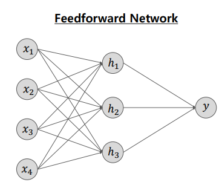
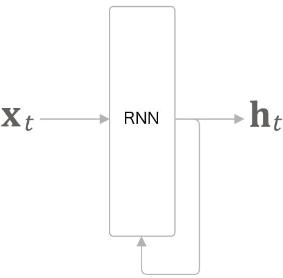
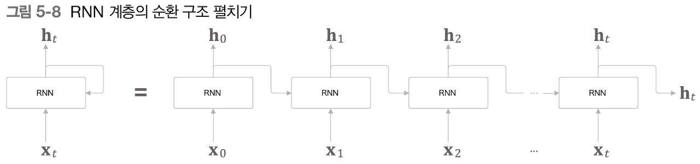
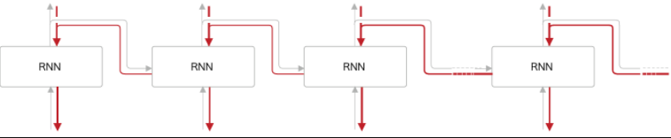
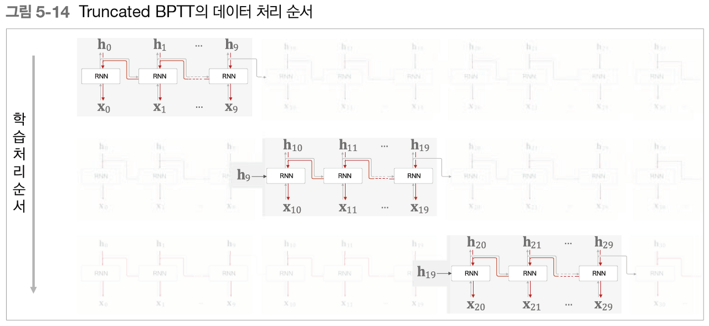
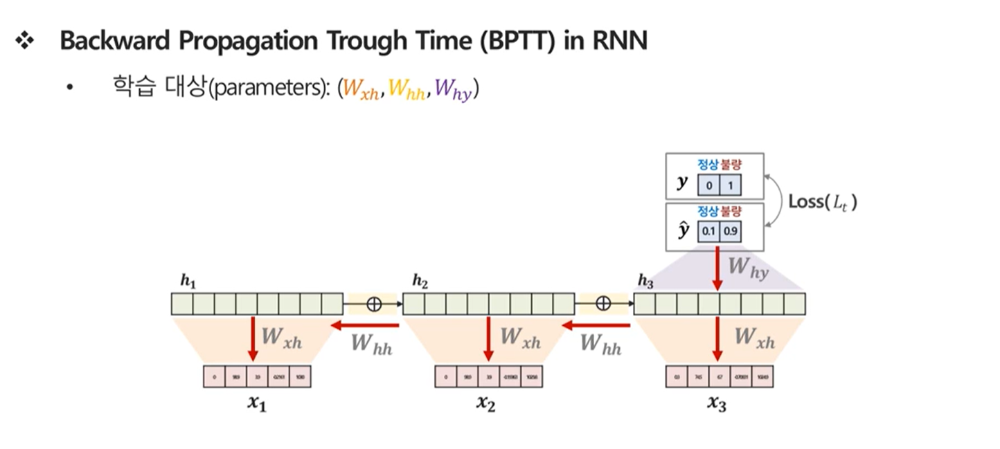
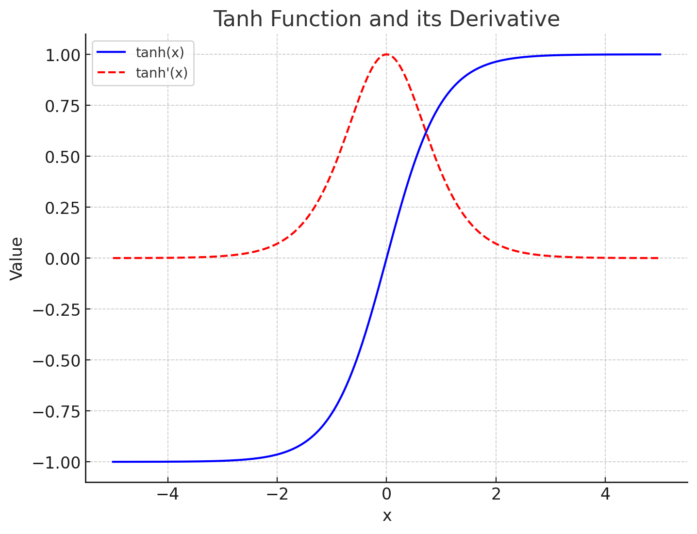
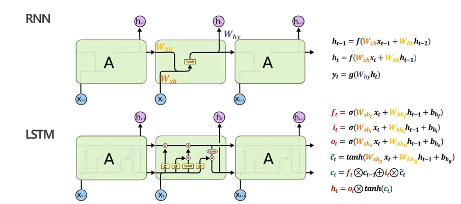
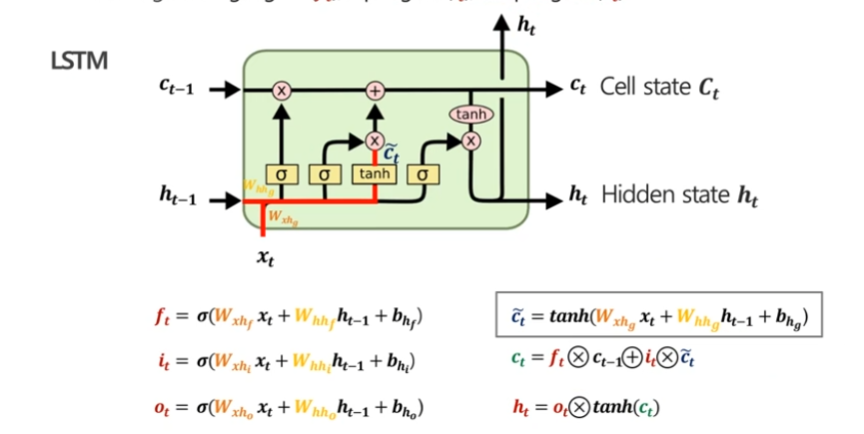
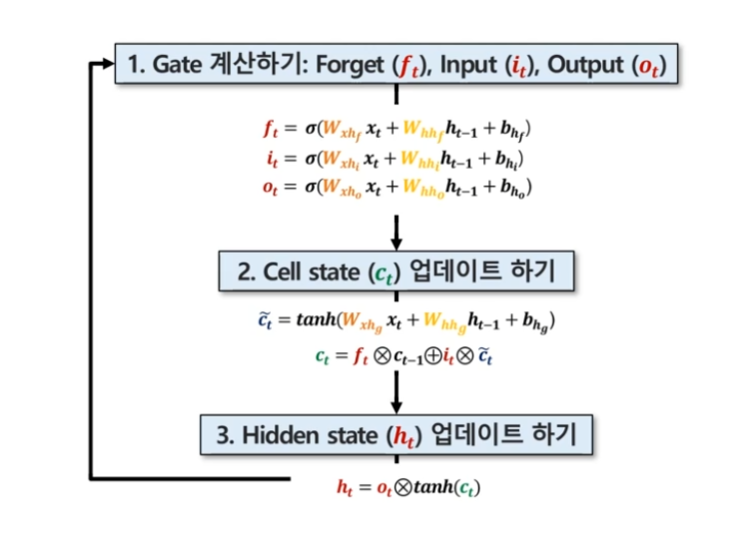

# 심화 RNN / LSTM Model

## RNN (Recurrent Neural Network)

### 등장배경

RNN은 피드포워드 신경망 (FeedForward Neural Network,FNN)에서 시계열 데이터의 성질(패턴,순서)을 충분히 학습 없기 때문에 등장하게 되었습니다.

#### FNN

피드 포워드 신경망은 우리가 알고 있는 가장 기본적인 형태의 신경망입니다. 입력층에서 시작해서 출력층까지 거치면서 각 노드들이 상호작용합니다. 

예시로는 MLP , CNN 등이 있습니다. 

$$
P(w_t | w_{t-1}) = \frac{P(w_{t-1}, w_t)}{P(w_{t-1})} = \frac{P(w_{t-1} \cap w_t)}{P(w_{t-1})}
$$

우리는 Bigram 모델에서 다음과 같은 조건부 확률 식을 배웠습니다. 이는 이전 단어 w_{t-1}로부터 현재 단어 $w_t$ 가 나타날 확률을 의미합니다.   
이걸 조금더 확장하면 ,

$$
P(w_t | w_{t-1}, w_{t+1}) = \frac{P(w_{t-1}, w_{t+1} | w_t) \cdot P(w_t)}{P(w_{t-1}, w_{t+1})} = \frac{P(w_t \cap w_{t-1} \cap w_{t+1})}{P(w_{t-1} \cap w_{t+1})}
$$

이는 중간에 있는 단어를 예측하는 CROW 모델입니다.

즉, 우리는 RNN이 없었던 때는 , 단순히 앞 , 뒤 단어를 통해서 중간에 있는 단어를 예측하거나, 앞의 2개의 단어를 통해서 다음 단어를 예측하는 등 고정된 범위의 단어만을 고려하기 때문에, 먼 문맥을 반영하지 못했습니다. Bigram 모델은 바로 이전 단어 하나만 고려하고 , 트라이그램 모델은 두 개의 앞 단어만 고려하므로, 긴 문맥을 파악하기 어려웠습니다.

**n-그램 모델의 한계**: n-그램 모델은 고정된 범위의 단어만 고려하기 때문에, 더 먼 문맥을 반영하지 못하고, 데이터가 부족할 경우 sparsity 문제가 발생합니다. 예를 들어, 빅람 모델은 바로 이전 단어 하나만 고려하고, 트라이그램 모델은 두 개의 앞 단어만 고려하므로, 긴 문맥을 파악하는 데는 한계가 있습니다.  

**장기 의존성 처리의 어려움**: n-그램 모델은 문맥을 고정된 크기만큼만 고려하기 때문에, 문장의 앞부분이나 멀리 떨어진 단어와의 관계를 잘 학습하지 못합니다.

### 언어 모델이 다루는 사후 확률

언어 모델은 t번째 단어를 타깃으로 하여 t번째보다 왼쪽 단어 모두를 맥락(조건)으로 고려한다  
이를 `조건부 언어 모델`이라고 한다.  

$$
P(w_1, w_2, \dots, w_{t-1}, w_t, \dots, w_m) = P(w_t | w_1, w_2, \dots, w_{t-1})
$$

이 수식에서, $w_{1}$부터 $w_{t}$ 까지 동시에 일어날 확률을 계산하면 곱해야 하기 때문에  동시 확률이다. 동시 확률은 사후 확률의 총곱으로 나타낼 수 있다. (Chain Rule)

$$
P(w_1, w_2, \dots, w_m) = \prod_{t=1}^{m} P(w_t | w_1, w_2, \dots, w_{t-1})
$$

#### bigram에 조건부 언어모델 적용

$$
P(w_1, w_2, \dots, w_t) = P(w_2 | w_1) \cdot P(w_3 | w_2) \cdot \dots \cdot P(w_t | w_{t-1}) =  \prod_{t=1}^{m} P(w_{t+1} | w_t)
$$
다음과 같이, 강제로 조건부 언어 모델을 만들 수 있다.  
ex) Tom was watching TV in his room. Mary came into the room. Marry said hi to [  ? ]  
위 문장에서 **?**에 해당하는 부분을 예측할 때, 문맥이 바로 앞의 단어까지만 고려된다고 가정하면, 모델은 to라는 정보만을 바탕으로 예측을 시도합니다. 하지만, 그 이전의 문맥, 즉 Tom이나 TV와 같은 정보는 전혀 고려되지 않습니다. 

따라서, 아무리 , 맥락이 길어지더라도, 이를 이해하기 위한 모델의 필요성이 생겨서 길어지는 맥락을 이해할 수 있는 RNN모델이 등장했다.  

### RNN이란?

**RNN(Recurrent Neural Network)** 를 직역하면 '순환하는 신경망'이다. 

RNN 계층은 위와 같이 표현됩니다. 그림과 같이 RNN 계층은 순환하는 경로를 포함합니다.  
 이 순환 경로를 따라 데이터를 계층 안에서 순환시킬 수 있습니다. 그림에서 $x_t$ 를 입력으로 받는데, t는 시각을 의미합니다. 이는 시계열 데이터가 RNN 계층에 입력됨을 표현한 것입니다. 그리고 그 입력에 대응하여 출력 $h_t$(h0, h1, h2 ...) 가 나옵니다. 또한, 각 시각에 입력되는 $x_t$ 는 벡터라고 가정합니다. 문장을 다루는 경우를 예로 든다면 각 단어의 분산 표현이 $x_t$ 가 되며, 이 분산 표현이 순서대로 하나씩 RNN 계층에 입력되는 것입니다.

더 자세히 순환 구조 펼쳐보기 

### RNN 계층의 수식

#### 1. 은닉 상태 계산

$$
h_t = f(W_{xh} x_t + W_{hh} h_{t-1} + b_h)
$$

여기서:     

- $ h_t $: 현재 시점 $t $에서의 **은닉 상태**.
- $ h_{t-1} $: 이전 시점 $t-1$에서의 **은닉 상태**.
- $ x_t $: 현재 시점 $ t $에서의 **입력**.
- $ W_{xh} $: 입력 $ x_t $와 은닉 상태 $ h_t $ 사이의 **가중치 행렬**.
- $ W_{hh} $: 이전 은닉 상태 $ h_{t-1} $와 현재 은닉 상태 $ h_t $ 사이의 **가중치 행렬**.
- $ b_h $: **편향**.
- $ f $: 활성화 함수(일반적으로 **tanh** 또는 **ReLU**).

#### 2. 출력 계산

$$
y_t = g(W_{hy} h_t + b_y)
$$

여기서:

- $y_t$: 현재 시점 $ t $에서의 **출력**.
- $ W_{hy} $: 은닉 상태 $ h_t $와 출력 $ y_t $ 사이의 **가중치 행렬**.
- $ b_y $: 출력에 대한 **편향**.
- $ g $: 출력에서 사용하는 활성화 함수(일반적으로 **softmax** 또는 **sigmoid**).

### BPTT (BackPropagation Through Time)

BPTT는 시간 방향으로 펼친 신경망의 오차역전파법 이라는 뜻입니다.

이 BPTT를 이용하여 RNN모델을 학습한다. 그러나 , 시간 크기가 커지면 역전파 시의 기울기가 불안정해지는 문제가 발생하고, 시간의 크기에 비례하여 컴퓨팅 자원도 증가한다. 

이 문제를 해결하기 위해 Truncated BPTT를 사용한다

### Truncated BPTT

Truncated BPTT는 시간축 방향으로 너무 길어진 신경망을 적당한 지점에서 잘라내어 작은 신경망을 여러개로 만든다. 그리고 잘라낸 작은 신경망에서 오차역전파법을 수행한다. 

> 예시  
>단어 1000개짜리 말뭉치를 이은다. 즉, 여러 문장들을 이어서 하나의 시계열 데이터로 취급함. 
근데 여기서 단어 하나하나가 하나의 계층(Layer)이기 때문에, 1000개의 계층이 만들어진다.
1000개의 계층을 BPTT를 하기에는 계산량과 메모리등이 문제가 된다. 

위 그림을 보면 RNN 계층을 길이 10개 단위로 학습할 수 있도록 역전파의 연결을 끊었습니다. 이처럼 역전파의 연결을 잘라버리면, 그보다 미래의 데이터에 대해서는 생각할 필요가 없어집니다. 따라서 각각의 블록 단위로, 미래의 블록과는 독립적으로 오차역전파법을 완결시킬 수 있습니다. 여기서 반드시 기억할 점은 역전파의 연결은 끊어지지만, 순전파의 연결은 끊어지지 않는다는 점입니다. 그러므로 RNN을 학습시킬 때는 순전파가 연결된다는 점을 고려해야 합니다. 즉 데이터를 순서대로 입력해야만 합니다.

# Chain rule을 활용한 Parameter 업데이트 

$$
\frac{\partial Loss}{\partial W_{hy}} = \frac{\partial L_t}{\partial \hat{y}_t} \times \frac{\partial \hat{y}_t}{\partial W_{hy} h_t} \times \frac{\partial W_{hy} h_t}{\partial W_{hy}}
$$

$$
\frac{\partial Loss}{\partial W_{hh}} =
\frac{\partial Loss}{\partial \hat{y}_t} \times \frac{\partial \hat{y}_t}{\partial h_3} \times \frac{\partial h_3}{\partial W_{hh}} +
\frac{\partial Loss}{\partial \hat{y}_t} \times \frac{\partial \hat{y}_t}{\partial h_3} \times \frac{\partial h_3}{\partial h_2} \times \frac{\partial h_2}{\partial W_{hh}} +
\frac{\partial Loss}{\partial \hat{y}_t} \times \frac{\partial \hat{y}_t}{\partial h_3} \times \frac{\partial h_3}{\partial h_2} \times \frac{\partial h_2}{\partial h_1} \times \frac{\partial h_1}{\partial W_{hh}}
$$
dd
$$
\frac{\partial Loss}{\partial W_{xh}} =
\frac{\partial Loss}{\partial \hat{y}_t} \times \frac{\partial \hat{y}_t}{\partial h_3} \times \frac{\partial h_3}{\partial W_{xh}} +
\frac{\partial Loss}{\partial \hat{y}_t} \times \frac{\partial \hat{y}_t}{\partial h_3} \times \frac{\partial h_3}{\partial h_2} \times \frac{\partial h_2}{\partial W_{xh}} +
\frac{\partial Loss}{\partial \hat{y}_t} \times \frac{\partial \hat{y}_t}{\partial h_3} \times \frac{\partial h_3}{\partial h_2} \times \frac{\partial h_2}{\partial h_1} \times \frac{\partial h_1}{\partial W_{xh}}
$$

$$
W_{hy} \text{의 기여도} = \frac{\partial Loss}{\partial W_{hy}} \\
\Rightarrow W_{hy}^{new} = W_{hy}^{old} - \eta \cdot \frac{\partial Loss}{\partial W_{hy}}
$$

$$
W_{hh} \text{의 기여도} = \frac{\partial Loss}{\partial W_{hh}} \\
\Rightarrow W_{hh}^{new} = W_{hh}^{old} - \eta \cdot \frac{\partial Loss}{\partial W_{hh}}
$$

$$
W_{xh} \text{의 기여도} = \frac{\partial Loss}{\partial W_{xh}} \\
\Rightarrow W_{xh}^{new} = W_{xh}^{old} - \eta \cdot \frac{\partial Loss}{\partial W_{xh}}
$$

## LSTM 
### LSTM 등장배경 
LSTM은 RNN(Recurrent Neural Network)의 한계점을 극복하기 위해 개발된 모델입니다. RNN의 주요 문제점인 **장기 의존성 문제**와 기울기 소실 문제를 해결하기 위해 고안되었습니다.

$$
W_{hh}^{new} = W_{hh}^{old} - \eta \times \left( \frac{\partial \text{Loss}}{\partial \hat{y}_t} \times \frac{\partial \hat{y}_t}{\partial h_{t00}} \times \frac{\partial h_{t00}}{\partial W_{hh}} + \dots + \frac{\partial \text{Loss}}{\partial \hat{y}_t} \times \frac{\partial \hat{y}_t}{\partial h_{t00}} \times \frac{\partial h_{t00}}{\partial h_{t09}} \times \dots \times \frac{\partial h_{t2}}{\partial h_{t1}} \times \frac{\partial h_{t1}}{\partial W_{hh}} \right)
$$

## LSTM의 구조

LSTM은 기존 RNN에 없던 몇 가지 핵심 개념을 도입했습니다:

1. **셀 스테이트 (Cell State)**: 정보를 장기적으로 유지하는 역할을 합니다.(Cell vetor라고 부를 때도 있음. )
2. **세 가지 게이트**:
   - **포겟 게이트 (Forget Gate)**: 어떤 정보를 버릴지 결정합니다.
   - **인풋 게이트 (Input Gate)**: 어떤 새로운 정보를 저장할지 결정합니다.
   - **아웃풋 게이트 (Output Gate)**: 어떤 정보를 출력으로 내보낼지 결정합니다.

## LSTM의 수식

LSTM의 핵심 수식은 다음과 같습니다:

- 포겟 게이트:  
  $f_t = \sigma(W_{xhf} \cdot x_t + W_{hhf} \cdot h_{t-1} + b_f)$

- 인풋 게이트:  
  $i_t = \sigma(W_{xhi} \cdot x_t + W_{hhi} \cdot h_{t-1} + b_i)$

- 아웃풋 게이트:   
  $o_t = \sigma(W_{xho} \cdot x_t + W_{hho} \cdot h_{t-1} + b_o)$

- 셀 스테이트 후보:  
  $\tilde{C}_t = \tanh(W_{xhg} \cdot x_t + W_{hhg} \cdot h_{t-1} + b_g)$

- 셀 스테이트 업데이트:   
  $C_t = f_t \odot C_{t-1} + i_t \odot \tilde{C}_t$

- 히든 스테이트:  
  $h_t = o_t \odot \tanh(C_t)$  
여기서 σ는 시그모이드 함수, tanh는 하이퍼볼릭 탄젠트 함수를 나타냅니다.

## LSTM의 작동 원리

1. **포겟 게이트**: 
   - 이전 정보 중 어떤 것을 버릴지 결정합니다. 
   - 0과 1 사이의 값을 출력하며, 1에 가까울수록 정보를 유지하고 0에 가까울수록 정보를 버립니다.
   - 수식: $f_t = \sigma(W_{xhf} \cdot x_t + W_{hhf} \cdot h_{t-1} + b_f)$

2. **인풋 게이트**: 
   - 새로운 정보 중 어떤 것을 셀 스테이트에 저장할지 결정합니다.
   - 두 단계로 구성됩니다:
     a) 시그모이드 층: 어떤 값을 업데이트할지 결정
     b) tanh 층: 새로운 후보 값 벡터 생성
   - 수식: 
     $i_t = \sigma(W_{xhi} \cdot x_t + W_{hhi} \cdot h_{t-1} + b_i)$

3. **셀 스테이트 업데이트**: 
   - 포겟 게이트와 인풋 게이트의 결과를 바탕으로 셀 스테이트를 업데이트합니다. 
   - 이 과정에서 장기 기억이 유지됩니다.
   - 수식: $C_t = f_t \odot C_{t-1} + i_t \odot \tilde{C}_t$

4. **아웃풋 게이트**: 
   - 업데이트된 셀 스테이트 중 어떤 부분을 출력으로 내보낼지 결정합니다.
   - 수식:
      $o_t = \sigma(W_{xho} \cdot x_t + W_{hho} \cdot h_{t-1} + b_o)$

## LSTM vs RNN

LSTM은 RNN과 달리 셀 스테이트를 통해 정보를 장기간 유지할 수 있습니다. 또한, 게이트 메커니즘을 통해 정보의 흐름을 제어함으로써 기울기 소실 문제를 완화합니다.

## LSTM의 장점

1. 장기 의존성 문제 해결
2. 기울기 소실 문제 완화
3. 선택적 정보 유지 및 갱신 가능

## 결론
LSTM은 RNN의 한계를 극복하고 장기 의존성을 효과적으로 처리할 수 있는 강력한 모델입니다. 복잡한 구조에도 불구하고 다양한 시퀀스 데이터 처리 작업에서 우수한 성능을 보여주고 있습니다.

#### 용어 풀이 

시퀀스 데이터란?  
시퀀스 데이터는 연관된 연속(순서가 있는)의 데이터를 지칭하며 소리, 문자열, 주가 등의 데이터를 나타낸다.

  
은닉층(hidden layer)  -> 책이나 논문에서 $h(x)$ 로 많이 활용  
목적: 은닉층은 입력 데이터를 변환하고, 중간 계산을 수행하는 역할을 합니다. 입력층에서 받은 데이터를 여러 차례의 변환을 거쳐, 출력층에서 원하는 결과를 만들 수 있도록 돕습니다.  
출력: 은닉층의 출력은 다음 은닉층이나 출력층에 전달되는 값입니다. 즉, 외부로 직접적으로 나타나지 않고, 신경망 내부에서만 사용됩니다.  
활성화 함수: 보통 비선형 활성화 함수(예: ReLU, tanh)를 사용하여 복잡한 패턴을 학습할 수 있도록 합니다. 은닉층의 활성화 함수는 신경망이 선형적이지 않은 변환을 학습할 수 있게 해줍니다.  
기능: 데이터의 특징을 추출하고, 패턴을 찾아내며, 입력 데이터를 고차원 공간으로 변환합니다. 신경망이 복잡한 문제를 풀 수 있게 해주는 핵심 역할을 합니다.  

출력층(output layer)  
목적: 출력층은 은닉층에서 전달된 최종 정보를 기반으로 예측 결과를 제공합니다. 이는 신경망이 풀고자 하는 문제의 답(예: 분류 결과, 회귀값 등)을 결정하는 역할을 합니다.  
출력: 출력층의 값은 최종 결과로, 신경망이 학습한 결과를 외부에 전달합니다. 예를 들어, 분류 문제라면 각 클래스에 속할 확률이나 예측된 클래스를 출력하게 됩니다.  
활성화 함수: 출력층의 활성화 함수는 문제의 유형에 따라 다릅니다.  
분류 문제: softmax (다중 클래스 분류)나 sigmoid (이진 분류)가 주로 사용됩니다.  
회귀 문제: 활성화 함수 없이 선형 출력(예: identity function)을 사용하는 경우가 많습니다.
기능: 출력층은 예측된 값을 전달하고, 이 값은 손실 함수(예: 크로스엔트로피, 평균제곱오차)와 비교되어 모델의 성능을 평가하고 학습하는 데 사용됩니다.  

활성화 함수(activition function ) 정리 

| 층     | 활성화 함수 | 용도 및 설명                                                     | 수식                                      |
|--------|-------------|------------------------------------------------------------------|-------------------------------------------|
| 출력층 | 시그모이드   | 이진 분류에서 0과 1 사이 확률을 출력                              | $$ f(x) = \frac{1}{1 + e^{-x}} $$         |
|        | 소프트맥스   | 다중 클래스 분류에서 각 클래스에 속할 확률을 출력, 합이 1이 됨     | $$ f(x_i) = \frac{e^{x_i}}{\sum_{j} e^{x_j}} $$ |
|        | 항등 함수    | 회귀 문제에서 연속적인 값을 출력, 값이 그대로 출력됨               | $$ f(x) = x $$                            |
| 은닉층 | ReLU        | 0보다 큰 값을 그대로 출력, 0보다 작은 값을 0으로 출력             | $$ f(x) = \max(0, x) $$                   |
|        | tanh        | 입력을 -1에서 1 사이로 변환, 중간 값이 0이므로 학습에서 더 균형적   | $$ f(x) = \tanh(x) $$                     |
|        | 시그모이드   | 0과 1 사이로 변환, 깊은 신경망에서는 잘 사용되지 않음             | $$ f(x) = \frac{1}{1 + e^{-x}} $$         |

**Sigmoid VS tanh**

