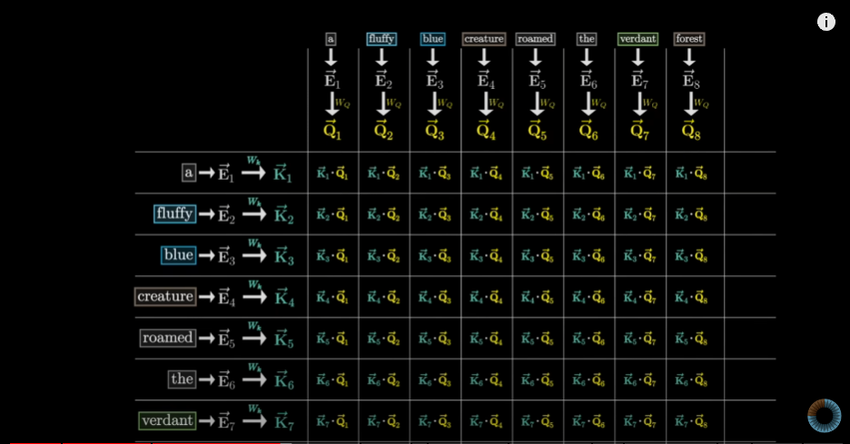
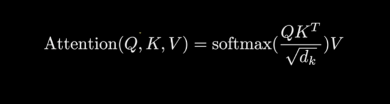
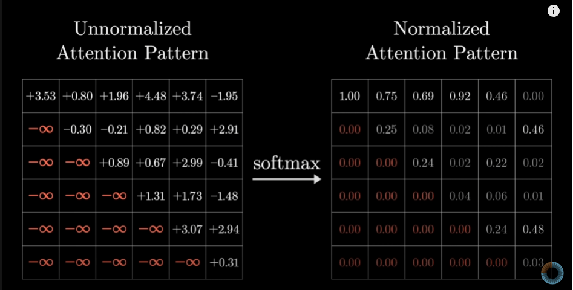
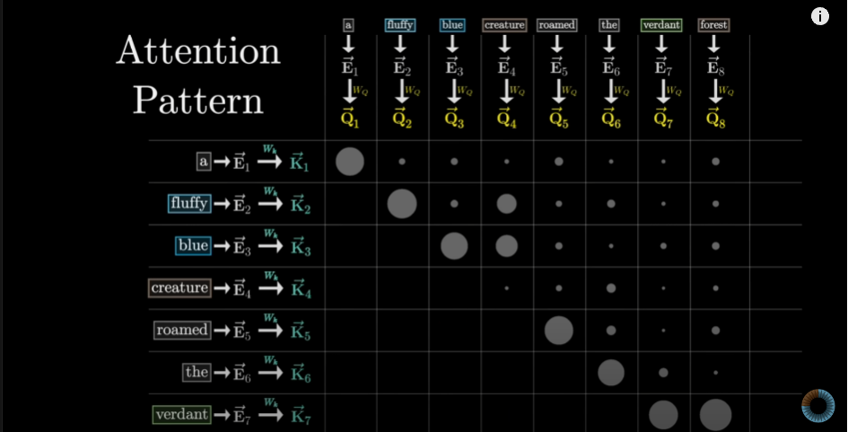

# But what is a GPT? Visual intro to transformers | Chapter 5, Deep Learning

## URL 

https://www.youtube.com/watch?v=wjZofJX0v4M

https://www.youtube.com/watch?v=eMlx5fFNoYc


## Predict, sample , repeat

### GPT의 정의와 구조

- GPT: Generative Pre-trained Transformer의 약자
  - Generative: 새로운 텍스트를 생성하는 봇
  - Pre-trained: 대량의 데이터로 사전 학습됨
  - Transformer: 특정 유형의 신경망, 현재 AI 붐의 핵심 발명품

### Transformer의 다양한 응용

- 텍스트 생성
- 음성-텍스트 변환 및 그 반대
- 텍스트 기반 이미지 생성 (DALL-E, Midjourney 등)
- 언어 간 번역 (원래 Google이 2017년에 개발)

### GPT의 작동 원리

1. 텍스트 입력 받음 (이미지나 소리도 가능)
2. 다음에 올 텍스트에 대한 확률 분포 예측
3. 예측된 분포에서 무작위로 샘플링하여 새 텍스트 생성
4. 생성된 텍스트를 기존 텍스트에 추가
5. 전체 과정을 반복하여 긴 텍스트 생성

### GPT 모델의 발전

- GPT-2: 초기 모델, 간단한 텍스트 생성 가능
- GPT-3: 더 큰 규모, 더 정교한 텍스트 생성 가능

### Transformer의 내부 구조

1. 입력을 작은 조각(토큰)으로 분할
2. 각 토큰을 벡터로 변환 (임베딩)
3. 어텐션 블록을 통과: 벡터들이 서로 "대화"하며 정보 교환
4. 다층 퍼셉트론(MLP) 블록 통과: 각 벡터에 대한 개별 처리
5. 어텐션과 MLP 블록을 여러 번 반복
6. 최종 벡터로 다음 토큰 예측

### 주요 개념

- 컨텍스트 크기: 한 번에 처리할 수 있는 토큰의 수 (GPT-3는 2048)
- 소프트맥스 함수: 로짓을 확률 분포로 변환
- 온도(temperature): 텍스트 생성의 무작위성 조절

### 학습 방법

- 대규모 데이터로 사전 학습
- 특정 작업에 대해 추가 학습(파인튜닝) 가능


## Transformer의 내부 구조 상세 설명

### 1. 입력 처리
- **토큰화 (Tokenization)**
  - 입력 텍스트를 작은 단위(토큰)로 분할
  - 단어, 서브워드, 또는 문자 수준의 토큰화 가능
  - 예: "Hello, world!" → ["Hello", ",", "world", "!"]

- **임베딩 (Embedding)**
  - 각 토큰을 고정된 길이의 벡터로 변환
  - 일반적으로 256에서 1024 차원의 벡터 사용
  - 학습 가능한 파라미터로, 모델 훈련 중 최적화됨

### 2. Transformer 블록의 주요 구성 요소

#### a. 어텐션 블록 (Attention Block)
- **목적**: 각 토큰이 다른 모든 토큰과 어떻게 관련되는지 계산
- **작동 원리**:
  1. 각 토큰 벡터로부터 Query, Key, Value 벡터 생성
  2. Query와 Key의 내적을 통해 어텐션 점수 계산
  3. 점수를 정규화하고 Value에 가중치로 적용
- **멀티헤드 어텐션**:
  - 여러 개의 어텐션 메커니즘을 병렬로 실행
  - 다양한 관점에서 토큰 간 관계 포착 가능

#### b. 다층 퍼셉트론 (MLP) 블록
- **구조**: 일반적으로 2개의 선형 층과 활성화 함수로 구성
- **목적**: 
  - 비선형성 추가
  - 각 토큰의 표현을 개별적으로 변환
- **활성화 함수**: ReLU 또는 GELU 주로 사용

### 3. 처리 과정
1. 임베딩된 입력 벡터들이 어텐션 블록 통과
2. 어텐션 블록의 출력에 잔차 연결(residual connection) 적용
3. 레이어 정규화(layer normalization) 적용
4. 정규화된 출력이 MLP 블록 통과
5. MLP 블록의 출력에 다시 잔차 연결과 레이어 정규화 적용
6. 이 과정을 여러 번 반복 (보통 6~24개의 레이어)

### 4. 최종 출력 생성
- 마지막 레이어의 출력 벡터를 언임베딩(unembedding) 과정을 통해 변환
- 변환된 벡터를 어휘 크기의 로짓(logits)으로 해석
- 소프트맥스 함수를 적용하여 다음 토큰에 대한 확률 분포 생성

### 5. 주요 특징 및 개념
- **컨텍스트 크기 (Context Size)**
  - 한 번에 처리할 수 있는 최대 토큰 수
  - 모델의 메모리 요구사항과 직접적으로 연관
  - 예: GPT-3는 2048 토큰, 일부 최신 모델은 8192 토큰 이상 처리 가능

- **잔차 연결 (Residual Connections)**
  - 각 서브블록의 입력을 출력에 더함
  - 그래디언트 소실 문제 완화 및 학습 안정화

- **레이어 정규화 (Layer Normalization)**
  - 각 레이어의 출력을 정규화하여 학습 안정화
  - 배치 간 변동성 감소 및 수렴 속도 향상

- **위치 인코딩 (Positional Encoding)**
  - 토큰의 순서 정보를 모델에 제공
  - 사인/코사인 함수 또는 학습 가능한 임베딩 사용

### 6. 스케일링 및 성능
- 더 큰 모델은 더 많은 레이어, 더 큰 차원의 벡터, 더 많은 어텐션 헤드 사용
- 파라미터 수 증가에 따라 성능 향상, 그러나 계산 비용도 증가
- 모델 크기, 학습 데이터, 컴퓨팅 리소스 간의 균형 필요


## Chapter layout


### 1. 임베딩(Embeddings)
- **정의**: 단어나 토큰을 고정된 길이의 벡터로 변환하는 과정
- **목적**: 
  - 텍스트 데이터를 신경망이 처리할 수 있는 수치 형태로 변환
  - 단어 간의 의미론적 관계를 수학적으로 표현
- **주요 내용**:
  - 단어 임베딩의 기본 원리
  - 단어 벡터 간의 연산과 그 의미 (예: king - man + woman ≈ queen)
  - 서브워드 토크나이제이션 기법
  - 위치 인코딩(positional encoding)의 중요성과 구현 방법

### 2. 어텐션(Attention)
- **정의**: 입력 시퀀스의 각 요소가 다른 요소들과 어떻게 관련되는지 계산하는 메커니즘
- **목적**: 
  - 장거리 의존성 문제 해결
  - 입력 시퀀스의 중요한 부분에 집중할 수 있게 함
- **주요 내용**:
  - 셀프 어텐션(self-attention)의 작동 원리
  - 쿼리(Query), 키(Key), 밸류(Value) 개념 설명
  - 멀티헤드 어텐션(multi-head attention)의 구조와 이점
  - 어텐션 가중치 시각화 및 해석 방법

### 3. 다층 퍼셉트론(Multi-Layer Perceptron, MLP)
- **정의**: 여러 층의 뉴런으로 구성된 전방향(feedforward) 신경망
- **목적**: 
  - 비선형성 도입을 통한 모델의 표현력 증가
  - 복잡한 패턴 학습 능력 향상
- **주요 내용**:
  - MLP의 기본 구조와 각 층의 역할
  - 활성화 함수(ReLU, GELU 등)의 중요성과 선택 기준
  - 드롭아웃(dropout)과 같은 정규화 기법
  - Transformer에서 MLP 블록의 위치와 기능

### 4. 트레이닝(Training)
- **정의**: 모델의 파라미터를 최적화하여 원하는 작업을 수행할 수 있도록 하는 과정
- **목적**: 
  - 대규모 데이터셋을 사용하여 모델의 성능 향상
  - 과적합 방지와 일반화 능력 개선
- **주요 내용**:
  - 손실 함수 선택과 그 의미 (예: 교차 엔트로피)
  - 역전파 알고리즘의 상세한 작동 원리
  - 최적화 알고리즘 (Adam, AdamW 등)의 비교와 선택 기준
  - 학습률 스케줄링과 웜업(warmup) 전략
  - 배치 정규화(batch normalization)와 레이어 정규화(layer normalization)의 차이
  - 전이 학습(transfer learning)과 파인튜닝(fine-tuning) 기법

### 접근 방식 및 특징
- 각 챕터는 독립적으로 이해할 수 있지만, 순차적 학습을 통해 전체 아키텍처의 흐름 파악 가능
- 복잡한 수학적 개념을 직관적인 시각화와 비유를 통해 설명
- 실제 구현 코드보다는 핵심 아이디어와 원리에 초점
- 각 개념의 역사적 배경과 발전 과정도 함께 소개
- 실제 응용 사례와 최신 연구 동향을 포함하여 실용적 이해 도모

이 상세한 구조는 Transformer의 각 구성 요소를 깊이 있게 다루며, 학습자가 전체 시스템의 작동 원리를 체계적으로 이해할 수 있도록 돕습니다.


### 딥러닝의 전제 (The Premise of Deep Learning)

### 1. 딥러닝의 기본 개념

- **정의**: 여러 층의 인공 신경망을 사용하여 데이터로부터 패턴을 학습하는 기계학습의 한 분야
- **목적**: 복잡한 비선형 관계를 모델링하고 고차원 데이터에서 유용한 특징을 자동으로 추출

### 2. 신경망의 구조

- **뉴런 (Neuron)**:
  - 생물학적 뉴런에서 영감을 받은 기본 계산 단위
  - 입력값들의 가중합을 계산하고 활성화 함수를 통과시킴

- **층 (Layer)**:
  - 여러 뉴런의 집합
  - 입력층, 은닉층, 출력층으로 구성

- **가중치 (Weights)와 편향 (Biases)**:
  - 네트워크의 학습 가능한 파라미터
  - 입력 데이터의 중요도를 조절하는 역할

### 3. 딥러닝의 핵심 아이디어

- **표현 학습 (Representation Learning)**:
  - 원시 데이터로부터 유용한 특징을 자동으로 학습
  - 수동으로 특징을 설계할 필요 없이 데이터 자체에서 학습

- **계층적 특징 추출**:
  - 낮은 층에서는 간단한 특징을, 높은 층에서는 복잡한 특징을 학습
  - 예: 이미지 인식에서 에지 → 텍스처 → 물체 부분 → 전체 물체

- **end-to-end 학습**:
  - 입력부터 출력까지 모든 처리 단계를 통합적으로 최적화
  - 중간 단계의 수동 조정 없이 전체 파이프라인을 학습

### 4. 학습 과정

- **순전파 (Forward Propagation)**:
  - 입력 데이터를 네트워크의 각 층을 통과시켜 예측 생성

- **역전파 (Backpropagation)**:
  - 예측과 실제 값의 차이(오차)를 사용해 가중치 조정
  - 경사 하강법을 통해 손실 함수를 최소화

- **최적화 알고리즘**:
  - SGD(Stochastic Gradient Descent), Adam, RMSprop 등
  - 학습률, 모멘텀 등의 하이퍼파라미터 조정 필요

### 5. 딥러닝의 강점

- **비선형성 모델링**: 복잡한 패턴과 관계를 포착 가능
- **확장성**: 더 많은 데이터와 더 큰 모델로 성능 향상
- **전이 학습**: 사전 학습된 모델을 다른 작업에 적용 가능

### 6. 딥러닝의 도전 과제

- **대량의 데이터 필요**: 과적합 방지와 일반화를 위해 많은 데이터 요구
- **계산 비용**: 대규모 모델 학습에 많은 컴퓨팅 리소스 필요
- **해석 가능성**: 모델의 결정 과정을 이해하기 어려움 (블랙박스 문제)

### 7. Transformer와 딥러닝

- Transformer는 딥러닝의 원리를 자연어 처리에 적용한 혁신적 모델
- 어텐션 메커니즘을 통해 장거리 의존성 문제 해결
- 대규모 언어 모델(예: GPT, BERT)의 기반이 됨

### 8. 미래 전망

- 모델 효율성 향상: 더 적은 데이터와 계산으로 높은 성능 달성
- 다중 모달 학습: 텍스트, 이미지, 음성 등 다양한 데이터 유형 통합
- 윤리적 AI: 편향 감소, 공정성 향상, 해석 가능성 개선에 중점


## 단어 임베딩 (Word Embeddings)

### 1. 단어 임베딩의 정의
- 단어를 고정된 길이의 실수 벡터로 표현하는 기법
- 목적: 단어의 의미와 관계를 수치적으로 표현

### 2. 임베딩의 필요성
- 컴퓨터가 텍스트를 이해하고 처리할 수 있도록 변환
- 단어 간의 의미적, 문법적 관계를 수학적으로 포착

### 3. 임베딩의 특성
- **차원**: 일반적으로 50~300차원 사용, 모델 크기에 따라 더 큰 차원도 가능
- **밀집 표현**: 모든 차원에 의미 있는 값을 가짐 (원-핫 인코딩과 대조적)
- **연속성**: 유사한 단어는 벡터 공간에서 가까이 위치

### 4. 임베딩 생성 방법
- **Word2Vec**: 
  - CBOW(Continuous Bag of Words)와 Skip-gram 모델 사용
  - 주변 단어를 통해 중심 단어 예측, 또는 그 반대
- **GloVe (Global Vectors)**:
  - 전체 말뭉치의 동시 출현 통계를 활용
- **FastText**:
  - 서브워드 정보를 활용하여 미등록 단어 처리 가능
- **BERT, GPT 등 사전 학습 모델**:
  - 대규모 언어 모델의 중간 층 출력을 임베딩으로 사용

### 5. 임베딩의 특징과 장점
- **의미적 유사성 포착**: 
  - 유사한 의미의 단어들은 벡터 공간에서 가까이 위치
  - 예: "king"과 "queen"의 벡터 거리가 가까움
- **유추 관계 표현**:
  - 벡터 연산을 통해 단어 간 관계 표현 가능
  - 예: vec("king") - vec("man") + vec("woman") ≈ vec("queen")
- **다차원 의미 표현**:
  - 단어의 여러 의미나 특성을 다른 차원에 분산하여 표현

### 6. 임베딩 학습 과정
1. 대규모 텍스트 데이터 수집
2. 단어 또는 서브워드 토큰화
3. 학습 알고리즘 선택 (예: Skip-gram)
4. 목적 함수 최적화 (예: 네거티브 샘플링)
5. 반복적인 학습을 통해 임베딩 벡터 조정

### 7. 임베딩의 시각화
- t-SNE, PCA 등의 차원 축소 기법 사용
- 2D 또는 3D 공간에 단어들을 배치하여 관계 시각화

### 8. 임베딩의 평가
- **내재적 평가**: 
  - 단어 유사도 테스트, 유추 문제 해결 능력 측정
- **외재적 평가**: 
  - 실제 NLP 작업(분류, 번역 등)에서의 성능 평가

### 9. 컨텍스트 기반 임베딩
- BERT, ELMo 등의 모델에서 사용
- 단어의 문맥에 따라 동적으로 임베딩 생성
- 다의어 처리에 효과적

### 10. 임베딩의 한계와 주의점
- 편향(bias) 문제: 학습 데이터의 편향이 임베딩에 반영될 수 있음
- 문화적, 시간적 특성: 특정 시기나 문화권의 언어 사용을 반영
- 지속적인 업데이트 필요: 언어 사용의 변화를 반영하기 위해

### 11. Transformer에서의 임베딩
- 입력 토큰을 임베딩 벡터로 변환하는 첫 단계
- 위치 정보를 추가하기 위해 위치 인코딩과 결합

### 12. 미래 전망
- 다국어, 다중 모달 임베딩 발전
- 더 효율적이고 압축된 임베딩 기법 연구
- 편향 감소와 공정성 향상을 위한 연구

## Unembedding 

### 1. 언임베딩의 정의
- 임베딩 벡터를 다시 단어 또는 토큰 확률 분포로 변환하는 과정
- Transformer 모델의 출력 단계에서 중요한 역할 수행

### 2. 언임베딩의 목적
- 모델의 내부 표현(벡터)을 사람이 이해할 수 있는 형태(단어/토큰)로 변환
- 다음 토큰 예측을 위한 확률 분포 생성

### 3. 언임베딩 레이어의 구조
- 일반적으로 선형 변환(linear transformation) 사용
- 입력 차원: 모델의 은닉 상태 차원 (예: 768, 1024)
- 출력 차원: 어휘 크기 (예: 30,000, 50,000)

### 4. 언임베딩 과정
1. 모델의 최종 은닉 상태 벡터 입력 받음
2. 언임베딩 가중치 행렬과 행렬 곱 수행
3. 결과로 어휘 크기의 로짓(logits) 벡터 생성
4. (선택적) 소프트맥스 함수 적용하여 확률 분포로 변환

### 5. 수학적 표현
- 언임베딩: y = Wx + b
  - y: 출력 로짓 벡터 (어휘 크기)
  - W: 언임베딩 가중치 행렬
  - x: 입력 은닉 상태 벡터
  - b: 편향 (bias) 벡터

### 6. 가중치 공유 (Weight Tying)
- 임베딩 레이어와 언임베딩 레이어의 가중치를 공유하는 기법
- 장점:
  - 파라미터 수 감소 (메모리 효율성)
  - 일반화 성능 향상
  - 학습 안정성 개선
- 구현: 언임베딩 가중치 행렬을 임베딩 행렬의 전치(transpose)로 설정

### 7. 언임베딩의 중요성
- 모델의 예측을 해석 가능한 형태로 변환
- 다음 토큰 생성을 위한 핵심 단계
- 모델의 전체 성능에 직접적인 영향

### 8. 언임베딩과 온도 조절 (Temperature Scaling)
- 언임베딩 후 생성된 로짓에 온도 파라미터 적용
- 출력 분포의 엔트로피(다양성) 조절 가능
- 낮은 온도: 더 확실한(sharp) 분포, 높은 온도: 더 균일한 분포

### 9. 대규모 언어 모델에서의 언임베딩
- GPT, BERT 등의 모델에서 핵심 컴포넌트
- 어휘 크기가 매우 큰 경우 (50,000 이상) 계산 비용 증가
- 효율적인 구현 기법 필요 (예: 적응형 소프트맥스)

### 10. 언임베딩의 최적화 기법
- 희소 행렬 연산 활용
- GPU 가속을 위한 최적화된 CUDA 커널 사용
- 양자화(Quantization) 기법 적용하여 메모리 사용량 감소

### 11. 언임베딩의 평가
- 퍼플렉서티(Perplexity) 측정을 통한 모델 성능 평가
- 생성된 텍스트의 품질과 다양성 분석

### 12. 언임베딩의 도전 과제
- 대규모 어휘에 대한 효율적인 처리
- 희귀 단어나 미등록 단어(OOV) 처리
- 다국어 모델에서의 언어 간 균형 유지

### 13. 미래 연구 방향
- 더 효율적인 언임베딩 아키텍처 개발
- 문맥에 따른 동적 언임베딩 기법
- 멀티모달 출력을 위한 확장된 언임베딩 방법

이 정리는 언임베딩의 개념, 구조, 중요성, 구현 방법, 그리고 관련된 다양한 측면을 포괄적으로 다루고 있습니다. 학습 시 참고하기에 충분한 세부 정보를 포함하고 있으며, 언임베딩에 대한 깊이 있는 이해를 제공합니다.


## Softmax with Temperature (온도 조절 소프트맥스)

### 1. 기본 개념
- 소프트맥스 함수에 온도 파라미터를 추가한 변형
- 목적: 출력 확률 분포의 '날카로움(sharpness)' 또는 '부드러움(smoothness)' 조절

### 2. 수학적 정의
- 기본 소프트맥스: $\text{softmax}(x_i) = \frac{e^{x_i}}{\sum_j e^{x_j}}$
- 온도 조절 소프트맥스: $\text{softmax}(x_i, T) = \frac{e^{x_i/T}}{\sum_j e^{x_j/T}}$
  - $T$: 온도 파라미터
  - $x_i$: i번째 로짓 값

### 3. 온도 파라미터의 영향
- $T < 1$: 분포가 더 날카로워짐 (높은 확률값은 더 높아지고, 낮은 확률값은 더 낮아짐)
- $T = 1$: 기본 소프트맥스와 동일
- $T > 1$: 분포가 더 부드러워짐 (확률값들이 서로 비슷해짐)
- $T \to 0$: 극단적으로 날카로워져 argmax 함수와 유사해짐
- $T \to \infty$: 균일 분포에 가까워짐

### 4. 사용 목적
- **텍스트 생성의 다양성 조절**:
  - 낮은 온도: 더 예측 가능하고 일관된 출력
  - 높은 온도: 더 다양하고 창의적인 출력
- **모델 캘리브레이션**: 모델의 신뢰도 조정
- **지식 증류(Knowledge Distillation)**: 큰 모델의 '소프트' 출력을 작은 모델로 전달

### 5. 구현 방법
```python
def softmax_with_temperature(logits, temperature):
    logits = logits / temperature
    exp_logits = np.exp(logits)
    return exp_logits / np.sum(exp_logits)
```

### 6. 텍스트 생성에서의 응용
- **그리디 탐색(Greedy Search)**: T ≈ 0, 항상 가장 높은 확률의 토큰 선택
- **빔 서치(Beam Search)**: 낮은 T 값 사용, 상위 k개의 가능성 유지
- **랜덤 샘플링**: T > 0, 확률에 따라 다음 토큰 무작위 선택
- **Top-k 샘플링**: 상위 k개 토큰 중에서만 샘플링
- **Nucleus (Top-p) 샘플링**: 누적 확률이 p를 넘는 최소 집합에서 샘플링

### 7. 온도 선택의 중요성
- 태스크와 요구사항에 따라 적절한 온도 선택 필요
- 일반적으로 0.5 ~ 1.5 범위의 값 사용
- 실험을 통한 최적 온도 탐색 권장

### 8. 장단점
- **장점**:
  - 출력의 다양성과 품질 간 균형 조절 가능
  - 모델 동작의 유연성 증가
- **단점**:
  - 추가적인 하이퍼파라미터 조정 필요
  - 부적절한 온도 설정 시 성능 저하 가능

### 9. 고급 기법
- **동적 온도 조절**: 문맥에 따라 온도를 자동으로 조정
- **앙상블 방법**: 여러 온도 설정의 결과를 조합
- **적응형 온도 스케줄링**: 생성 과정에서 온도를 점진적으로 변경

### 10. 연구 동향
- 최적의 온도 자동 선택 알고리즘 개발
- 다중 온도 레이어: 모델의 각 층에 다른 온도 적용
- 태스크 특화 온도 조절 전략 연구

### 11. 실제 적용 사례
- OpenAI의 GPT 모델: 텍스트 생성의 창의성 조절
- 구글의 BERT: 파인튜닝 단계에서의 지식 전달
- 챗봇 시스템: 응답의 다양성과 적절성 균형 유지

### 12. 주의사항
- 과도하게 높은 온도: 무의미한 텍스트 생성 위험
- 과도하게 낮은 온도: 반복적이고 단조로운 출력 위험
- 모델 평가 시 온도 설정 명시 필요


# 주의력, 트랜스포머의 마음 시각화하기 | 6장, 딥 러닝


## Recap on embeddings

1. 트랜스포머 모델의 목표
   - 텍스트 조각을 입력받아 다음에 올 단어를 예측하는 것

2. 토큰 (Token)
   - 입력 텍스트를 작은 조각으로 나눈 것
   - 일반적으로 단어나 단어의 일부
   - 이 비디오에서는 이해를 돕기 위해 토큰을 항상 단어로 가정

3. 임베딩 (Embedding)
   - 트랜스포머의 첫 번째 단계
   - 각 토큰을 고차원 벡터와 연결시키는 과정
   
4. 임베딩 공간의 방향성
   - 고차원 임베딩 공간에서의 방향이 의미론적 의미와 대응될 수 있음
   - 예: 성별에 대응하는 방향
     * 특정 방향으로 이동하면 남성 명사의 임베딩에서 여성 명사의 임베딩으로 변환 가능
   - 단어 의미의 다양한 측면이 임베딩 공간의 여러 방향과 대응될 수 있음

5. 트랜스포머의 목표
   - 임베딩을 점진적으로 조정하여 개별 단어의 단순 인코딩을 넘어섬
   - 더 풍부한 문맥적 의미를 포함하도록 함

6. 주의사항
   - 주의 집중 메커니즘은 많은 사람들이 이해하기 어려워하는 개념
   - 이해하는 데 시간이 걸릴 수 있으므로 인내심을 가질 것 


## Motivating examples

1. 주의 집중 메커니즘의 필요성
   - 계산 세부사항과 행렬 곱셈을 살펴보기 전에 주의 집중의 작동 방식에 대한 예시를 살펴보는 것이 중요

2. 단어의 다의성 예시: "mole"
   - "American true mole": 동물로서의 두더지
   - "one mole of carbon dioxide": 화학에서의 몰 단위
   - "take a biopsy of the mole": 피부의 점
   - 이 예시는 같은 단어가 문맥에 따라 완전히 다른 의미를 가질 수 있음을 보여줌

3. 문맥에 따른 의미 변화 예시: "tower"
   - 일반적인 "tower": 보편적인 탑의 이미지
   - "Eiffel tower": 특정한 유명 건축물
   - "miniature tower": 작은 모형 탑
   - 이 예시는 앞에 오는 단어에 따라 "tower"의 의미와 이미지가 어떻게 변할 수 있는지 보여줌

4. 주의 집중 메커니즘의 역할
   - 이러한 유형의 문맥 기반 의미 해석을 수행하는 것이 주의 집중 메커니즘의 목표
   - 각 단어가 주변의 다른 단어들과 어떻게 연관되는지 파악

5. 초기 임베딩의 한계
   - 초기 임베딩은 문맥을 고려하지 않고 각 단어에 고정된 벡터를 할당
   - 이는 단어의 다양한 의미를 포착하기에 충분하지 않음

6. 주의 집중의 다층적 특성
   - 트랜스포머 모델은 여러 층의 주의 집중 메커니즘을 가짐
   - 각 층은 이전 층의 출력을 입력으로 받아 더 복잡한 관계를 파악

7. 주의 집중의 목표
   - 단어의 초기 임베딩을 점진적으로 조정하여 문맥에 맞는 의미를 포착
   - 복잡한 언어적 관계와 뉘앙스를 이해할 수 있는 풍부한 표현 학습


네, 이해했습니다. 강의 내용을 바탕으로 "The attention pattern"에 대해 자세히 정리해드리겠습니다.

## The attention pattern (주의 집중 패턴)

1. 주의 집중 패턴의 개념
   - 각 단어가 다른 단어들과 얼마나 관련되어 있는지를 나타내는 방식
   - 문장 내 단어들 간의 관계를 시각화하는 도구

2. 예시 문장
   - "a fluffy blue creature roaming through the verdant forest"
   - 이 예시를 통해 형용사가 명사의 의미를 조정하는 과정을 설명

3. 초기 임베딩 (Initial Embeddings)
   - 각 단어에 대한 고차원 벡터
   - 단어의 의미와 위치 정보를 인코딩
   - 문자 'e'로 표시

4. 주의 집중 메커니즘의 목표
   - 초기 임베딩을 조정하여 문맥을 반영한 새로운 임베딩 생성
   - 예: 명사 "creature"가 형용사 "fluffy"와 "blue"의 의미를 반영하도록 조정

5. 쿼리 (Query) 계산
   - 각 단어에 대한 쿼리 벡터 생성
   - 쿼리 행렬(Wq)을 임베딩에 곱하여 계산
   - 예: "creature"가 "내 앞에 형용사가 있나요?"라고 묻는 것과 유사

6. 키 (Key) 계산
   - 각 단어에 대한 키 벡터 생성
   - 키 행렬을 임베딩에 곱하여 계산
   - 쿼리에 대한 잠재적 답변 역할

7. 쿼리와 키의 유사도 계산
   - 각 쿼리-키 쌍의 내적(dot product) 계산
   - 큰 내적값은 높은 관련성을 의미
   - 예: "fluffy"와 "blue"의 키가 "creature"의 쿼리와 높은 유사도를 가짐





9. 주의 집중 패턴 형성 (`Attention Pattern` Formation)

   - 정규화된 점수로 그리드를 채우는 과정은 주의 집중 메커니즘의 핵심 단계입니다.
   
   - 강의에서 사용된 예시: "a fluffy blue creature roaming through the verdant forest"
   
   - 그리드 구조:
     * 행과 열은 문장의 각 단어를 나타냅니다.
     * 각 셀의 값은 해당 단어 쌍 간의 관련성을 나타냅니다.

   - 점수 계산 과정:
     * 쿼리(Q)와 키(K) 벡터의 내적을 계산합니다.
     * 계산된 값을 √d_k로 나누어 스케일링합니다.
     * 소프트맥스 함수를 적용하여 0에서 1 사이의 값으로 정규화합니다.(이것을 Attention Pattern이라 부름 )

   - 그리드 해석:
     * 각 열은 특정 단어(쿼리)가 다른 모든 단어들(키)과 얼마나 관련있는지를 나타냅니다. (음수면 키(K)와 쿼리(Q)의 유사도가 낮음 / 양수인데 크면 유사도가 높음)
     * 높은 값은 강한 관련성을, 낮은 값은 약한 관련성을 의미합니다.

   - 예시 해석:
     * "creature" 열을 보면, "fluffy"와 "blue"에 높은 값이 할당될 것입니다.
     * 이는 모델이 "creature"의 의미를 이해할 때 "fluffy"와 "blue"라는 형용사에 주의를 기울인다는 것을 의미합니다.

   - 동적 특성:
     * 주의 집중 패턴은 입력 문장에 따라 동적으로 변화합니다.
     * 같은 단어라도 문맥에 따라 다른 주의 집중 패턴을 보일 수 있습니다.

   - 다중 헤드 주의 집중:
     * 실제 트랜스포머 모델에서는 여러 개의 주의 집중 헤드를 사용합니다.
     * 각 헤드는 서로 다른 주의 집중 패턴을 학습할 수 있어, 다양한 유형의 관계를 포착할 수 있습니다.

10. 수학적 표현
    - Attention(Q, K, V) = softmax(QK^T / sqrt(d_k))V
    - Q: 쿼리 행렬, K: 키 행렬, V: 값 행렬
    - d_k: 키 벡터의 차원
    - softmax는 열 단위로 계산함




## Masking

1. 마스킹 (Masking)
    - 미래의 단어가 현재 단어에 영향을 주지 않도록 함
    - 대각선 위쪽의 값들을 0으로 설정

2. 병렬 처리
    - 문장의 모든 위치에 대해 동시에 다음 단어 예측
    - 훈련 효율성 증가

3. 마스킹의 개념
   - 주의 집중 메커니즘에서 특정 연결을 차단하는 기술
   - 모델이 특정 정보를 보지 못하게 하는 방법

2. 마스킹의 목적
   - 모델이 미래의 정보를 사용하지 못하게 함
   - 예측 작업에서 공정성을 유지



 - 사진을 마스킹이라고 한다.

4. 인과적 마스킹 (Causal Masking)
   - 각 단어가 자신의 이전 단어들만 볼 수 있도록 제한
   - 미래의 단어들은 마스킹되어 접근 불가능

5. 마스킹 패턴 시각화
   - 주의 집중 패턴 행렬에서 삼각형 모양으로 나타남
   - 대각선 아래 부분(미래 단어)이 마스킹됨




### 강의에 안 나오지만 추가한 내용들 

6. 마스킹의 효과
   - 모델이 순차적으로 텍스트를 처리하도록 함
   - 각 단어 예측 시 오직 이전 단어들의 정보만 사용

7. 양방향 모델과의 차이
   - 인과적 마스킹을 사용하지 않는 모델은 전체 문맥을 볼 수 있음
   - 예: BERT 모델은 양방향으로 문맥을 파악

8. 마스킹의 응용
   - 텍스트 생성 작업에서 주로 사용됨
   - 언어 모델링, 기계 번역 등에 적용

9. 마스킹의 한계
   - 전체 문맥을 활용하지 못할 수 있음
   - 특정 작업에서는 성능 저하를 초래할 수 있음

10. 다양한 마스킹 전략
   - 작업의 특성에 따라 다른 마스킹 패턴을 적용할 수 있음
   - 예: 특정 단어만 마스킹하거나, 특정 패턴으로 마스킹

11. 마스킹과 모델 아키텍처
    - 마스킹 패턴은 모델의 아키텍처와 밀접하게 연관됨
    - GPT 계열 모델은 인과적 마스킹을 사용하는 대표적 예시

## Context size

### 강의에 없는 내용도 정리 

1. 컨텍스트 크기의 정의
   - 모델이 한 번에 처리할 수 있는 토큰(단어)의 최대 수
   - 모델의 "주의 집중 창(attention window)"이라고도 불림

2. 컨텍스트 크기의 중요성
   - 모델이 얼마나 긴 문맥을 이해하고 기억할 수 있는지 결정
   - 더 큰 컨텍스트 크기는 더 복잡한 관계와 패턴을 파악할 수 있게 함

3. 컨텍스트 크기의 발전
   - 초기 모델들은 상대적으로 작은 컨텍스트 크기를 가짐 (예: 512 토큰)
   - 최신 모델들은 훨씬 더 큰 컨텍스트 크기를 지원 (예: 수천 또는 수만 토큰)

4. 컨텍스트 크기 증가의 이점
   - 더 긴 문서나 대화를 한 번에 처리할 수 있음
   - 복잡한 추론과 장기 의존성 파악이 가능해짐
   - 다양한 작업에서 성능 향상을 가져올 수 있음

5. 컨텍스트 크기 증가의 도전과제
   - 계산 복잡도가 크게 증가 (일반적으로 제곱에 비례)
   - 메모리 요구사항이 증가
   - 학습 및 추론 시간이 길어짐

6. 컨텍스트 크기와 모델 아키텍처
   - 트랜스포머 모델의 구조적 특성으로 인해 컨텍스트 크기 증가가 가능해짐
   - 자기 주의(self-attention) 메커니즘이 긴 시퀀스 처리에 효과적

7. 컨텍스트 크기 최적화 기법
   - 희소 주의 집중(sparse attention) 메커니즘 사용
   - 슬라이딩 윈도우 접근법
   - 계층적 주의 집중 구조

8. 컨텍스트 크기와 응용 분야
   - 문서 요약: 더 긴 문서를 한 번에 처리 가능
   - 대화 시스템: 더 긴 대화 기록을 유지할 수 있음
   - 코드 생성: 더 큰 코드베이스를 이해하고 생성 가능

9. 미래 전망
   - 컨텍스트 크기는 계속해서 증가할 것으로 예상됨
   - 효율적인 처리 방법에 대한 연구가 활발히 진행 중

10. 컨텍스트 크기의 한계
    - 무한정 증가시킬 수 없음 (계산 자원의 한계)
    - 매우 큰 컨텍스트에서는 관련성 없는 정보로 인한 노이즈 문제 발생 가능


## Values


1. Values의 정의
   - 주의 집중 메커니즘에서 사용되는 세 가지 주요 요소 중 하나 (Query, Key, Value)
   - 각 토큰(단어)에 대해 계산되는 벡터
   - 해당 토큰의 의미나 특성을 나타내는 정보를 담고 있음

2. Values의 역할
   - 주의 집중 계산 후 실제로 집계되는 정보
   - 다른 토큰들이 현재 토큰에서 "가져가는" 정보를 표현

3. Values 계산 과정
   - 입력 임베딩에 가중치 행렬을 곱하여 계산
   - 각 주의 집중 헤드마다 독립적인 Value 벡터 세트를 가짐

4. Values의 차원
   - 일반적으로 모델의 은닉 차원을 주의 집중 헤드 수로 나눈 값
   - 예: 768차원 모델, 12개 헤드 → 각 Value 벡터는 64차원

5. Values와 의미 표현
   - Values는 토큰의 다양한 의미적, 문법적 특성을 인코딩
   - 문맥에 따라 동적으로 변화할 수 있음

6. Multi-head attention에서의 Values
   - 각 주의 집중 헤드는 독립적인 Value 세트를 학습
   - 이를 통해 다양한 유형의 정보를 병렬적으로 처리 가능

7. Values의 학습
   - 모델 학습 과정에서 Values를 계산하는 가중치 행렬이 최적화됨
   - 목표: 주어진 작업에 가장 유용한 정보를 Values에 인코딩

8. Values와 Query, Key의 관계
   - Query와 Key는 주의 집중 점수를 계산하는 데 사용됨
   - Values는 이 점수에 따라 실제로 집계되는 정보

9. Values 집계 과정
   - 주의 집중 점수를 사용해 Values의 가중 평균을 계산
   - 이 집계된 Value가 해당 위치의 새로운 표현이 됨

10. Values의 해석
    - Values의 각 차원이 정확히 무엇을 나타내는지 직접적으로 해석하기는 어려움
    - 그러나 전체적으로 토큰의 중요한 특성들을 포착하고 있다고 볼 수 있음

11. Values와 모델 성능
    - 효과적인 Value 표현은 모델의 전반적인 성능 향상에 중요
    - 특히 장거리 의존성을 포착하는 데 중요한 역할

12. Values의 시각화
    - Values를 직접 시각화하는 것은 복잡하지만, 주의 집중 패턴을 통해 간접적으로 그 영향을 볼 수 있음
    - 높은 주의 집중 점수를 받은 토큰의 Values가 더 많이 반영됨

13. Values와 컨텍스트 이해
    - Values는 모델이 문맥을 이해하고 적절한 정보를 추출하는 데 핵심적인 역할
    - 동음이의어 해소, 대명사 해석 등의 작업에서 중요

14. Values의 미래 발전 방향
    - Values 표현을 더욱 효율적으로 만드는 연구 진행 중
    - 예: 희소 Values 표현, 동적 Values 계산 등


## Counting parameters

1. 트랜스포머 모델의 구조
   - 층 수 (num_layers): 12
   - 은닉층 크기 (hidden_size): 768
   - 주의 집중 헤드 수 (num_heads): 12
   - 피드포워드 네트워크 크기 (ffn_size): 3072

2. 주의 집중 층 (Self-Attention Layer) 파라미터 계산
   - 각 주의 집중 헤드의 가중치 파라미터:
     * 계산식: 3 * (hidden_size // num_heads) * hidden_size
     * 3은 Query, Key, Value 각각에 대한 가중치를 나타냄
   - 총 주의 집중 층 파라미터:
     * 계산식: num_layers * (attention_head_params + hidden_size)
     * hidden_size를 더하는 이유는 출력 프로젝션 층을 고려하기 위함
   - 결과: 1,778,688 파라미터

3. 피드포워드 네트워크 층 (Feed Forward Network Layer) 파라미터 계산
   - 계산식: num_layers * (hidden_size * ffn_size + ffn_size + hidden_size * hidden_size)
   - 첫 번째 선형 층, 활성화 함수, 두 번째 선형 층을 모두 고려
   - 결과: 35,426,304 파라미터

4. 총 파라미터 수
   - 주의 집중 층 + 피드포워드 네트워크 층
   - 결과: 37,204,992 파라미터

5. 파라미터 분포 분석
   - 주의 집중 층: 약 4.8% (1,778,688 파라미터)
   - 피드포워드 네트워크 층: 약 95.2% (35,426,304 파라미터)

6. 주요 관찰 사항
   - 피드포워드 네트워크 층이 전체 파라미터의 대부분을 차지함
   - 주의 집중 메커니즘은 상대적으로 적은 수의 파라미터로 효율적인 정보 처리를 수행

7. 파라미터 수의 의미
   - 모델의 복잡성과 표현력을 나타냄
   - 더 많은 파라미터 = 더 복잡한 패턴을 학습할 수 있는 능력
   - 그러나 과적합의 위험도 증가

8. 모델 크기와 성능의 관계
   - 일반적으로 더 큰 모델이 더 좋은 성능을 보임
   - 그러나 계산 비용과 메모리 요구사항도 증가

9. 효율적인 모델 설계의 중요성
   - 주의 집중 메커니즘은 적은 파라미터로 강력한 성능을 제공
   - 피드포워드 네트워크의 효율적인 설계가 전체 모델 크기에 큰 영향을 미침

10. 파라미터 수 최적화 전략
    - 모델 압축 기법 (예: 가지치기, 양자화)
    - 지식 증류 (작은 모델이 큰 모델의 지식을 학습)
    - 효율적인 아키텍처 설계 (예: MobileNet, EfficientNet)


## Cross-attention

1. 정의
   - 두 개의 다른 입력 시퀀스 간의 관계를 포착하는 메커니즘
   - 일반적으로 인코더-디코더 구조에서 사용됨

2. Self-attention과의 차이
   - Self-attention: 단일 입력 시퀀스 내의 관계를 포착
   - Cross-attention: 두 개의 다른 입력 시퀀스 간의 관계를 포착

3. 작동 원리
   - Query (Q): 주로 디코더의 입력에서 생성
   - Key (K)와 Value (V): 주로 인코더의 출력에서 생성
   - Q, K, V를 사용하여 attention 점수 계산
   - 계산된 점수를 바탕으로 소스 시퀀스의 정보를 타겟 시퀀스에 반영

4. 수학적 표현
   - Attention(Q, K, V) = softmax(QK^T / sqrt(d_k))V
   - d_k: key 벡터의 차원

5. 주요 응용 분야
   - 기계 번역: 소스 문장(인코더)과 타겟 문장(디코더) 간의 관계 포착
   - 이미지 캡셔닝: 이미지 특징(인코더)과 생성되는 캡션(디코더) 간의 관계 포착
   - 질의응답 시스템: 질문(인코더)과 답변 생성(디코더) 간의 관계 포착

6. Cross-attention의 장점
   - 두 모달리티 간의 복잡한 관계와 의존성 포착 가능
   - 컨텍스트를 넘어선 이해와 생성 가능
   - 다중 모달 작업에서 특히 효과적

7. 구현 예시 (PyTorch)
   ```python
   class CrossAttention(nn.Module):
       def __init__(self, d_model, nhead):
           super().__init__()
           self.multihead_attn = nn.MultiheadAttention(d_model, nhead)
       
       def forward(self, decoder_hidden_states, encoder_hidden_states):
           attn_output, _ = self.multihead_attn(decoder_hidden_states, 
                                                encoder_hidden_states, 
                                                encoder_hidden_states)
           return attn_output
   ```

8. Cross-attention vs. Self-attention 비교
   | 특성 | Self-attention | Cross-attention |
   |------|----------------|-----------------|
   | 입력 | 단일 시퀀스 | 두 개의 다른 시퀀스 |
   | 목적 | 단일 시퀀스 내 관계 포착 | 두 시퀀스 간 관계 포착 |
   | 사용 위치 | 주로 인코더 | 주로 디코더 |
   | Q, K, V 출처 | 동일한 입력 | Q: 디코더, K/V: 인코더 |

9. Cross-attention의 확장
   - 다중 모달 크로스 어텐션: 이미지, 텍스트, 오디오 등 다양한 모달리티 간 관계 포착
   - 계층적 크로스 어텐션: 여러 레벨의 추상화에서 크로스 어텐션 적용

10. 향후 연구 방향
    - 효율적인 크로스 어텐션 계산 방법 개발
    - 더 복잡한 다중 모달 작업을 위한 크로스 어텐션 구조 설계
    - 크로스 어텐션의 해석 가능성 향상


## Multiple heads

1. 다중 헤드 주의 집중의 정의
   - 여러 개의 독립적인 주의 집중 메커니즘을 병렬로 실행하는 기법
   - 각 헤드는 입력 데이터의 서로 다른 측면에 집중할 수 있음

2. 다중 헤드의 목적
   - 모델이 입력의 다양한 측면을 동시에 고려할 수 있게 함
   - 더 풍부하고 다양한 표현을 학습할 수 있도록 함

3. 다중 헤드의 작동 원리
   - 각 헤드는 독립적인 Query, Key, Value 변환을 수행
   - 각 헤드의 출력은 연결(concatenate)된 후 선형 변환됨

4. 다중 헤드의 수학적 표현
   - MultiHead(Q, K, V) = Concat(head_1, ..., head_h)W^O
   - 여기서 head_i = Attention(QW_i^Q, KW_i^K, VW_i^V)

5. 다중 헤드의 장점
   - 다양한 유형의 정보를 병렬적으로 처리 가능
   - 모델의 표현력과 성능을 향상시킴
   - 복잡한 패턴과 관계를 더 잘 포착할 수 있음

6. 헤드 수 선택
   - 일반적으로 8~16개의 헤드가 사용됨
   - 모델 크기와 작업의 복잡성에 따라 조정될 수 있음

7. 각 헤드의 역할
   - 문법적 관계 포착 (예: 주어-동사 일치)
   - 의미적 관계 포착 (예: 동의어, 반의어)
   - 장거리 의존성 포착
   - 문맥에 따른 단어의 다양한 의미 파악

8. 다중 헤드 시각화
   - 각 헤드의 주의 집중 패턴을 개별적으로 시각화 가능
   - 서로 다른 헤드가 입력의 다른 측면에 집중하는 것을 관찰할 수 있음

9. 다중 헤드와 모델 복잡성
   - 헤드 수 증가 = 파라미터 수 증가
   - 그러나 각 헤드의 차원은 줄어들어 전체 계산량은 유지됨

10. 다중 헤드의 구현 예시 (PyTorch)
    ```python
    class MultiHeadAttention(nn.Module):
        def __init__(self, d_model, num_heads):
            super().__init__()
            self.num_heads = num_heads
            self.d_model = d_model
            assert d_model % num_heads == 0
            
            self.d_k = d_model // num_heads
            self.W_q = nn.Linear(d_model, d_model)
            self.W_k = nn.Linear(d_model, d_model)
            self.W_v = nn.Linear(d_model, d_model)
            self.W_o = nn.Linear(d_model, d_model)
            
        def forward(self, Q, K, V, mask=None):
            batch_size = Q.size(0)
            
            Q = self.W_q(Q).view(batch_size, -1, self.num_heads, self.d_k).transpose(1, 2)
            K = self.W_k(K).view(batch_size, -1, self.num_heads, self.d_k).transpose(1, 2)
            V = self.W_v(V).view(batch_size, -1, self.num_heads, self.d_k).transpose(1, 2)
            
            scores = torch.matmul(Q, K.transpose(-2, -1)) / math.sqrt(self.d_k)
            if mask is not None:
                scores = scores.masked_fill(mask == 0, -1e9)
            attention = F.softmax(scores, dim=-1)
            
            output = torch.matmul(attention, V)
            output = output.transpose(1, 2).contiguous().view(batch_size, -1, self.d_model)
            return self.W_o(output)
    ```

11. 다중 헤드의 미래 발전 방향
    - 동적 헤드 할당: 작업에 따라 헤드 수를 자동으로 조정
    - 헤드 간 상호작용 강화: 헤드 간 정보 교환 메커니즘 개발
    - 효율적인 다중 헤드 구현: 계산 효율성 향상을 위한 기법 연구


## The output matrix

1. 출력 행렬의 정의
   - 주의 집중 메커니즘의 최종 단계에서 사용되는 가중치 행렬
   - 여러 주의 집중 헤드의 출력을 결합하고 변환하는 역할

2. 출력 행렬의 목적
   - 다중 헤드 주의 집중의 결과를 모델의 다음 층에 적합한 형태로 변환
   - 여러 헤드의 정보를 통합하여 더 풍부한 표현을 생성

3. 출력 행렬의 차원
   - 입력 차원: (num_heads * head_dim)
   - 출력 차원: model_dim
   - 일반적으로 model_dim = num_heads * head_dim

4. 출력 행렬의 수학적 표현
   - O = Concat(head_1, ..., head_h)W^O
   - W^O: 출력 행렬
   - Concat(head_1, ..., head_h): 모든 헤드의 출력을 연결한 것

5. 출력 행렬의 학습
   - 모델 훈련 과정에서 다른 가중치와 함께 학습됨
   - 목적 함수를 최적화하는 방향으로 조정됨

6. 출력 행렬의 역할
   - 정보 통합: 여러 헤드의 다양한 관점을 하나의 일관된 표현으로 통합
   - 차원 조정: 주의 집중 메커니즘의 출력을 모델의 다른 부분과 호환되게 만듦
   - 특징 추출: 여러 헤드의 출력에서 가장 중요한 특징을 추출

7. 출력 행렬과 모델 성능
   - 출력 행렬의 적절한 초기화와 학습이 모델의 전반적인 성능에 중요
   - 과적합을 방지하고 일반화 능력을 향상시키는 데 기여

8. 출력 행렬의 시각화
   - 출력 행렬의 가중치를 시각화하여 모델이 어떤 정보를 중요하게 여기는지 파악 가능
   - 각 행이 특정 유형의 정보나 패턴을 나타낼 수 있음

9. 출력 행렬의 구현 예시 (PyTorch)
   ```python
   class MultiHeadAttention(nn.Module):
       def __init__(self, d_model, num_heads):
           super().__init__()
           # ... 이전 코드 생략 ...
           self.W_o = nn.Linear(d_model, d_model)  # 출력 행렬
       
       def forward(self, Q, K, V, mask=None):
           # ... 주의 집중 계산 ...
           concat_output = output.transpose(1, 2).contiguous().view(batch_size, -1, self.d_model)
           return self.W_o(concat_output)  # 출력 행렬 적용
   ```

10. 출력 행렬의 최적화
    - 희소성 도입: 불필요한 연결을 제거하여 효율성 향상
    - 저순위 근사: 행렬의 순위를 줄여 파라미터 수 감소
    - 양자화: 가중치를 더 적은 비트로 표현하여 메모리 사용량 감소

11. 출력 행렬과 모델 해석 가능성
    - 출력 행렬의 분석을 통해 모델의 의사 결정 과정을 이해할 수 있음
    - 특정 출력 뉴런이 어떤 유형의 정보에 반응하는지 파악 가능

12. 출력 행렬의 미래 연구 방향
    - 동적 출력 행렬: 입력에 따라 적응적으로 변화하는 출력 행렬 구조
    - 계층적 출력 구조: 여러 수준의 추상화를 표현할 수 있는 복잡한 출력 구조
    - 전이 학습 최적화: 사전 학습된 모델의 출력 행렬을 효과적으로 미세 조정하는 방법

## Going deeper

1. 깊은 네트워크의 개념
   - 여러 층의 트랜스포머 블록을 쌓아 모델의 복잡성과 표현력을 증가시키는 방법
   - 각 층은 이전 층의 출력을 입력으로 받아 처리

2. 깊은 네트워크의 장점
   - 더 복잡한 패턴과 관계를 학습할 수 있음
   - 추상화 수준이 높아져 더 풍부한 표현이 가능
   - 장거리 의존성을 더 잘 포착할 수 있음

3. 트랜스포머 블록의 구조
   - 주의 집중 층 (Self-Attention Layer)
   - 정규화 층 (Layer Normalization)
   - 피드포워드 네트워크 (Feed-Forward Network)
   - 잔차 연결 (Residual Connections)

4. 층 수 증가에 따른 변화
   - 초기 층: 주로 지역적이고 문법적인 특징 포착
   - 중간 층: 의미적 관계와 문맥 정보 처리
   - 깊은 층: 추상적이고 복잡한 개념 및 관계 파악

5. 깊은 네트워크의 도전 과제
   - 기울기 소실/폭발 문제
   - 계산 복잡도 증가
   - 과적합 위험 증가
   - 학습의 불안정성

6. 이러한 도전 과제를 해결하기 위한 기법
   - 잔차 연결 (Residual Connections): 기울기 흐름 개선
   - 층 정규화 (Layer Normalization): 각 층의 출력을 정규화하여 안정성 향상
   - 학습률 스케줄링: 학습 과정에서 학습률을 조절하여 수렴 개선
   - 가중치 초기화 기법: 적절한 초기화로 학습 초기 단계의 안정성 확보

7. 깊은 네트워크의 구현 예시 (PyTorch)
   ```python
   class TransformerBlock(nn.Module):
       def __init__(self, d_model, num_heads, d_ff, dropout=0.1):
           super().__init__()
           self.self_attn = MultiHeadAttention(d_model, num_heads)
           self.feed_forward = nn.Sequential(
               nn.Linear(d_model, d_ff),
               nn.ReLU(),
               nn.Linear(d_ff, d_model)
           )
           self.norm1 = nn.LayerNorm(d_model)
           self.norm2 = nn.LayerNorm(d_model)
           self.dropout = nn.Dropout(dropout)
       
       def forward(self, x):
           attn_output = self.self_attn(x, x, x)
           x = self.norm1(x + self.dropout(attn_output))
           ff_output = self.feed_forward(x)
           x = self.norm2(x + self.dropout(ff_output))
           return x

   class DeepTransformer(nn.Module):
       def __init__(self, num_layers, d_model, num_heads, d_ff):
           super().__init__()
           self.layers = nn.ModuleList([
               TransformerBlock(d_model, num_heads, d_ff)
               for _ in range(num_layers)
           ])
       
       def forward(self, x):
           for layer in self.layers:
               x = layer(x)
           return x
   ```

8. 깊은 네트워크의 성능 분석
   - 층 수 증가에 따른 성능 변화 관찰
   - 각 층의 주의 집중 패턴 분석
   - 층별 표현 학습 과정 시각화

9. 최적의 깊이 결정
   - 작업의 복잡성에 따라 다름
   - 일반적으로 12~24층이 많이 사용됨
   - 더 깊은 모델(예: GPT-3)은 수백 층을 가질 수 있음

10. 깊은 네트워크와 계산 효율성
    - 모델 병렬화: 여러 GPU에 걸쳐 층을 분산
    - 그래디언트 체크포인팅: 메모리 사용량 감소를 위해 일부 중간 활성화만 저장

11. 깊은 네트워크의 미래 연구 방향
    - 동적 깊이 조절: 입력의 복잡성에 따라 사용할 층 수를 동적으로 결정
    - 효율적인 지식 전달: 얕은 층에서 깊은 층으로의 효과적인 정보 전달 메커니즘
    - 해석 가능한 깊은 네트워크: 각 층의 역할과 학습 과정을 더 잘 이해할 수 있는 방법


## Ending

1. 주요 내용 요약
   - 트랜스포머 모델의 핵심 구성 요소인 주의 집중 메커니즘을 상세히 살펴봄
   - 주의 집중의 작동 원리, 다중 헤드 구조, 깊은 네트워크 구성 등을 학습

2. 트랜스포머 모델의 중요성
   - 현대 자연어 처리의 근간이 되는 아키텍처
   - GPT, BERT 등 최신 언어 모델의 기반 기술

3. 학습 목표 달성
   - 주의 집중 메커니즘의 기본 개념 이해
   - 트랜스포머 모델의 구조와 작동 방식 파악
   - 다중 헤드와 깊은 네트워크의 장점 인식

4. 실제 적용 사례
   - 기계 번역, 텍스트 요약, 질의응답 시스템 등 다양한 NLP 작업에서 활용
   - 이미지 캡셔닝, 음성 인식 등 다중 모달 작업으로 확장

5. 향후 학습 방향
   - 트랜스포머 모델의 구현 및 실험
   - 다양한 변형 모델 (예: GPT, BERT, T5) 탐구
   - 특정 도메인이나 작업에 맞는 모델 최적화 방법 연구

6. 주의 집중 메커니즘의 한계와 개선 방향
   - 긴 시퀀스 처리의 효율성 문제
   - 계산 복잡도 개선을 위한 연구 필요성
   - 해석 가능성 향상을 위한 방법 모색

7. 트랜스포머 모델의 윤리적 고려사항
   - 대규모 언어 모델의 편향성 문제
   - 개인정보 보호와 데이터 사용에 대한 윤리적 고려
   - AI의 책임있는 개발과 사용에 대한 논의

8. 실무 적용 시 고려사항
   - 모델 크기와 계산 자원의 균형
   - 특정 작업에 맞는 미세 조정 전략
   - 모델 배포와 유지보수 관련 고려사항

9. 커뮤니티와 리소스
   - 트랜스포머 관련 오픈소스 프로젝트 소개 (예: Hugging Face Transformers)
   - 관련 학술 논문과 튜토리얼 추천
   - 온라인 커뮤니티와 포럼 소개

10. 마무리 메시지
    - 트랜스포머 모델의 지속적인 발전 가능성 강조
    - 학습자들의 추가 연구와 실험 독려
    - AI와 NLP 분야의 흥미로운 미래에 대한 전망

11. Q&A 세션 안내
    - 시청자들의 질문에 대한 답변 제공
    - 추가 학습 자료 및 리소스 공유

12. 다음 강의 예고
    - 트랜스포머 모델의 실제 구현과 실험에 대한 내용 소개
    - 특정 NLP 작업에 트랜스포머 모델을 적용하는 방법 안내
