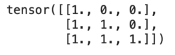
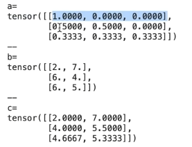
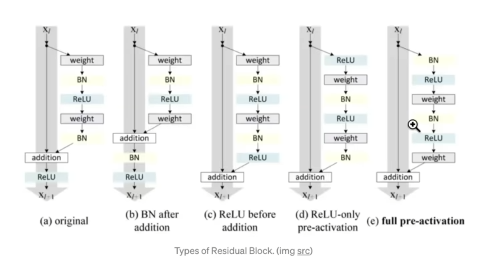

# Let's build GPT: from scratch, in code, spelled out.

## URL 
https://www.youtube.com/watch?v=kCc8FmEb1nY

https://github.com/karpathy/nanoGPT

## intro: ChatGPT , Transformers , nanoGPT,Shakespeare


## ChatGPT 소개

ChatGPT는 최근 AI 커뮤니티에서 큰 주목을 받고 있는 대화형 AI 시스템입니다. 이 시스템은 사용자가 텍스트 기반 작업을 요청하면 AI가 이를 수행하는 방식으로 작동합니다.

주요 특징:
1. 텍스트 기반 작업 수행: 사용자는 ChatGPT에게 다양한 텍스트 기반 작업을 요청할 수 있습니다.
2. 확률적 시스템: 동일한 프롬프트에 대해 매번 약간씩 다른 응답을 생성할 수 있습니다.
3. 순차적 생성: 왼쪽에서 오른쪽으로 단어를 순차적으로 생성합니다.

예시:
- AI의 중요성에 대한 짧은 시 작성 요청:
  결과 1: "AI knowledge brings prosperity for all to see, Embrace its power"
  결과 2: "AI's power to grow, ignorance holds us back, learn Prosperity waits"

ChatGPT의 다양한 활용 예:
- "개에게 설명하듯이 HTML 설명하기"
- "체스 2의 릴리스 노트 작성하기"
- "일론 머스크의 트위터 인수에 대한 메모 작성하기"
- "나무에서 떨어지는 잎에 대한 속보 기사 작성하기"

## Transformers 아키텍처

Transformer는 ChatGPT의 핵심 기술로, 2017년 "Attention is All You Need" 논문에서 처음 소개되었습니다.

주요 특징:
1. 랜드마크 논문: AI 분야에 큰 영향을 미친 중요한 논문입니다.
2. 원래 목적: 기계 번역을 위해 개발되었으나, 이후 AI의 다양한 분야에 적용되었습니다.
3. 광범위한 적용: minor 변경을 거쳐 다양한 AI 응용 분야에 사용되고 있습니다.
4. ChatGPT의 핵심: ChatGPT의 핵심 기술로 사용되고 있습니다.

GPT (Generatively Pre-trained Transformer):
- GPT는 "Generatively Pre-trained Transformer"의 약자입니다.
- Transformer 아키텍처를 기반으로 하는 언어 모델입니다.

## nanoGPT


주요 특징:
1. 간단한 구현: 두 개의 파일로 구성되어 있으며, 각 파일은 300줄의 코드로 이루어져 있습니다.
2. 구성:
   - 하나의 파일은 GPT 모델(Transformer)을 정의합니다.
   - 다른 파일은 주어진 텍스트 데이터셋에 대해 모델을 훈련시킵니다.
3. 성능: Open WebText 데이터셋으로 훈련시키면 GPT-2의 성능을 재현할 수 있습니다.
4. 목적: Transformer의 작동 원리를 이해하고 직접 구현해볼 수 있도록 돕습니다.

## Shakespeare 데이터셋

강의에서 사용되는 "tiny Shakespeare" 데이터셋의 특징:

1. 구성: Shakespeare의 모든 작품을 하나의 파일로 연결한 것입니다.
2. 크기: 약 1MB 크기의 파일입니다.
3. 목적: 문자들이 어떻게 서로 뒤따르는지 모델링하는 데 사용됩니다.
4. 작동 방식: 
   - 주어진 문맥의 문자들을 보고, Transformer 신경망이 다음에 올 문자를 예측합니다.
   - 이 과정을 통해 데이터 내의 모든 패턴을 모델링하게 됩니다.

훈련 결과:
- 시스템 훈련 후, "Shakespeare 스타일"의 무한한 텍스트를 생성할 수 있습니다.
- 생성된 텍스트는 실제 Shakespeare가 아닌, Shakespeare처럼 보이는 가짜 텍스트입니다.
- 문자 단위로 생성됩니다 (ChatGPT는 토큰 단위로 생성).


## reading and exploring the data

``` python
# tiny shakespeare 데이터셋을 다운
!wget https://raw.githubusercontent.com/karpathy/char-rnn/master/data/tinyshakespeare/input.txt
```

``` python
#  파일을 읽어 내용물을 확인 
with open('input.txt', 'r', encoding='utf-8') as f:
    text = f.read()
```

``` python
print("length of dataset in characters: ", len(text))
# length of dataset in characters:  1115394

# let's look at the first 1000 characters
print(text[:1000])
```

```python

# here are all the unique characters that occur in this text
chars = sorted(list(set(text)))
vocab_size = len(chars)
print(''.join(chars))
print(vocab_size)

> !$&',-.3:;?ABCDEFGHIJKLMNOPQRSTUVWXYZabcdefghijklmnopqrstuvwxyz
>65 #총 문자는 65개 
```

## tokenization , train/val split 

### Tokenization

토큰화(tokenization)는 원시 텍스트 문자열을 정수 시퀀스로 변환하는 과정입니다. 이는 텍스트를 모델이 이해할 수 있는 형태로 변환하는 중요한 단계입니다.

1. 문자 수준 토큰화:
   - 이 강의에서는 문자 수준의 언어 모델을 구축하므로, 개별 문자를 정수로 변환합니다.
   - 예: "hi there"를 [46, 47, ...]와 같은 정수 리스트로 변환합니다.

```python
# 문자를 정수로, 정수를 문자로 변환하는 딕셔너리 생성

stoi = { ch:i for i,ch in enumerate(chars) }
itos = { i:ch for i,ch in enumerate(chars) }

# 인코딩 함수: 문자열을 정수 리스트로 변환
def encode(s):
    return [stoi[c] for c in s] 

# 디코딩 함수: 정수 리스트를 문자열로 변환
def decode(l):
    return ''.join([itos[i] for i in l])
```

이 코드는 다음과 같은 작업을 수행합니다:
- 텍스트에서 고유한 문자들을 추출하고 정렬합니다.
- 각 문자에 고유한 정수를 할당합니다 (stoi).
- 각 정수에 해당하는 문자를 저장합니다 (itos).
- encode 함수는 문자열을 정수 리스트로 변환합니다.
- decode 함수는 정수 리스트를 원래 문자열로 복원합니다.

2. 토큰화 예시:

```python
text = "hi there"
encoded = encode(text)
print(encoded)  # 예: [46, 47, 1, 58, 46, 43, 56, 43]
decoded = decode(encoded)
print(decoded)  # "hi there"
```

3. 전체 데이터셋 토큰화:

```python
import torch

data = torch.tensor(encode(text), dtype=torch.long)
print(data.shape, data.dtype)
print(data[:1000])  # 처음 1000개 토큰 출력
```
이 코드는 전체 Shakespeare 텍스트를 토큰화하고 PyTorch 텐서로 변환합니다. 결과는 긴 1차원 정수 시퀀스가 됩니다.


2. 인코더와 디코더:
   - 인코더: 문자열을 정수 리스트로 변환합니다.
   - 디코더: 정수 리스트를 원래 문자열로 복원합니다.
   - 이를 위해 문자와 정수 간의 양방향 매핑 테이블을 생성합니다.

3. 구현 방법:
   - 모든 문자를 반복하며 문자-정수 간 룩업 테이블을 생성합니다.
   - 인코딩: 각 문자를 개별적으로 정수로 변환합니다.
   - 디코딩: 역매핑을 사용하여 정수를 문자로 변환하고 연결합니다.

4. 다른 토큰화 방식:
   - 문장 조각(Sentence Piece): Google에서 사용하는 서브워드 수준 토크나이저입니다.
   - Byte Pair Encoding: OpenAI의 GPT에서 사용하는 방식으로, tiktoken 라이브러리로 구현됩니다.
   - 단어 수준 토큰화: 전체 단어를 정수로 인코딩하는 방식입니다.

5. 토큰화 방식의 트레이드오프:
   - 작은 어휘 크기와 긴 시퀀스 vs 큰 어휘 크기와 짧은 시퀀스
   - 예: 문자 수준(65개 토큰)과 GPT-2(50,000개 토큰)의 차이

6. 강의에서의 선택:
   - 간단한 구현을 위해 문자 수준 토큰화를 사용합니다.
   - 작은 코드북 크기, 간단한 인코딩/디코딩 함수를 가지지만, 매우 긴 시퀀스가 생성됩니다.

### Train/Val Split

훈련 데이터와 검증 데이터를 분리하는 것은 모델의 성능을 평가하고 과적합을 방지하는 데 중요합니다.

1. 데이터 준비:
   - PyTorch 라이브러리의 torch.tensor를 사용하여 전체 Shakespeare 텍스트를 토큰화합니다.
   - 결과는 정수의 긴 시퀀스로, 원본 텍스트의 문자를 나타냅니다.

2. 분할 비율:
   - 훈련 데이터: 전체 데이터셋의 처음 90%
   - 검증 데이터: 마지막 10%

3. 분할의 목적:
   - 과적합 정도를 이해하고 평가하기 위함입니다.
   - 모델이 단순히 Shakespeare 텍스트를 완벽히 암기하는 것이 아니라, Shakespeare 스타일의 텍스트를 생성할 수 있도록 하는 것이 목표입니다.

4. 검증 데이터의 역할:
   - 모델이 학습하지 않은 데이터에 대한 성능을 평가합니다.
   - 실제 Shakespeare 텍스트와 유사한 텍스트를 생성할 수 있는지 확인합니다.

5. 구현:
   - 전체 데이터셋을 torch.tensor로 변환한 후, 인덱싱을 사용하여 훈련 데이터와 검증 데이터로 분할합니다.

    1. 데이터 분할:

    ```python
    # 데이터를 훈련 세트(90%)와 검증 세트(10%)로 분할
    n = int(0.9 * len(data))
    train_data = data[:n]
    val_data = data[n:]
    ```

    이 코드는 다음과 같은 작업을 수행합니다:
    - 전체 데이터의 90%를 훈련 데이터로 사용합니다.
    - 나머지 10%를 검증 데이터로 사용합니다.

    2. 분할의 목적:
    - 과적합 정도를 평가합니다.
    - 모델이 단순히 Shakespeare 텍스트를 암기하는 것이 아니라, Shakespeare 스타일의 텍스트를 생성할 수 있도록 합니다.


## Data Loader: Batches of Chunks of Data

1. 데이터 입력 방식

Transformer 모델은 전체 텍스트를 한 번에 처리하지 않습니다. 대신, 텍스트의 작은 청크(chunk)들을 사용하여 학습합니다. 이는 계산 비용을 줄이고 효율성을 높이기 위함입니다.

2. 블록 크기 (Block Size)

- 정의: 한 번에 처리할 텍스트의 최대 길이
- 코드에서는 주로 'block_size'로 표현됨
- 다른 용어로는 'context length'라고도 불림
- 예시 코드에서는 block_size = 8로 설정

3. 데이터 청크 예시

```python
block_size = 8
x = train_data[:block_size]
y = train_data[1:block_size+1]
for t in range(block_size):
    context = x[:t+1]
    target = y[t]
    print(f"when input is {context} the target: {target}")
```

```
>
when input is tensor([18]) the target: 47
when input is tensor([18, 47]) the target: 56
when input is tensor([18, 47, 56]) the target: 57
when input is tensor([18, 47, 56, 57]) the target: 58
when input is tensor([18, 47, 56, 57, 58]) the target: 1
when input is tensor([18, 47, 56, 57, 58,  1]) the target: 15
when input is tensor([18, 47, 56, 57, 58,  1, 15]) the target: 47
when input is tensor([18, 47, 56, 57, 58,  1, 15, 47]) the target: 58
```

- x는 입력 시퀀스
- y는 목표 시퀀스 (x에서 한 칸 이동)
- 각 단계에서 context는 증가하고, 그에 따른 target이 있음

4. 배치 차원 (Batch Dimension)

여러 청크를 동시에 처리하기 위해 배치 차원을 추가합니다. 이는 GPU 활용을 최적화하기 위함입니다.

```python
import torch
torch.manual_seed(1337)
batch_size = 4
block_size = 8

def get_batch(split):
    data = train_data if split == 'train' else val_data
    ix = torch.randint(len(data) - block_size, (batch_size,))
    x = torch.stack([data[i:i+block_size] for i in ix])
    y = torch.stack([data[i+1:i+block_size+1] for i in ix])
    return x, y

xb, yb = get_batch('train')
```

이 코드의 주요 특징:
- batch_size: 한 번에 처리할 독립적인 시퀀스의 수 (여기서는 4)
- block_size: 최대 컨텍스트 길이 
- get_batch 함수: 
  - 무작위로 데이터에서 위치를 선택
  - 선택된 위치에서 block_size 길이의 청크를 추출
  - x는 입력 시퀀스, y는 목표 시퀀스 (x에서 한 칸 이동)
- 결과: xb는 (4, 8) 형태의 텐서, yb도 같은 형태 4rows 8col (8col-> chunck of data set )

5. 배치 내 예제 설명

```python
for b in range(batch_size):
    for t in range(block_size):
        context = xb[b, :t+1]
        target = yb[b,t]
        print(f"when input is {context.tolist()} the target: {target}")
```

이 코드는 배치 내의 모든 예제를 보여줍니다:
- 4x8 배열에는 총 32개의 독립적인 예제가 포함됨
- 각 행은 서로 독립적인 시퀀스
- 각 위치에서 입력(context)과 그에 따른 목표(target)가 있음

6. Transformer 입력 준비

이렇게 준비된 xb 텐서가 Transformer에 입력됩니다. Transformer는 이 모든 예제를 동시에 처리하고, 각 위치에서 다음 문자를 예측하려고 시도합니다.

7. 학습의 이점

- 다양한 길이의 컨텍스트로 학습: 1부터 block_size까지
- 추론 시 유연성: 모델은 짧은 컨텍스트부터 긴 컨텍스트까지 모두 처리 가능
- 효율성: 병렬 처리를 통해 GPU 활용도 극대화

이렇게 준비된 데이터는 Transformer 모델에 입력되어 학습을 진행하게 됩니다. 이 방식은 대규모 텍스트 데이터를 효율적으로 처리하면서도, 다양한 길이의 컨텍스트에 대해 모델을 훈련시킬 수 있게 해줍니다.


## simplest baseline: bigram language model, loss, generation

1. 바이그램 언어 모델 구현

바이그램 언어 모델은 언어 모델링에서 가장 간단한 형태의 신경망입니다. PyTorch를 사용하여 구현합니다.

```python
import torch
import torch.nn as nn
from torch.nn import functional as F 

class BigramLanguageModel(nn.Module):
    def __init__(self, vocab_size):
        super().__init__()
        self.token_embedding_table = nn.Embedding(vocab_size, vocab_size)

    def forward(self, idx, targets): #input을 idx로 표현 
        logits = self.token_embedding_table(idx) #(B,T,C)
        
        if targets is None:
            loss = None
        else:
            B, T, C = logits.shape
            logits = logits.view(B*T, C) #차원 축소 
            targets = targets.view(B*T)
            loss = F.cross_entropy(logits, targets) #손실함수 
        
        return logits, loss

    def generate(self, idx, max_new_tokens):
        for _ in range(max_new_tokens):
            logits, loss = self(idx)
            logits = logits[:, -1, :] #becomes (B,C)
            probs = F.softmax(logits, dim=-1)
            idx_next = torch.multinomial(probs, num_samples=1) #(B,1)
            idx = torch.cat((idx, idx_next), dim=1) #(B,T+1)
        return idx  #generate할때 , forward 함수의 targets= None으로 설정하고 함
```

``` python
m= BigramLanguageModel(vocab_size)
out= m(xb,yb)
print(out.shape)
> torch.Size([4,8,65])
```
주요 특징:
- `token_embedding_table`: 각 토큰을 벡터로 변환하는 임베딩 테이블
- `forward` 메서드: 입력 시퀀스를 받아 로짓(logits)과 손실(loss)을 계산
- `generate` 메서드: 주어진 시작 시퀀스로부터 새로운 토큰을 생성

2. 손실 함수 계산

손실 함수는 모델의 예측 품질을 평가합니다. 여기서는 교차 엔트로피 손실을 사용합니다.

```python
loss = F.cross_entropy(logits, targets)
```

주의할 점:
- PyTorch의 `cross_entropy` 함수는 특정 형태의 입력을 기대합니다.
- 로짓과 타겟의 shape을 적절히 변형해야 합니다 (B*T, C)와 (B*T) 형태로.

3. 텍스트 생성

학습된 모델을 사용하여 새로운 텍스트를 생성합니다.

```python
idx = torch.zeros((1, 1), dtype=torch.long)
generated_text = model.generate(idx, max_new_tokens=100)
print(decode(generated_text[0].tolist()))
```

생성 과정:
1. 시작 토큰(여기서는 0, 즉 새 줄 문자)으로 시작
2. 모델이 다음 토큰의 확률 분포를 예측
3. 이 분포에서 무작위로 샘플링하여 다음 토큰 선택
4. 선택된 토큰을 시퀀스에 추가
5. 원하는 길이에 도달할 때까지 2-4 반복

4. 모델 훈련

모델을 훈련시키기 위해 옵티마이저를 설정합니다.

```python
optimizer = torch.optim.AdamW(model.parameters(), lr=1e-3)
```

훈련 루프:
1. 배치 데이터 가져오기
2. 모델에 데이터 입력, 손실 계산
3. 역전파를 통해 그래디언트 계산
4. 옵티마이저를 사용해 모델 파라미터 업데이트

5. 주요 개념 설명

- 바이그램 모델: 현재 토큰만을 보고 다음 토큰을 예측합니다. 컨텍스트를 고려하지 않는 가장 간단한 형태의 언어 모델입니다.
- 임베딩 테이블: 각 토큰을 고정된 크기의 벡터로 변환합니다. 여기서는 vocab_size x vocab_size 크기의 테이블을 사용합니다.
- 로짓(Logits): 모델의 원시 출력값으로, 각 토큰의 점수를 나타냅니다.
- 소프트맥스: 로짓을 확률 분포로 변환합니다.
- 교차 엔트로피 손실: 모델의 예측과 실제 타겟 사이의 차이를 측정합니다.

이 간단한 바이그램 모델은 언어 모델링의 기본을 이해하는 데 도움이 됩니다. 하지만 실제로는 매우 제한적인 성능을 보입니다. 이후 강의에서는 이를 개선하여 더 복잡하고 강력한 Transformer 모델로 발전시킬 것입니다.


## Training the Bigram Model

1. 옵티마이저 설정

먼저, PyTorch의 최적화 객체를 생성합니다. 이 강의에서는 AdamW 옵티마이저를 사용합니다.

```python
optimizer = torch.optim.AdamW(model.parameters(), lr=1e-3)
```

- AdamW는 Adam 옵티마이저의 변형으로, 매우 효과적이고 널리 사용되는 옵티마이저입니다.
- 학습률(learning rate)은 3e-4 (0.0003)가 일반적으로 좋은 설정이지만, 이 경우처럼 매우 작은 네트워크에서는 더 높은 학습률(1e-3 또는 0.001)을 사용할 수 있습니다.

2. 배치 크기 설정

```python
batch_size = 32
```

- 이전에 사용한 배치 크기 4보다 큰 32를 사용합니다.
- 더 큰 배치 크기는 학습 속도를 높이고 더 안정적인 그래디언트 추정을 제공할 수 있습니다.

3. 학습 루프

```python
for steps in range(max_iters):
    xb, yb = get_batch('train')
    logits, loss = model(xb, yb)
    optimizer.zero_grad(set_to_none=True)
    loss.backward()
    optimizer.step()
```

이 루프는 다음 단계를 반복합니다:
a) 새로운 배치의 데이터를 샘플링합니다.
b) 모델을 통해 로짓과 손실을 계산합니다.
c) 이전 단계의 그래디언트를 초기화합니다.
d) 역전파를 통해 그래디언트를 계산합니다.
e) 계산된 그래디언트를 사용하여 모델 파라미터를 업데이트합니다.

4. 학습 과정 모니터링

처음에는 100회 반복으로 시작하여 손실 값의 변화를 관찰합니다:

```python
for iter in range(100):
    # (학습 루프 코드)
    print(f"step {iter}: loss {loss.item():.4f}")
```

- 초기 손실값은 약 4.7에서 시작하여 4.6, 4.5 등으로 감소하는 것을 볼 수 있습니다.

5. 학습 확장

더 많은 반복을 통해 모델을 개선합니다:

```python
for iter in range(10000):
    # (학습 루프 코드)

print(f"final loss: {loss.item()}")
```

- 10,000회 반복 후 손실값이 약 2.5까지 감소하는 것을 볼 수 있습니다.

6. 학습된 모델로 텍스트 생성

학습 후, 모델을 사용하여 새로운 텍스트를 생성합니다:

```python
context = torch.zeros((1, 1), dtype=torch.long)
print(decode(model.generate(context, max_new_tokens=500)[0].tolist()))
```

- 생성된 텍스트는 초기의 무작위 출력보다 훨씬 개선된 결과를 보여줍니다.
- 완벽한 Shakespeare 텍스트는 아니지만, 어느 정도 의미 있는 패턴을 보입니다.

7. 모델의 한계

이 바이그램 모델의 한계를 지적합니다:
- 토큰들이 서로 "대화"하지 않습니다. 즉, 각 예측은 직전의 문자만을 고려합니다.
- 더 넓은 컨텍스트를 고려하지 않아 복잡한 패턴을 학습하지 못합니다.

8. 다음 단계

이 간단한 모델을 기반으로, 다음 단계에서는 토큰들이 서로 정보를 교환하고 더 넓은 컨텍스트를 고려할 수 있는 Transformer 아키텍처로 발전시킬 것입니다.

이 바이그램 모델 학습 과정은 언어 모델의 기본 원리를 이해하는 데 도움이 됩니다. 손실 함수의 감소와 생성된 텍스트의 품질 향상을 통해 모델이 학습되고 있음을 확인할 수 있습니다. 그러나 이 모델의 한계도 분명히 드러나며, 이는 더 복잡한 모델의 필요성을 보여줍니다.


## port our code to a script Building the "self-attention"


Jupyter 노트북에서 개발한 코드를 Python 스크립트로 변환했습니다. 이는 중간 작업을 단순화하고 최종 결과물을 정리하기 위함입니다. 주요 변경사항과 추가된 기능들은 다음과 같습니다:

https://github.com/karpathy/ng-video-lecture/blob/master/bigram.py
(bigram.py) 


1. 하이퍼파라미터 정리
   - 스크립트 상단에 모든 하이퍼파라미터를 모아 정의했습니다.
   - 일부 새로운 하이퍼파라미터가 추가되었습니다.

2. 코드 구조
   - 재현 가능성을 위한 설정
   - 데이터 읽기
   - 인코더와 디코더 생성
   - 훈련 및 검증 데이터 분할
   - 배치 데이터를 가져오는 데이터 로더 함수

3. Bigram 언어 모델
   - 이전에 개발한 Bigram 언어 모델이 포함되어 있습니다.
   - forward 메서드로 logits와 loss를 계산합니다.
   - generate 메서드로 텍스트를 생성합니다.

4. GPU 지원 추가
   - GPU가 있는 경우 CUDA를 사용하도록 설정했습니다.
   - `device` 변수를 사용하여 데이터와 모델을 GPU로 이동시킵니다.
   ```python
   device = 'cuda' if torch.cuda.is_available() else 'cpu'
   model = model.to(device)
   data = data.to(device)
   ```

5. 손실 추정 함수 도입
   - `estimate_loss` 함수를 추가하여 더 안정적인 손실 측정을 가능하게 했습니다.
   - 여러 배치에 대한 평균 손실을 계산합니다.
   ```python
   @torch.no_grad()
   def estimate_loss():
       out = {}
       model.eval()
       for split in ['train', 'val']:
           losses = torch.zeros(eval_iters)
           for k in range(eval_iters):
               X, Y = get_batch(split)
               logits, loss = model(X, Y)
               losses[k] = loss.item()
           out[split] = losses.mean()
       model.train()
       return out
   ```

6. 모델 평가 모드 설정
   - 평가 시 모델을 evaluation 모드로 설정하고, 훈련 시 training 모드로 재설정합니다.
   - 현재 모델에서는 큰 영향이 없지만, 향후 dropout이나 batch normalization 등을 사용할 때 중요해집니다.

7. torch.no_grad() 컨텍스트 매니저 사용
   - 평가 시 `torch.no_grad()`를 사용하여 메모리 효율성을 높입니다.
   - 역전파를 수행하지 않을 때 PyTorch에 알려 중간 변수 저장을 방지합니다.

8. 스크립트 실행 결과
   - 터미널에서 실행 시 훈련 손실과 검증 손실을 출력합니다.
   - Bigram 모델의 경우 손실이 약 2.5 근처로 수렴합니다.
   - 훈련 후 샘플 텍스트를 생성하여 출력합니다.

9. 코드 길이
   - 최종 스크립트는 약 120줄의 코드로 구성되어 있습니다.
   - 강사는 이를 'bigram.py'로 명명했습니다.

이렇게 정리된 스크립트는 앞으로의 Transformer 모델 개발을 위한 기반이 됩니다. 다음 단계에서는 이 코드를 바탕으로 self-attention 블록을 구현하여 토큰 간의 상호작용을 가능하게 할 예정입니다.


## version 1: averaging the past context with for loops , the weakest form of aggregation 


Version 1: 과거 컨텍스트의 평균화 (for 루프 사용) - 가장 약한 형태의 집계

1. 목적
   - 시퀀스 내의 토큰들이 서로 "대화"할 수 있게 하는 것입니다.
   - 각 토큰이 자신의 과거 컨텍스트 정보를 활용할 수 있게 합니다.

2. 접근 방식
   - 각 토큰 위치에서, 해당 위치와 그 이전의 모든 토큰들의 평균을 계산합니다.
   - 이는 가장 간단하지만 가장 약한 형태의 정보 집계 방법입니다.

3. 데이터 구조
   - B (batch size) x T (time steps) x C (channels) 형태의 3차원 텐서를 사용합니다.
   - 예제에서는 B=4, T=8, C=2로 설정했습니다.

4. 구현 코드
```python
import torch

# 초기 데이터 생성 (B=4, T=8, C=2) batch , time , channels 
B,T,C = 4,8,2
x = torch.randn(B, T, C)
x.shape
```
``` python 
# 결과를 저장할 텐서 초기화
x_bow = torch.zeros((B,T,C) #bow = bag of words

# 각 배치와 시간 단계에 대해 평균 계산 x[b,t] = mean_{i<=t>} x[b,i]
for b in range(x.shape[0]):  # 배치 반복
    for t in range(x.shape[1]):  # 시간 단계 반복
        x_prev = x[b,:t+1]  # 현재 시점까지의 모든 이전 토큰 (t,C)
        x_bow[b,t] = x_prev.mean(dim=0)  # 평균 계산

# 결과 확인 (첫 번째 배치의 결과만 출력)
print(x[0])
print(x_bow[0])
```

5. 결과 해석
   - 첫 번째 위치: 자기 자신만의 값을 가집니다.
   - 두 번째 위치: 첫 번째와 두 번째 토큰의 평균입니다.
   - 세 번째 위치: 첫 번째, 두 번째, 세 번째 토큰의 평균입니다.
   - 이런 식으로 계속됩니다.

6. 한계점
   - 정보 손실: 단순 평균은 토큰 간의 순서 정보를 잃어버립니다.
   - 비효율성: for 루프를 사용하므로 계산 효율이 낮습니다.
   - 제한된 상호작용: 평균화는 매우 단순한 형태의 정보 교환입니다.

7. 의의
   - 이 방법은 자기 주의(self-attention) 메커니즘의 기본 아이디어를 이해하는 데 도움이 됩니다.
   - 향후 더 복잡하고 효율적인 방법으로 발전시킬 기초가 됩니다.

8. 다음 단계
   - 이 연산을 행렬 곱셈을 사용하여 더 효율적으로 수행하는 방법을 탐구할 것입니다.
   - 이는 Transformer의 자기 주의 메커니즘 구현의 핵심이 될 것입니다.

이 방법은 매우 기본적이지만, 시퀀스 내에서 정보를 전파하는 방법의 기초를 보여줍니다. 이를 통해 각 토큰이 자신의 과거 컨텍스트를 "인식"할 수 있게 되지만, 여전히 많은 개선의 여지가 있습니다.


## The trick in self-attention: matrix multiply as weighted aggregation

셀프 어텐션의 트릭: 행렬 곱을 이용한 가중 집계

이 트릭은 행렬 곱셈을 사용하여 효율적으로 가중 평균을 계산하는 방법입니다.

1. 기본 아이디어 소개
   - 이전에 설명한 for 루프를 사용한 방법이 비효율적임을 지적합니다.
   - 행렬 곱셈을 사용하면 이 과정을 매우 효율적으로 수행할 수 있다고 설명합니다.

2. 예시를 통한 설명
   다음과 같은 예시를 사용합니다:
   ```python
   torch.manual_seed(42)
   A = torch.ones(3, 3)
   B = torch.randint(0,10,(3,2)).float()
   C = a@b
   ```
   - A는 3x3 크기의 모든 원소가 1인 행렬
   - B는 3x2 크기의 랜덤 숫자로 이루어진 행렬
   - C는 A와 B의 행렬 곱 결과 (3x2 크기)

3. 행렬 곱의 결과 분석
   - C의 각 원소는 A의 행과 B의 열의 내적(dot product)입니다.
   - A의 모든 원소가 1이므로, C의 각 원소는 B의 해당 열의 합이 됩니다.

4. 하삼각 행렬(lower triangular matrix) 도입
   ```python
   A = torch.tril(torch.ones(3, 3))
   ```
   - `torch.tril` 함수를 사용하여 하삼각 행렬을 만듭니다.
   - 이렇게 하면 A의 상단 부분이 0이 되어, B의 특정 행들만 선택적으로 합할 수 있습니다.

        

5. 가중 평균 계산
   - A의 각 행을 정규화하여 합이 1이 되게 만듭니다:
     ```python
     A = A / A.sum(1, keepdim=True)
     ```

     

   - 이렇게 하면 C의 각 원소는 B의 해당 행들의 가중 평균이 됩니다.

6. 결과 해석
   - C의 첫 번째 행: B의 첫 번째 행과 동일 (가중치가 1이므로)
   - C의 두 번째 행: B의 첫 번째와 두 번째 행의 평균
   - C의 세 번째 행: B의 모든 행의 평균

7. 셀프 어텐션과의 연관성
   - 이 방법을 사용하면 각 토큰이 이전 토큰들의 정보를 효율적으로 집계할 수 있습니다.
   - 가중치 행렬 A를 조절함으로써 각 토큰이 어떤 이전 토큰에 더 주목할지 결정할 수 있습니다.

8. 효율성
   - 이 방법은 for 루프를 사용하는 것보다 훨씬 효율적입니다.
   - GPU에서 행렬 곱셈은 매우 최적화되어 있어 빠른 계산이 가능합니다.

이 트릭은 셀프 어텐션 메커니즘의 핵심입니다. 이를 통해 각 토큰이 다른 토큰들의 정보를 효율적으로 집계하고, 문맥을 고려한 표현을 만들 수 있습니다. 이는 Transformer 모델의 강력한 성능의 기반이 됩니다.


## Version 2: using matrix multiply

Version 2: 행렬 곱셈 사용하기

이 부분에서는 이전에 for 루프를 사용해 구현했던 과거 컨텍스트의 평균화를 행렬 곱셈을 사용하여 더 효율적으로 구현하는 방법을 설명합니다.

1. 행렬 곱셈의 기본 원리 소개
   ```python
   A = torch.ones(3, 3)
   B = torch.rand(3, 2)
   C = torch.matmul(A, B)
   ```
   - A: 3x3 크기의 모든 원소가 1인 행렬
   - B: 3x2 크기의 랜덤 숫자로 이루어진 행렬
   - C: A와 B의 행렬 곱 결과 (3x2 크기)

2. 하삼각 행렬(lower triangular matrix) 도입
   ```python
   A = torch.tril(torch.ones(3, 3))
   ```
   - `torch.tril` 함수를 사용하여 하삼각 행렬을 만듭니다.
   - 이렇게 하면 A의 상단 부분이 0이 되어, B의 특정 행들만 선택적으로 합할 수 있습니다.

3. 가중 평균 계산을 위한 정규화
   ```python
   A = A / A.sum(1, keepdim=True)
   ```
   - A의 각 행을 정규화하여 합이 1이 되게 만듭니다.
   - 이렇게 하면 C의 각 원소는 B의 해당 행들의 가중 평균이 됩니다.

4. 실제 구현
   ```python
   B, T, C = x.shape
   weights = torch.tril(torch.ones(T, T))
   weights = weights / weights.sum(1, keepdim=True)
   xbow2 = torch.bmm(weights.unsqueeze(0).expand(B, T, T), x) #wei @ x    EX) (B,T,T) @(B,T,C)  --> (B,T,C)
   torch.allclose(xbow,xbow2) # xbow와 xbow2 두 텐서의 모든 원소가 거의 동일한지(작은 오차 내에서) 확인하는 코드
   ```
   - `x`는 원본 입력 텐서 (B x T x C)
   - `weights`는 하삼각 행렬로, 각 행이 1로 정규화됩니다.
   - `torch.bmm`을 사용하여 배치 행렬 곱셈을 수행합니다.

5. 결과 해석
   - `x_bow`는 `x`와 동일한 형태 (B x T x C)를 가집니다.
   - 각 위치의 값은 해당 위치까지의 모든 이전 값들의 가중 평균입니다.

6. 효율성 비교
   - 이 방법은 for 루프를 사용하는 것보다 훨씬 효율적입니다.
   - GPU에서 행렬 곱셈은 매우 최적화되어 있어 빠른 계산이 가능합니다.

7. 주의점
   - PyTorch의 `matmul` 함수는 브로드캐스팅을 지원합니다. 즉, 배치 차원에 대해 자동으로 연산을 수행합니다.
   - 이로 인해 `weights`를 배치 차원으로 확장할 필요가 있습니다 (`weights.unsqueeze(0).expand(B, T, T)`).

8. 검증
   ```python
   assert torch.allclose(x_bow, x_bow_loop)
   ```
   - 이 assertion을 통해 행렬 곱셈 방식의 결과가 for 루프 방식의 결과와 동일함을 확인할 수 있습니다.

이 방법은 셀프 어텐션 메커니즘의 기본 아이디어를 구현하는 데 사용됩니다. 각 토큰이 이전 토큰들의 정보를 효율적으로 집계할 수 있게 해주며, 이는 Transformer 모델의 핵심 요소 중 하나입니다. 이 구현은 간단하면서도 효율적이어서, 더 복잡한 어텐션 메커니즘을 이해하는 데 좋은 기초가 됩니다.

## Version 3 : adding softmax

Version 3: 소프트맥스 추가하기

이 버전은 이전 버전들과 동일한 결과를 산출하지만, 소프트맥스 함수를 사용하여 가중치를 계산합니다. 이 방법은 향후 셀프 어텐션 메커니즘을 구현하는 데 중요한 기초가 됩니다.

1. 초기 가중치 설정
   ```python
   tril = torch.tril(torch.ones(T,T))
   wei = torch.zeros((T, T))
   ```
   - T x T 크기의 0으로 채워진 행렬을 생성합니다.

2. 하삼각 마스크 생성
   ```python
   wei = wei.masked_fill(trill == 0, float('-inf'))
   ```
   - `torch.tril`을 사용하여 하삼각 행렬을 생성합니다.
   - 상삼각 부분(0인 부분)을 음의 무한대로 채웁니다.

3. 소프트맥스 적용
   ```python
   wei = F.softmax(wei, dim=-1)
   ```
   - 각 행에 대해 소프트맥스를 적용합니다.

4. 결과 해석
   - 소프트맥스 적용 후, 가중치 행렬은 이전 버전들과 동일한 형태를 가집니다.
   - 각 행의 합은 1이 되며, 상삼각 부분은 0이 됩니다.

5. 가중치의 의미
   - 이 가중치들은 "상호작용 강도" 또는 "유사도"로 해석될 수 있습니다.
   - 각 토큰이 과거의 어떤 토큰들로부터 정보를 얼마나 가져올지 결정합니다.

6. 미래 토큰과의 통신 방지
   - 음의 무한대를 사용하여 미래 토큰으로부터의 정보 흐름을 차단합니다.
   - 소프트맥스 적용 시 이 부분은 0이 되어 영향을 미치지 않습니다.

7. 셀프 어텐션으로의 확장
   - 현재는 가중치가 고정되어 있지만, 실제 셀프 어텐션에서는 이 가중치가 데이터에 따라 동적으로 변합니다.
   - 토큰들은 서로를 "관찰"하고, 그들의 값에 따라 서로에 대한 관심도가 달라집니다.

8. 구현 코드
   ```python
   #version 3: use Softmax
   tril = torch.tril(torch.ones(T,T))
   wei = torch.zeros((T, T), device=x.device)
   wei = wei.masked_fill(torch.tril(torch.ones((T, T), device=x.device)) == 0, float('-inf'))
   wei = F.softmax(wei, dim=-1)
   out = wei @ x
   ```

9. 주요 이점
   - 이 방법은 가중치를 계산하는 더 유연한 방법을 제공합니다.
   - 소프트맥스를 사용함으로써, 가중치의 합이 항상 1이 되도록 보장합니다.
   - 음의 무한대를 사용하여 미래 정보의 유출을 효과적으로 방지합니다.

10. 셀프 어텐션으로의 연결
    - 이 구조는 셀프 어텐션의 기본 형태입니다.
    - 실제 셀프 어텐션에서는 이 가중치들이 입력 데이터에 따라 계산됩니다.
    - 이를 통해 각 토큰은 문맥에 따라 다른 토큰들과 동적으로 상호작용할 수 있습니다.

이 버전은 이전 버전들과 동일한 결과를 제공하지만, 소프트맥스를 사용함으로써 더 유연하고 확장 가능한 구조를 제공합니다. 이는 Transformer 모델의 핵심 요소인 셀프 어텐션 메커니즘을 구현하는 데 중요한 기초가 됩니다.


## Minor Code Cleanup

강사는 코드를 정리하고 개선하기 위해 몇 가지 변경사항을 제안합니다:

1. vocab_size 파라미터 제거
   - Constructor에 vocab_size를 전달할 필요가 없습니다.
   - vocab_size는 이미 전역 변수로 정의되어 있기 때문입니다.

2. 임베딩 차원 도입
   ```python
   n_embd = 32  # 임베딩 차원 수
   ```
   - 토큰 임베딩의 차원을 32로 설정합니다.
   - 이 값은 GitHub Copilot의 제안을 따른 것입니다.

3. 토큰 임베딩과 로짓 분리
   ```python
   self.token_embedding_table = nn.Embedding(vocab_size, n_embd)
   self.lm_head = nn.Linear(n_embd, vocab_size)
   ```
   - 토큰 임베딩 테이블은 이제 vocab_size x n_embd 크기를 가집니다.
   - lm_head (language modeling head)라는 선형 레이어를 추가하여 임베딩을 로짓으로 변환합니다.

4. forward 메서드 수정
   ```python
   token_embeddings = self.token_embedding_table(idx)
   logits = self.lm_head(token_embeddings)
   ```
   - 토큰 임베딩을 먼저 계산한 후, 이를 lm_head를 통해 로짓으로 변환합니다.

이러한 변경사항들은 코드를 더 모듈화하고, 향후 확장성을 높이는 데 도움이 됩니다.

## Positional Encoding

위치 인코딩은 Transformer 모델에서 중요한 역할을 합니다. 각 토큰의 위치 정보를 모델에 제공합니다.

1. 위치 임베딩 테이블 추가
   ```python
   self.position_embedding_table = nn.Embedding(block_size, n_embd)
   ```
   - block_size는 시퀀스의 최대 길이입니다.
   - 각 위치(0부터 block_size-1까지)에 대해 n_embd 차원의 임베딩 벡터를 할당합니다.

2. forward 메서드에서 위치 임베딩 적용
   ```python
   B, T = idx.shape
   tok_emb = self.token_embedding_table(idx)  # (B,T,C)
   pos_emb = self.position_embedding_table(torch.arange(T, device=device))  # (T,C)
   x = tok_emb + pos_emb  # (B,T,C)
   logits = self.lm_head(x)  # (B,T,vocab_size)
   ```
   - tok_emb: 토큰 임베딩 (배치 크기 B, 시퀀스 길이 T, 채널 수 C)
   - pos_emb: 위치 임베딩 (시퀀스 길이 T, 채널 수 C)
   - x: 토큰 임베딩과 위치 임베딩의 합

3. 브로드캐스팅
   - pos_emb (T,C)가 tok_emb (B,T,C)에 더해질 때, PyTorch의 브로드캐스팅 규칙에 따라 자동으로 배치 차원으로 확장됩니다.

4. 현재 단계에서의 의미
   - 바이그램 모델에서는 위치 정보가 아직 큰 의미가 없습니다.
   - 하지만 self-attention 블록을 구현할 때 이 위치 정보가 중요해집니다.

5. 향후 확장성
   - 이 구조는 더 복잡한 모델로 발전시킬 때 유용합니다.
   - 토큰의 정체성뿐만 아니라 위치도 고려할 수 있게 됩니다.

이러한 변경사항들은 모델이 단순한 바이그램 모델에서 더 복잡한 Transformer 모델로 발전할 수 있는 기반을 마련합니다. 위치 인코딩은 특히 self-attention 메커니즘에서 중요한 역할을 하게 될 것입니다.


## THE CRUX OF THE VIDEO : version 4: self-attention

1. 셀프 어텐션의 기본 개념
   - 목적: 시퀀스 내의 토큰들이 서로 "대화"하며 정보를 교환하는 방법
   - 각 토큰은 다른 토큰들과의 관계를 데이터에 기반하여 결정합니다.

2. 주요 구성 요소: Query, Key, Value
   - Query: "내가 찾고 있는 것은 무엇인가?"
   - Key: "내가 가지고 있는 것은 무엇인가?"
   - Value: "내가 공유할 정보는 무엇인가?"
   ``` python
   # let's see a single Head perform self-attention
    head_size = 16
    key = nn.Linear(C, head_size, bias=False)
    query = nn.Linear(C, head_size, bias=False)
    value = nn.Linear(C, head_size, bias=False)
    k = key(x)   # (B, T, 16)
    q = query(x) # (B, T, 16)
    wei =  q @ k.transpose(-2, -1) # (B, T, 16) @ (B, 16, T) ---> (B, T, T)
    v = value(x)
    out = wei @v #torch.Size([4,8,16])

    ```


4. 작동 원리
   a. 각 토큰은 자신의 Query, Key, Value 벡터를 생성합니다.
   b. Query와 Key의 내적을 통해 유사도(affinity)를 계산합니다.
   c. 이 유사도에 소프트맥스를 적용하여 가중치를 얻습니다.
   d. 가중치와 Value의 곱을 통해 최종 출력을 얻습니다.

5. 주요 특징
   - 데이터 의존성: 가중치가 입력 데이터에 따라 동적으로 결정됩니다.
   - 위치 정보 활용: 각 토큰은 자신의 위치 정보를 고려할 수 있습니다.
   - 마스킹: 미래 정보를 차단하기 위해 상삼각 부분을 마스킹합니다.

6. 수식 설명
   - Affinity 계산: wei = q @ k.transpose(-2,-1)
   - 스케일링: wei * head_size**-0.5 (그래디언트 안정화를 위함)
   - 마스킹: wei.masked_fill(self.tril[:T, :T] == 0, float('-inf'))
   - 정규화: F.softmax(wei, dim=-1)
   - 최종 출력: out = wei @ v

7. 셀프 어텐션의 의의
   - 유연한 컨텍스트 캡처: 각 토큰이 전체 시퀀스의 어느 부분과도 상호작용할 수 있습니다.
   - 병렬 처리: 모든 토큰이 동시에 처리됩니다.
   - 장거리 의존성 포착: 시퀀스 내의 멀리 떨어진 토큰들 사이의 관계도 쉽게 포착할 수 있습니다.

8. 주의할 점
   - 계산 복잡도: O(n^2)로, 시퀀스 길이가 길어질수록 계산량이 급격히 증가합니다.
   - 메모리 사용량: 어텐션 가중치 행렬의 크기가 시퀀스 길이의 제곱에 비례합니다.

이 셀프 어텐션 메커니즘은 Transformer 모델의 핵심 구성 요소이며, 이를 통해 모델은 입력 시퀀스의 복잡한 패턴과 관계를 효과적으로 학습할 수 있습니다. 이는 ChatGPT와 같은 고급 언어 모델의 성능 향상에 크게 기여했습니다.

네, 이해했습니다. 강의 내용을 바탕으로 1-3번 대제목에 대해 더 자세히 정리해드리겠습니다.

## Note 1: Attention as Communication

1. 기본 개념:
   - Attention은 본질적으로 노드 간의 정보 교환 메커니즘입니다.
   - 방향성 그래프의 노드들로 생각할 수 있습니다.

2. 노드의 특성:
   - 각 노드는 정보의 벡터를 가지고 있습니다.
   - 노드들 사이에 가중치가 부여된 엣지가 존재합니다.

3. 정보 흐름 과정:
   - 각 노드는 다른 노드들로부터 정보를 수집합니다.
   - 수집된 정보는 가중치에 따라 집계됩니다.

4. 가중치 결정 방식:
   - 가중치는 Query와 Key의 내적을 통해 계산됩니다.
   - 이는 노드 간의 "관심도" 또는 "유사성"을 나타냅니다.

5. 결과:
   - 각 노드는 다른 노드들의 정보를 선택적으로 집계하여 자신의 표현을 업데이트합니다.

6. 실제 구현에서의 의미:
   - Query: "내가 찾고 있는 것은 무엇인가?"
   - Key: "내가 가지고 있는 것은 무엇인가?"
   - Value: "내가 공유할 정보는 무엇인가?"

7. Attention의 장점:
   - 유연한 정보 교환: 노드들은 필요에 따라 서로 다른 양의 정보를 교환할 수 있습니다.
   - 동적인 관계 모델링: 입력에 따라 노드 간의 관계가 동적으로 결정됩니다.

## Note 2: Attention Has No Notion of Space, Operates Over Sets

1. 전통적인 신경망과의 차이:
   - CNN이나 RNN은 입력의 공간적 또는 시간적 구조를 가정합니다.
   - Attention은 이러한 가정 없이 작동합니다.

2. 입력을 집합으로 취급:
   - 입력 요소들의 순서나 위치는 중요하지 않습니다.
   - 각 요소는 독립적으로 처리됩니다.

3. 유연성의 이점:
   - 다양한 길이와 구조의 입력을 처리할 수 있습니다.
   - 입력 요소 간의 관계를 동적으로 학습할 수 있습니다.

4. 위치 정보 처리:
   - 필요한 경우, 위치 인코딩을 통해 위치 정보를 추가할 수 있습니다.
   - 이는 Transformer 모델에서 사용되는 기법입니다.

5. 계산 효율성:
   - 병렬 처리가 가능합니다. 모든 입력 요소를 동시에 처리할 수 있습니다.

6. 응용 분야의 확장:
   - 텍스트뿐만 아니라 그래프, 이미지 등 다양한 데이터 유형에 적용 가능합니다.

7. 한계점:
   - 순서가 중요한 작업에서는 추가적인 처리가 필요할 수 있습니다.

## Note 3: There Is No Communication Across Batch Dimension

1. 배치 처리의 독립성:
   - 각 배치 요소는 완전히 독립적으로 처리됩니다.
   - 배치 내의 다른 요소들과 정보를 교환하지 않습니다.

2. 병렬 처리의 이점:
   - GPU에서 효율적인 병렬 처리가 가능합니다.
   - 각 배치 요소를 동시에 독립적으로 처리할 수 있습니다.

3. 구현 시 주의사항:
   - 코드 작성 시 배치 차원을 고려해야 합니다.
   - 연산은 각 배치 요소 내에서만 이루어져야 합니다.

4. 메모리 효율성:
   - 각 배치 요소가 독립적이므로, 메모리를 효율적으로 사용할 수 있습니다.

5. 확장성:
   - 이 특성 덕분에 모델을 큰 배치 크기로 쉽게 확장할 수 있습니다.
   - 학습 및 추론 시 계산 효율성이 향상됩니다.

6. 한계점:
   - 배치 간 정보 교환이 필요한 경우, 별도의 처리가 필요합니다.

7. 응용:
   - 대규모 데이터셋 처리에 적합합니다.
   - 분산 학습 시스템에서 효과적으로 활용될 수 있습니다.


네, 강의 내용을 바탕으로 4-6번 대제목에 대해 자세히 정리해드리겠습니다.

## Note 4: Encoder Blocks vs. Decoder Blocks

1. 인코더 블록:
   - 목적: 입력 시퀀스를 처리하고 표현을 생성합니다.
   - 특징:
     - 양방향 어텐션 사용 (전체 컨텍스트 고려)
     - 입력 시퀀스의 모든 토큰을 동시에 처리
   - 구조:
     - 셀프 어텐션 레이어
     - 피드포워드 네트워크
   - 작동 방식:
     - 각 토큰이 시퀀스의 모든 다른 토큰과 상호작용할 수 있습니다.
     - 전체 컨텍스트를 고려한 풍부한 표현을 생성합니다.

2. 디코더 블록:
   - 목적: 인코더의 출력을 사용하여 출력 시퀀스 생성
   - 특징:
     - 마스크된 어텐션 사용 (미래 정보 차단)
     - 자기회귀적 처리 (한 번에 하나의 토큰 생성)
   - 구조:
     - 마스크된 셀프 어텐션 레이어
     - 인코더-디코더 어텐션 레이어 (크로스 어텐션)
     - 피드포워드 네트워크
   - 작동 방식:
     - 각 단계에서 이전에 생성된 토큰만 고려합니다.
     - 인코더의 출력을 참조하여 추가 컨텍스트를 얻습니다.

3. 주요 차이점:
   - 정보 접근: 인코더는 전체 입력에 접근, 디코더는 부분적 접근
   - 처리 방식: 인코더는 병렬 처리, 디코더는 순차적 처리
   - 용도: 인코더는 입력 이해, 디코더는 출력 생성에 특화

4. 실제 응용:
   - 기계 번역: 인코더는 소스 언어 처리, 디코더는 타겟 언어 생성
   - 텍스트 요약: 인코더는 전체 텍스트 이해, 디코더는 요약문 생성

## Note 5: Attention vs. Self-Attention vs. Cross-Attention

1. 어텐션 (Attention):
   - 정의: 중요한 정보에 집중하는 일반적인 메커니즘
   - 구성 요소: 쿼리(Q), 키(K), 값(V)
   - 작동 원리: Q와 K의 유사도를 계산하여 V에 가중치를 부여

2. 셀프 어텐션 (Self-Attention):
   - 정의: 동일한 시퀀스 내에서 수행되는 어텐션
   - 특징: 
     - Q, K, V가 모두  같은 시퀀스에서 유래
     - 시퀀스 내 요소들 간의 관계 파악에 유용
   - 사용: 인코더와 디코더 모두에서 사용
   - 장점: 
     - 시퀀스 내 장거리 의존성 포착 가능
     - 병렬 처리에 효율적

3. 크로스 어텐션 (Cross-Attention):
   - 정의: 서로 다른 두 시퀀스 간의 어텐션
   - 특징:
     - Q는 한 시퀀스에서, K와 V는 다른 시퀀스에서 유래
     - 주로 디코더에서 인코더의 출력을 참조할 때 사용
   - 사용: 주로 인코더-디코더 구조에서 사용
   - 장점:
     - 두 시퀀스 간의 관계 학습 가능
     - 번역, 요약 등의 작업에서 중요한 역할

4. 주요 차이점:
   - 정보 소스: 셀프 어텐션은 단일 시퀀스, 크로스 어텐션은 두 시퀀스
   - 적용 범위: 셀프 어텐션은 더 일반적, 크로스 어텐션은 특정 작업에 특화
   - 계산 복잡도: 셀프 어텐션은 O(n^2), 크로스 어텐션은 O(nm) (n, m은 각 시퀀스 길이)

## Note 6: "Scaled" Self-Attention - Why Divide by sqrt(head_size)

1. 스케일링의 필요성:
   - 문제: 큰 차원의 입력에서 dot product 값이 매우 커질 수 있음
   - 결과: softmax 함수의 기울기가 매우 작아져 학습이 어려워짐

2. 스케일링 방법:
   - 공식: Attention(Q, K, V) = softmax(QK^T / sqrt(d_k))V
   - d_k: 키 벡터의 차원 (head_size와 동일)

3. 수학적 근거:
   - Q와 K의 각 요소가 평균 0, 분산 1인 독립 확률 변수라고 가정
   - QK^T의 각 요소의 분산은 d_k가 됨
   - sqrt(d_k)로 나누면 분산이 1로 조정됨

4. 스케일링의 효과:
   - softmax 입력값의 분포를 적절한 범위로 조정
   - 그래디언트 소실 문제 완화
   - 학습 안정성 향상

5. 구현 예시:
   ```python
   attention_scores = torch.matmul(Q, K.transpose(-2, -1)) / math.sqrt(self.head_size)
   ```

6. 주의점:
   - 스케일링 factor는 모델 구조에 따라 조정될 수 있음
   - 일부 구현에서는 1/sqrt(d_k) 대신 다른 상수를 사용하기도 함

7. 실제 영향:
   - 모델의 수렴 속도 향상
   - 더 안정적인 학습 과정
   - 특히 깊은 네트워크에서 성능 향상에 기여


## inserting a single self-attention block to our network

단일 셀프 어텐션 블록을 네트워크에 삽입하기

1. Head 모듈 구현
   ```python
    class Head(nn.Module):
        def __init__(self, head_size):
            super().__init__()  
            # 부모 클래스인 nn.Module의 __init__() 메서드를 호출하여 PyTorch 모듈을 초기화합니다.
            # 이는 PyTorch의 신경망 계층을 정의할 때 필수적인 부분입니다.

            # 'key', 'query', 'value'는 어텐션 메커니즘에서 사용하는 3개의 중요한 행렬입니다.
            # 각 행렬은 입력 임베딩(n_embd)을 특정 크기(head_size)로 변환합니다.
            # n_embd는 입력 임베딩의 차원, head_size는 어텐션 헤드의 크기입니다.
            self.key = nn.Linear(n_embd, head_size, bias=False)  
            # 입력을 key 공간으로 변환하는 선형 계층(fully connected layer)입니다.
            # bias=False는 이 선형 변환에 바이어스 항을 사용하지 않는다는 뜻입니다.
            
            self.query = nn.Linear(n_embd, head_size, bias=False)  
            # 입력을 query 공간으로 변환하는 선형 계층입니다.
            # 쿼리(query)는 어텐션 점수를 계산하는 데 사용됩니다.

            self.value = nn.Linear(n_embd, head_size, bias=False)  
            # 입력을 value 공간으로 변환하는 선형 계층입니다.
            # value는 어텐션 스코어에 의해 가중치가 부여된 값들을 나타냅니다.

            # 'tril'은 상삼각 행렬(upper triangular matrix)을 마스킹하기 위한 하삼각 행렬(lower triangular matrix)을 정의합니다.
            # 이는 미래의 정보가 현재 시점에 영향을 주지 않도록 시퀀스를 마스킹하는 데 사용됩니다.
            # 'tril'은 어텐션 계산에서 causal mask(인과적 마스크)를 적용하는 데 사용되며,
            # 블록의 크기(block_size)만큼의 하삼각 행렬을 만듭니다.
            self.register_buffer('tril', torch.tril(torch.ones(block_size, block_size)))
            # register_buffer는 학습되지 않는 텐서를 등록하는 PyTorch 기능입니다.
            # 즉, 'tril'은 학습 중에 업데이트되지 않으며, 마스킹 용도로만 사용됩니다.
            # torch.ones(block_size, block_size)은 block_size x block_size 크기의 1로 이루어진 행렬을 생성합니다.
            # torch.tril은 이를 하삼각 행렬로 변환합니다.

    def forward(self, x):
        # x는 (B, T, C) 크기의 입력 텐서입니다.
        # B: 배치 크기 (batch size)
        # T: 시퀀스 길이 (sequence length, 각 배치마다 몇 개의 토큰이 있는지)
        # C: 임베딩 차원 (embedding dimension, 각 토큰이 몇 차원 벡터로 표현되는지)
        B, T, C = x.shape  # 입력 텐서의 모양을 배치 크기(B), 시퀀스 길이(T), 임베딩 차원(C)로 분리합니다.

        # key, query, value는 입력 x에서 각각의 특징을 추출하는 선형 변환을 합니다.
        k = self.key(x)   # 키 행렬 (key matrix)을 계산합니다. 크기: (B, T, head_size)
        q = self.query(x) # 쿼리 행렬 (query matrix)을 계산합니다. 크기: (B, T, head_size)
        
        # 어텐션 스코어(affinity)를 계산합니다. q와 k의 내적을 수행합니다.
        # k.transpose(-2,-1)는 키 행렬을 전치(Transpose)하여 내적을 할 수 있게 만듭니다.
        # 어텐션 스코어는 q와 k의 내적이므로 각 쿼리 벡터가 키 벡터와 얼마나 관련이 있는지 측정합니다.
        # k.shape[-1]**-0.5는 스케일링 팩터로, 차원이 커질수록 값이 커지는 것을 방지하기 위해 사용됩니다.
        wei = q @ k.transpose(-2,-1) * k.shape[-1]**-0.5  # 크기: (B, T, T)

        # 마스크를 적용합니다. tril은 하삼각 행렬로, 미래 시점의 정보를 차단하는 역할을 합니다.
        # 예를 들어, 시점 t에서 시점 t+1의 정보를 볼 수 없도록 만들어 미래 정보가 영향을 미치지 않게 합니다.
        # tril[:T, :T] == 0인 부분에 -무한대 값을 채워서, softmax에서 해당 위치의 가중치가 0이 되도록 만듭니다.
        wei = wei.masked_fill(self.tril[:T, :T] == 0, float('-inf'))  # 크기: (B, T, T)
        
        # 소프트맥스(softmax)를 적용하여 어텐션 스코어를 확률 값으로 변환합니다.
        # dim=-1을 지정하여 마지막 차원(T)에 대해 소프트맥스를 적용합니다.
        wei = F.softmax(wei, dim=-1)  # 크기: (B, T, T)
        
        # value 행렬을 계산합니다. 각 입력 토큰에 대해 값을 변환하는 선형 변환입니다.
        v = self.value(x)  # 값 행렬 (value matrix) 크기: (B, T, head_size)
        
        # 어텐션 가중치 wei를 사용하여 value를 가중 평균합니다.
        # wei는 (B, T, T) 크기의 가중치 행렬이고, v는 (B, T, head_size)입니다.
        # 이를 통해 어텐션에 의해 가중된 값들을 계산하여 출력으로 내보냅니다.
        out = wei @ v  # 크기: (B, T, head_size)
        
        return out  # 최종 출력. 크기: (B, T, head_size)

   ```

   - `key`, `query`, `value`: 각각 키, 쿼리, 값을 생성하는 선형 레이어
   - `tril`: 하삼각 행렬로, 미래 정보를 마스킹하는 데 사용
   - `forward` 메서드에서 어텐션 메커니즘 구현

2. 언어 모델에 셀프 어텐션 헤드 추가

   ```python
   class BigramLanguageModel(nn.Module):
       def __init__(self):
           super().__init__()
           # ... (기존 코드)
           self.sa_head = Head(n_embd)

       def forward(self, idx, targets=None):
           B, T = idx.shape
           tok_emb = self.token_embedding_table(idx) # (B,T,C)
           pos_emb = self.position_embedding_table(torch.arange(T, device=device)) # (T,C)
           x = tok_emb + pos_emb # (B,T,C)
           x = self.sa_head(x) # apply one head of self-attention
           logits = self.lm_head(x) # (B,T,vocab_size)
           # ... (나머지 코드)
   ```

   - `sa_head`: 셀프 어텐션 헤드 인스턴스 생성
   - `forward` 메서드에서 토큰 임베딩과 위치 임베딩을 더한 후 셀프 어텐션 적용

3. 생성 함수 수정
   ```python
   def generate(self, idx, max_new_tokens):
       for _ in range(max_new_tokens):
           idx_cond = idx[:, -block_size:]
           logits, _ = self(idx_cond)
           logits = logits[:, -1, :]
           probs = F.softmax(logits, dim=-1)
           idx_next = torch.multinomial(probs, num_samples=1)
           idx = torch.cat((idx, idx_next), dim=1)
       return idx
   ```

   - `idx_cond`: 입력 시퀀스를 `block_size`로 제한하여 위치 임베딩 범위를 벗어나지 않도록 함

4. 학습 과정 조정
   - 학습률(learning rate) 감소: 셀프 어텐션은 높은 학습률에 민감할 수 있음
   - 반복 횟수 증가: 낮은 학습률을 보완하기 위해

5. 성능 향상
   - 이전 모델(바이그램)의 손실: 약 2.5
   - 셀프 어텐션 추가 후 손실: 약 2.4
   - 약간의 성능 향상 관찰됨

6. 주요 개선 사항
   - 토큰 간 통신: 셀프 어텐션을 통해 토큰들이 서로 정보를 교환할 수 있게 됨
   - 컨텍스트 고려: 각 토큰이 이전 토큰들의 정보를 고려하여 예측을 수행

7. 한계점
   - 텍스트 생성 품질은 여전히 제한적
   - 단일 어텐션 헤드만으로는 복잡한 패턴을 충분히 포착하기 어려움

8. 다음 단계
   - 여러 어텐션 헤드 사용
   - 더 깊은 네트워크 구조 구현
   - 피드포워드 레이어 추가

이 단계에서 셀프 어텐션 메커니즘을 도입함으로써, 모델은 단순한 바이그램 모델보다 더 복잡한 패턴을 학습할 수 있게 되었습니다. 하지만 여전히 개선의 여지가 많으며, 이후 강의에서는 더 복잡하고 강력한 Transformer 아키텍처로 발전시킬 것입니다.


## Multi-Headed Self-Attention

1. 개념 소개
   - Multi-head attention은 "Attention is All You Need" 논문에서 소개된 개념입니다.
   - 여러 개의 attention 메커니즘을 병렬로 적용하고 그 결과를 연결(concatenate)하는 방식입니다.

2. 구현 방법
   ```python
   class MultiHeadAttention(nn.Module):
       def __init__(self, num_heads, head_size):
           super().__init__()
           self.heads = nn.ModuleList([Head(head_size) for _ in range(num_heads)])
           self.proj = nn.Linear(num_heads * head_size, n_embd)
           self.dropout = nn.Dropout(dropout)

       def forward(self, x):
           out = torch.cat([h(x) for h in self.heads], dim=-1)
           out = self.dropout(self.proj(out))
           return out
   ```
   - 여러 개의 Head 모듈을 병렬로 생성합니다.
   - 각 Head의 출력을 채널 차원(dim=-1)으로 연결합니다.
   - 연결된 결과를 원래의 임베딩 차원으로 투영합니다.

3. 장점
   - 여러 개의 독립적인 통신 채널을 생성합니다.
   - 토큰들이 다양한 측면에서 정보를 교환할 수 있게 합니다.
   - 예: 자음 찾기, 특정 위치의 모음 찾기 등 다양한 패턴을 동시에 학습할 수 있습니다.

4. 구조 설명
   - 기존의 단일 attention head 대신 여러 개의 작은 head를 사용합니다.
   - 예: n_embd가 32인 경우, 4개의 head를 사용하고 각 head의 크기를 8로 설정할 수 있습니다.
   - 4개의 8차원 벡터를 연결하여 다시 32차원 벡터를 만듭니다.

5. 성능 향상
   - 강의에서 실험 결과, 검증 손실이 2.4에서 2.28로 감소했습니다.
   - 생성된 텍스트의 품질은 아직 크게 향상되지 않았지만, 손실 감소는 모델 성능 향상을 나타냅니다.

6. 컨볼루션과의 유사성
   - 강사는 이를 그룹 컨볼루션(group convolution)과 유사하다고 설명합니다.
   - 하나의 큰 연산 대신 여러 개의 작은 그룹으로 나누어 연산을 수행하는 방식입니다.

7. 논문과의 연관성
   - 강사는 이 구현이 "Attention is All You Need" 논문의 그림에서 일부 컴포넌트를 구현한 것이라고 설명합니다.
   - 완전한 구현은 아니지만, 핵심 아이디어를 반영하고 있습니다.

8. 향후 발전 가능성
   - 여러 통신 채널을 통해 토큰들이 다양한 정보를 교환할 수 있게 되었습니다.
   - 이는 더 복잡한 패턴과 관계를 학습할 수 있는 기반이 됩니다.


## Feedforward Layers of Transformer Block

1. 목적
   - 셀프 어텐션 이후 각 토큰이 개별적으로 정보를 처리하기 위함
   - 네트워크에 비선형성을 추가하여 모델의 표현력을 향상시킴

2. 구조
   - 간단한 다층 퍼셉트론(MLP)으로 구성
   - 일반적으로 두 개의 선형 층과 그 사이의 활성화 함수로 이루어짐

3. 구현
   ```python
   class FeedForward(nn.Module):
       def __init__(self, n_embd):
           super().__init__()
           self.net = nn.Sequential(
               nn.Linear(n_embd, 4 * n_embd),
               nn.ReLU(),
               nn.Linear(4 * n_embd, n_embd)
           )
       
       def forward(self, x):
           return self.net(x)
   ```

4. 특징
   - 위치별(position-wise) 연산: 각 토큰에 대해 독립적으로 적용됨
   - 첫 번째 선형 층: 차원을 확장 (일반적으로 4배)
   - ReLU 활성화 함수: 비선형성 도입
   - 두 번째 선형 층: 원래 차원으로 축소

5. Transformer 블록 내 위치
   - 셀프 어텐션 층 직후에 위치
   - 순서: 셀프 어텐션 → 피드포워드

6. 역할
   - 셀프 어텐션에서 수집된 정보를 개별적으로 처리
   - 모델에 추가적인 학습 능력과 복잡성 부여

7. 성능 향상
   - 강의에서 언급된 예: 검증 손실이 2.28에서 2.24로 감소

8. Transformer 아키텍처와의 연관성
   - 원래 Transformer 논문의 "Position-wise Feed-Forward Networks" 부분에 해당
   - 통신(셀프 어텐션)과 계산(피드포워드)을 교차하여 배치

9. 블록 구조
   - 셀프 어텐션과 피드포워드 층을 하나의 블록으로 그룹화
   - 이 블록을 여러 번 반복하여 깊은 네트워크 구성

10. 계산 효율성
    - 토큰 간 병렬 처리 가능
    - GPU에서 효율적으로 계산 가능

11. 향후 발전 방향
    - 블록의 반복을 통한 더 깊은 네트워크 구성
    - 교차 어텐션(cross-attention) 등 추가 기능 구현 가능성

이 피드포워드 층은 Transformer의 핵심 구성 요소 중 하나로, 셀프 어텐션과 함께 모델의 성능을 크게 향상시킵니다. 통신(셀프 어텐션)과 계산(피드포워드)을 번갈아 수행함으로써, 모델은 복잡한 패턴을 효과적으로 학습할 수 있게 됩니다.


## Residual Connections (잔차 연결)

1. 개념 소개
   - Residual connections (또는 skip connections)은 2015년 "Deep Residual Learning for Image Recognition" 논문에서 처음 소개되었습니다.
   - 이는 깊은 신경망의 최적화 문제를 해결하기 위한 중요한 기법입니다.

2. 작동 원리
   - 데이터를 변환한 후, 이전 특징들로부터의 직접 연결(skip connection)을 더해줍니다.
   - 수식으로 표현하면: output = F(x) + x (여기서 F(x)는 레이어의 변환 함수)

3. 시각화
    


   - 주 경로에서 분기하여 계산을 수행한 후, 덧셈을 통해 다시 주 경로로 돌아옵니다.

4. 장점
   - 역전파 시 그래디언트가 더 쉽게 흐를 수 있게 합니다.
   - 덧셈 연산은 그래디언트를 양쪽 입력에 동등하게 분배합니다.
   - 이로 인해 손실 함수로부터의 그래디언트가 입력층까지 직접적으로 전달될 수 있습니다.

5. 초기화와 학습
   - 잔차 블록은 초기에 거의 영향을 미치지 않도록 초기화됩니다.
   - 학습이 진행됨에 따라 점차 기여도가 증가합니다.
   - 이는 네트워크가 얕은 상태에서 시작하여 점진적으로 깊어지는 효과를 줍니다.

6. 구현 방법
   ```python
   class Block(nn.Module):
       def __init__(self, n_embd, n_head):
           super().__init__()
           head_size = n_embd // n_head
           self.sa = MultiHeadAttention(n_head, head_size)
           self.ffwd = FeedForward(n_embd)
           self.ln1 = nn.LayerNorm(n_embd)
           self.ln2 = nn.LayerNorm(n_embd)

       def forward(self, x):
           x = x + self.sa(self.ln1(x)) # x+추가
           x = x + self.ffwd(self.ln2(x)) # x+추가
           return x
   ```
   - 셀프 어텐션과 피드포워드 레이어 각각에 잔차 연결을 추가합니다.

7. 프로젝션 레이어
   - 멀티헤드 어텐션의 출력을 원래 임베딩 차원으로 되돌리는 프로젝션 레이어를 추가합니다.
   ```python
   self.proj = nn.Linear(n_head * head_size, n_embd) #Class FeedForward에 추가 
   ```

8. 피드포워드 네트워크 확장
   - Transformer 논문을 따라 피드포워드 네트워크의 내부 차원을 4배로 확장합니다.
   ```python
   self.net = nn.Sequential(
       nn.Linear(n_embd, 4 * n_embd),
       nn.ReLU(),
       nn.Linear(4 * n_embd, n_embd)
   )
   ```

9. 성능 향상
   - 잔차 연결 추가 후, 검증 손실이 2.08까지 감소했습니다.
   - 생성된 텍스트의 품질도 향상되어 더 영어와 유사한 패턴을 보이기 시작했습니다.

10. 과적합 징후
    - 훈련 손실이 검증 손실보다 낮아지기 시작했습니다.
    - 이는 모델이 충분히 복잡해져 데이터를 과도하게 학습하기 시작했다는 신호입니다.

잔차 연결의 도입은 Transformer 모델의 성능을 크게 향상시키는 핵심 요소입니다. 이를 통해 모델은 더 깊어질 수 있으며, 그래디언트 흐름이 개선되어 학습이 더 효과적으로 이루어집니다. 결과적으로 모델은 더 복잡한 패턴을 학습할 수 있게 되어, 생성된 텍스트의 품질이 향상됩니다.

## layernorm (and its relationship to our previous batchnorm)

Layer Normalization (LayerNorm)과 Batch Normalization (BatchNorm)의 관계

1. 소개
   - LayerNorm은 매우 깊은 신경망을 최적화하는 데 도움이 되는 기술입니다.
   - Transformer 아키텍처에서 중요한 역할을 합니다.

2. BatchNorm 복습
   - 이전 "make more" 시리즈에서 구현했던 BatchNorm을 상기합니다.
   - BatchNorm은 배치 차원에서 각 개별 뉴런이 단위 가우시안 분포(평균 0, 표준편차 1)를 갖도록 정규화합니다.

3. BatchNorm vs LayerNorm
   - BatchNorm: 열(column)을 정규화합니다.
   - LayerNorm: 행(row)을 정규화합니다.

4. LayerNorm 구현
   ```python
   class LayerNorm(nn.Module):
       def __init__(self, dim, eps=1e-5):
           super().__init__()
           self.eps = eps
           self.gamma = nn.Parameter(torch.ones(dim))
           self.beta = nn.Parameter(torch.zeros(dim))
       
       def forward(self, x):
           mean = x.mean(-1, keepdim=True)
           var = x.var(-1, keepdim=True)
           x = (x - mean) / (var + self.eps).sqrt()
           return self.gamma * x + self.beta
   ```

5. LayerNorm의 특징
   - 각 개별 예제의 100차원 벡터를 정규화합니다.
   - 배치 간 계산이 없으므로 BatchNorm과 달리 running buffers가 필요 없습니다.
   - 훈련 시간과 테스트 시간의 동작이 동일합니다.

6. Transformer에서의 LayerNorm 적용
   - 원래 Transformer 논문과 약간 다른 방식으로 적용됩니다.
   - "Pre-norm" 방식: 변환 전에 LayerNorm을 적용합니다.

7. Transformer에서의 LayerNorm 구현
   ```python
   self.ln1 = nn.LayerNorm(n_embd)
   self.ln2 = nn.LayerNorm(n_embd)
   
   # 적용
   x = x + self.sa(self.ln1(x))
   x = x + self.ffwd(self.ln2(x))
   ```

8. LayerNorm의 역할
   - 각 토큰에 대해 독립적으로 적용됩니다.
   - 초기화 시 특성을 단위 평균과 분산으로 정규화합니다.
   - 학습 가능한 파라미터 gamma와 beta를 통해 정규화된 출력을 조정할 수 있습니다.

9. 성능 향상
   - LayerNorm 추가 후 검증 손실이 2.08에서 2.06으로 감소했습니다.
   - 더 크고 깊은 네트워크에서 더 큰 개선이 예상됩니다.

10. 추가 LayerNorm 적용
    - Transformer의 최종 출력에도 LayerNorm을 적용합니다.
    - 최종 선형 레이어 직전에 위치합니다.

11. BatchNorm과 LayerNorm의 주요 차이점
    - 정규화 축: BatchNorm은 배치 차원, LayerNorm은 특성 차원
    - 적용 범위: BatchNorm은 모든 예제에 걸쳐, LayerNorm은 각 예제 독립적으로
    - 러닝 버퍼: BatchNorm은 필요, LayerNorm은 불필요
    - 추론 시 동작: BatchNorm은 다름, LayerNorm은 동일

LayerNorm은 Transformer 아키텍처의 핵심 요소 중 하나로, 모델의 학습 안정성과 성능을 크게 향상시킵니다. BatchNorm과 유사한 아이디어를 기반으로 하지만, 시퀀스 모델링 작업에 더 적합하도록 설계되었습니다. 이를 통해 Transformer 모델은 더 깊고 복잡한 구조를 가질 수 있으며, 결과적으로 더 나은 성능을 달성할 수 있습니다.


## scaling up the model! creating a few variables. adding dropout

모델 확장과 드롭아웃 추가

1. 새로운 변수 도입
   ```python
   n_layer = 6  # 블록의 층 수
   n_head = 6   # 어텐션 헤드의 수
   ```
   - `n_layer`: Transformer 블록의 층 수를 지정합니다.
   - `n_head`: 각 블록에서 사용할 어텐션 헤드의 수를 지정합니다.

2. 드롭아웃 추가
   ```python
   class Block(nn.Module):
       def __init__(self, n_embd, n_head):
           # ... (기존 코드)
           self.attn = MultiHeadAttention(n_head, head_size)
           self.mlp = FeedForward(n_embd)
           self.ln1 = nn.LayerNorm(n_embd)
           self.ln2 = nn.LayerNorm(n_embd)
           self.dropout = nn.Dropout(0.2)  # 20% 드롭아웃 추가

       def forward(self, x):
           x = x + self.dropout(self.attn(self.ln1(x)))
           x = x + self.dropout(self.mlp(self.ln2(x)))
           return x
   ```
   - 잔차 연결 직전에 드롭아웃을 적용합니다.
   - 멀티헤드 어텐션과 피드포워드 네트워크의 출력에 드롭아웃을 적용합니다.

3. 드롭아웃의 목적
   - 과적합 방지: 모델이 훈련 데이터에 너무 특화되는 것을 막습니다.
   - 앙상블 효과: 여러 서브네트워크를 동시에 훈련하는 효과를 줍니다.

4. 하이퍼파라미터 변경
   ```python
   batch_size = 64      # 배치 크기 증가
   block_size = 256     # 컨텍스트 크기 증가
   learning_rate = 3e-4 # 학습률 조정
   n_embd = 384         # 임베딩 차원 증가
   n_head = 6           # 어텐션 헤드 수
   n_layer = 6          # Transformer 블록 수
   dropout = 0.2        # 드롭아웃 비율
   ```
   - 배치 크기와 블록 크기를 크게 증가시켜 더 많은 데이터를 한 번에 처리합니다.
   - 임베딩 차원을 384로 늘려 모델의 표현력을 높입니다.
   - 6개의 어텐션 헤드와 6개의 Transformer 블록을 사용합니다.

5. 성능 향상
   - 검증 손실이 2.07에서 1.48로 크게 감소했습니다.
   - 학습 시간: A100 GPU에서 약 15분 소요됩니다.

6. 생성된 텍스트 품질
   ```python
   # 10,000자 생성 예시
   generated_text = model.generate(torch.zeros((1, 1), dtype=torch.long), max_new_tokens=10000)
   print(decode(generated_text[0].tolist()))
   ```
   - 생성된 텍스트가 Shakespeare 스타일을 더 잘 모방합니다.
   - 문법적 구조는 유사하지만, 의미적으로는 여전히 부족합니다.

7. 주의사항
   - GPU 필요: 이 규모의 모델은 CPU에서 실행하기 어렵습니다.
   - 리소스 제한 시: 레이어 수와 임베딩 차원을 줄여야 할 수 있습니다.

이렇게 모델을 확장하고 드롭아웃을 추가함으로써, 더 큰 규모의 Transformer 모델을 구현하고 훈련할 수 있게 되었습니다. 이는 ChatGPT와 같은 대규모 언어 모델의 기본 구조를 이해하는 데 도움이 됩니다.


## super quick walkthrough of nanoGPT, batched multi-header self-attention


https://github.com/karpathy/nanoGPT의 train.py , model.py 코드 분석하기 !


