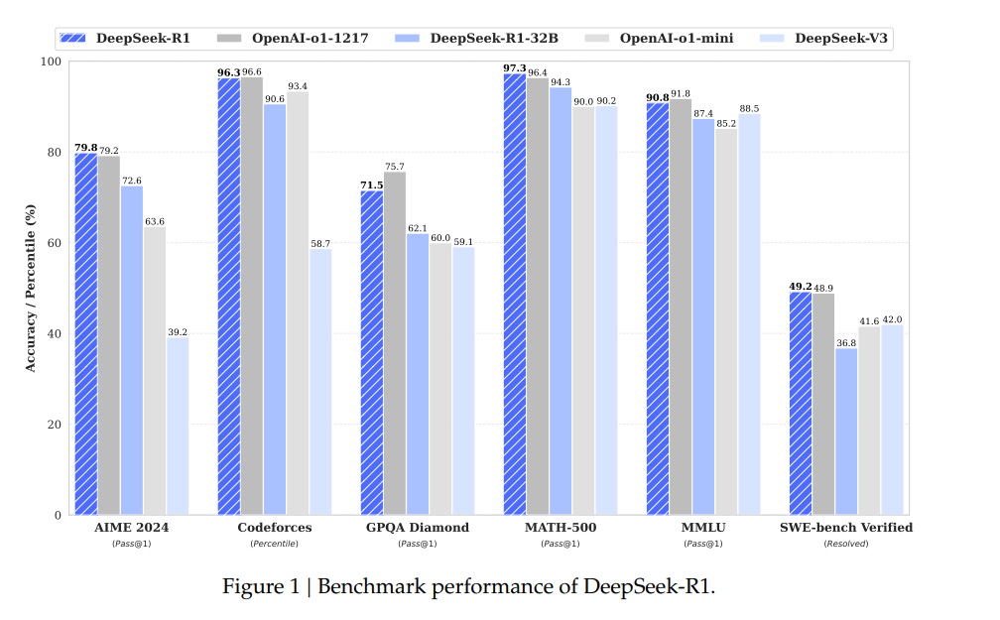

# DeepSeek-R1: Incentivizing Reasoning Capability in LLMs via Reinforcement Learning

## Abstract
우리는 1세대 추론 모델인 DeepSeek-R1-Zero와 DeepSeek-R1을 소개합니다.
DeepSeek-R1-Zero는 대규모 강화 학습(RL)을 통해 훈련된 모델로, 감독된 미세 조정(SFT)을 사전 단계로 거치지 않고도 뛰어난 추론 능력을 보여줍니다.
RL 과정을 통해 DeepSeek-R1-Zero는 강력하고 흥미로운 다양한 추론 행동을 자연스럽게 나타냅니다.
그러나 이 모델은 가독성이 떨어지거나 언어 혼합 문제가 발생하는 한계를 겪습니다.
이러한 문제를 해결하고 추론 성능을 더욱 향상시키기 위해 우리는 다단계 훈련 및 RL 이전에 **콜드 스타트 데이터**를 활용한 DeepSeek-R1을 도입했습니다.
DeepSeek-R1은 추론 작업에서 OpenAI-o1-1217과 유사한 성능을 달성했습니다.
연구 커뮤니티를 지원하기 위해 DeepSeek-R1-Zero, DeepSeek-R1, 그리고 DeepSeek-R1에서 Qwen 및 Llama를 기반으로 추출된 6개의 밀집 모델(1.5B, 7B, 8B, 14B, 32B, 70B)을 오픈소스화합니다.

## Introduction

최근 몇 년간, 대규모 언어 모델(LLMs)은 빠르게 반복적 발전을 거듭하며 인공지능 일반화(Artificial General Intelligence, AGI)와의 간극을 점점 좁히고 있다(Anthropic, 2024; Google, 2024; OpenAI, 2024a).  
최근에는 **후속 훈련(post-training)**이 전체 훈련 파이프라인에서 중요한 구성 요소로 부상했다. 이는 추론 태스크에서의 정확도를 높이고, 사회적 가치에 부합하며, 사용자 선호도에 적응할 수 있는 것으로 나타났으며, 사전 훈련(pre-training)에 비해 상대적으로 적은 계산 자원을 요구한다.  

추론 능력의 맥락에서 OpenAI의 **o1 시리즈 모델**(OpenAI, 2024b)은 체인-오브-생각(Chain-of-Thought) 추론 과정을 확장하여 추론 시간 동안 성능을 스케일링하는 접근 방식을 최초로 도입했다. 이 접근법은 수학, 코딩, 과학적 추론과 같은 다양한 추론 태스크에서 상당한 개선을 이뤘다. 그러나 **테스트 시간 스케일링(test-time scaling)** 을 효과적으로 구현하는 문제는 여전히 연구 커뮤니티의 미해결 과제로 남아 있다.  

이에 대한 해결책으로 여러 연구들이 다양한 접근법을 탐구했다. 예를 들어, **과정 기반 보상 모델(process-based reward models)**(Lightman et al., 2023; Uesato et al., 2022; Wang et al., 2023), **강화 학습**(Kumar et al., 2024), 그리고 몬테카를로 트리 검색(Monte Carlo Tree Search) 및 빔 검색(Beam Search)(Feng et al., 2024; Trinh et al., 2024; Xin et al., 2024) 등이 있다. 그러나 이러한 방법들은 OpenAI의 o1 시리즈 모델과 비교할 만한 일반적인 추론 성능을 달성하지 못했다.  

이 논문에서는 순수 강화 학습(RL)을 사용해 언어 모델의 추론 능력을 향상시키는 첫 번째 시도를 수행한다. 목표는 LLM이 지도(supervised) 데이터 없이 순수 RL 과정을 통해 스스로 진화하여 추론 능력을 개발할 가능성을 탐구하는 것이다. 이를 위해 **DeepSeek-V3-Base**를 기본 모델로 사용하고, **GRPO**(Shao et al., 2024)를 RL 프레임워크로 채택하여 추론 성능을 향상시키고자 한다.  

훈련 과정에서, **DeepSeek-R1-Zero**는 수많은 강력하고 흥미로운 추론 행동을 자연스럽게 발현했다. 수천 단계의 RL 훈련 이후, DeepSeek-R1-Zero는 추론 벤치마크에서 놀라운 성능을 보여주었다. 예를 들어, **AIME 2024**에서 Pass@1 점수가 15.6%에서 71.0%로 상승했으며, 다수결 투표 방식을 적용하면 점수가 86.7%로 더욱 향상되어 **OpenAI-o1-0912**와 동등한 성능을 기록했다.  

그러나 DeepSeek-R1-Zero는 **가독성 저하** 및 **언어 혼합**과 같은 문제에 직면했다. 이를 해결하고 추론 성능을 더욱 향상시키기 위해 **DeepSeek-R1**을 도입했다. DeepSeek-R1은 소량의 초기 데이터(cold-start data)와 다단계 훈련 파이프라인을 결합하여 개발되었다.  

구체적으로, 수천 개의 초기 데이터를 수집하여 DeepSeek-V3-Base 모델을 미세 조정한 뒤, DeepSeek-R1-Zero와 유사한 방식으로 추론 중심의 RL을 수행했다. RL 과정에서 수렴에 가까워질 때, RL 체크포인트에서 거절 샘플링(rejection sampling)을 통해 새로운 지도 데이터(SFT data)를 생성했다. 이 데이터를 작성, 사실 기반 QA, 자기 인식과 같은 도메인의 DeepSeek-V3 지도 데이터와 결합하여 DeepSeek-V3-Base 모델을 재훈련했다. 그런 다음, 추가 RL 과정을 거쳐 모든 시나리오에서 프롬프트를 고려한 체크포인트를 완성했다. 이를 통해 **DeepSeek-R1**이 개발되었으며, 이 모델은 **OpenAI-o1-1217**과 동등한 성능을 달성했다.  

우리는 DeepSeek-R1을 더 작은 밀집 모델(dense model)로 증류(distillation)하는 것도 탐구했다. **Qwen2.5-32B**(Qwen, 2024b)를 기본 모델로 사용해 DeepSeek-R1로부터 직접 증류한 결과, RL을 적용한 경우보다 더 나은 성능을 보였다. 이는 더 큰 기본 모델에서 발견된 추론 패턴이 추론 능력을 개선하는 데 중요함을 시사한다.  

우리는 증류된 **Qwen** 및 **Llama**(Dubey et al., 2024) 시리즈를 오픈소스화했다. 특히, 증류된 14B 모델은 최첨단 오픈소스 **QwQ-32B-Preview**(Qwen, 2024a)를 큰 폭으로 능가했으며, 증류된 32B 및 70B 모델은 밀집 모델 중에서 추론 벤치마크의 새로운 기록을 세웠다.

## Contributions

**후속 훈련(Post-Training): 기반 모델(Base Model)에서의 대규모 강화 학습**  
- 우리는 감독 학습 기반 미세 조정(Supervised Fine-Tuning, SFT)을 초기 단계로 사용하는 대신, 강화 학습(RL)을 기반 모델에 직접 적용했습니다. 이 접근법은 복잡한 문제를 해결하기 위해 연쇄적 사고(Chain-of-Thought, CoT)를 탐구할 수 있도록 모델을 학습시키며, 이를 통해 **DeepSeek-R1-Zero**를 개발하게 되었습니다.  
DeepSeek-R1-Zero는 자기 검증(self-verification), 반성(reflection), 긴 CoT를 생성하는 능력을 보여주며, 연구 커뮤니티에서 중요한 이정표를 세웠습니다. 특히, SFT 없이 순수히 RL을 통해 LLM의 추론 능력을 강화할 수 있음을 검증한 최초의 공개 연구입니다. 이 혁신은 해당 분야의 향후 발전 가능성을 열어줍니다.  
- 우리는 **DeepSeek-R1** 개발을 위한 파이프라인을 소개합니다. 이 파이프라인은 개선된 추론 패턴을 발견하고 인간의 선호와 정렬시키기 위한 두 가지 RL 단계를 포함하며, 추론 및 비추론 능력의 씨앗 역할을 하는 두 가지 SFT 단계도 포함하고 있습니다. 이 파이프라인은 더 나은 모델을 만드는 데 있어 산업계에 기여할 것이라 믿습니다.  

**지식 전달(Distillation): 작은 모델도 강력할 수 있다**  
- 우리는 대규모 모델의 추론 패턴을 더 작은 모델로 전달(distill)함으로써, 작은 모델에서 RL로 발견된 추론 패턴보다 더 나은 성능을 달성할 수 있음을 입증했습니다. 공개된 **DeepSeek-R1**과 그 API는 향후 연구 커뮤니티가 더 나은 소형 모델을 증류하는 데 기여할 것입니다.  
- DeepSeek-R1이 생성한 추론 데이터를 사용하여, 연구 커뮤니티에서 널리 사용되는 여러 밀집(dense) 모델을 미세 조정했습니다. 평가 결과에 따르면, 증류된 소형 밀집 모델들이 벤치마크에서 탁월한 성능을 보여줍니다.  
예를 들어, **DeepSeek-R1-Distill-Qwen-7B**는 AIME 2024에서 55.5%를 달성하며 **QwQ-32B-Preview**를 능가했고, **DeepSeek-R1-Distill-Qwen-32B**는 AIME 2024에서 72.6%, MATH-500에서 94.3%, LiveCodeBench에서 57.2%를 기록했습니다. 이러한 결과는 이전 공개 모델들을 크게 능가하며, **o1-mini**와 유사한 수준의 성능을 보여줍니다. 우리는 Qwen2.5와 Llama3 시리즈를 기반으로 한 1.5B, 7B, 8B, 14B, 32B, 70B의 증류 체크포인트를 커뮤니티에 공개합니다.  

### 1.2. 평가 결과 요약(Summary of Evaluation Results)  

**추론 작업(Reasoning tasks):**  
1. DeepSeek-R1은 AIME 2024에서 **Pass@1 79.8%**를 달성하며 OpenAI-o1-1217을 약간 능가했습니다. MATH-500에서는 **97.3%**라는 인상적인 점수를 기록했으며, 이는 OpenAI-o1-1217과 동등한 성능을 보이며 다른 모델들을 크게 앞섰습니다.  
2. 코딩 관련 작업에서 DeepSeek-R1은 코드 경쟁(Codeforces)에서 **2,029 Elo**의 점수를 기록하며, 경쟁 참가자의 96.3%를 능가하는 전문 수준의 코딩 능력을 보여줬습니다. 엔지니어링 관련 작업에서는, DeepSeek-R1이 DeepSeek-V3보다 약간 우수한 성능을 보여 실제 개발자 작업에 도움을 줄 수 있습니다.  

**지식(Knowledge):**  
- MMLU, MMLU-Pro, GPQA Diamond 등의 벤치마크에서 DeepSeek-R1은 MMLU **90.8%**, MMLU-Pro **84.0%**, GPQA Diamond **71.5%**를 기록하며, DeepSeek-V3를 크게 능가했습니다. 이러한 벤치마크에서는 OpenAI-o1-1217보다 약간 낮은 성능을 보였지만, 다른 비공개 모델을 능가하며 교육 작업에서 경쟁력을 입증했습니다.  
- 사실 기반 질의 벤치마크인 SimpleQA에서, DeepSeek-R1은 DeepSeek-V3를 능가하며 사실 기반 쿼리를 처리하는 능력을 보여줬습니다. 이 벤치마크에서도 OpenAI-o1이 DeepSeek-R1을 약간 앞서는 유사한 경향이 관찰되었습니다.  

### 기타(Others):  
DeepSeek-R1은 창의적인 글쓰기, 일반 질의 응답, 편집, 요약 등 다양한 작업에서도 뛰어난 성능을 발휘합니다. **AlpacaEval 2.0**에서 길이 조절 승률(length-controlled win-rate) **87.6%**를 기록했으며, **ArenaHard**에서는 **92.3%**의 승률을 기록하여 시험 중심이 아닌 쿼리를 지능적으로 처리하는 강력한 능력을 입증했습니다. 또한, DeepSeek-R1은 긴 맥락(long-context)을 이해해야 하는 작업에서도 탁월한 성능을 보여주며, 긴 맥락 벤치마크에서 DeepSeek-V3를 크게 능가합니다.  

## Approach

#### 2.1 개요(Overview):  
이전 연구들은 모델 성능을 향상시키기 위해 대량의 지도 학습 데이터(supervised data)에 크게 의존해 왔습니다. 이번 연구에서는, **지도 학습 기반 미세 조정(Supervised Fine-Tuning, SFT)** 없이도 대규모 강화 학습(RL)을 통해 추론 능력을 크게 향상시킬 수 있음을 입증했습니다. 또한, 소량의 초기 데이터(cold-start data)를 포함하면 성능이 더 향상될 수 있음을 보였습니다. 이후 섹션에서 다음을 소개합니다:  
1) **DeepSeek-R1-Zero**: SFT 데이터를 전혀 사용하지 않고 기반 모델에 직접 RL을 적용한 모델.  
2) **DeepSeek-R1**: 수천 개의 긴 연쇄적 사고(Chain-of-Thought, CoT) 예제로 미세 조정된 체크포인트에서 RL을 시작한 모델.  
3) DeepSeek-R1에서 작은 밀집(dense) 모델로 추론 능력을 증류(distill)하는 과정.  

---

#### 2.2 DeepSeek-R1-Zero: 기반 모델(Base Model)에서의 강화 학습(Reinforcement Learning)  
강화 학습은 우리의 이전 연구(Shao et al., 2024; Wang et al., 2023)에서도 입증되었듯, 추론 작업에서 상당한 효과를 보여주었습니다. 그러나 이 연구들은 지도 학습 데이터에 크게 의존했으며, 이는 데이터 수집에 많은 시간이 소요됩니다. 본 섹션에서는, 지도 학습 데이터를 사용하지 않고 순수한 강화 학습 과정을 통해 LLM의 자기 진화를 탐구하며 추론 능력을 개발하는 가능성을 연구합니다.  
강화 학습 알고리즘에 대한 간략한 개요를 시작으로, 흥미로운 결과들을 제시하며 커뮤니티에 귀중한 통찰력을 제공하기를 바랍니다.  

---

#### 2.2.1 강화 학습 알고리즘(Reinforcement Learning Algorithm):  
**그룹 상대적 정책 최적화(Group Relative Policy Optimization, GRPO)**  
RL의 훈련 비용을 절감하기 위해, 우리는 GRPO(Shao et al., 2024)를 채택했습니다. GRPO는 일반적으로 정책 모델과 동일한 크기인 비평 모델(critic model)을 생략하고, 그룹 점수에서 기준선을 추정합니다.  
구체적으로, 각 질문 **𝑞**에 대해 GRPO는 이전 정책 **𝜋𝜃𝑜𝑙𝑑**에서 출력 그룹 **{𝑜1, 𝑜2, · · · , 𝑜𝐺}**을 샘플링한 후, 다음 목표를 최대화하여 정책 모델 $𝜋_𝜃$를 최적화합니다:  

https://huggingface.co/docs/trl/main/en/grpo_trainer (GRPO 자세한 설명)

#### GRPO의 목적함수:
$$
\mathcal{J}_{\text{GRPO}}(\theta) = \mathbb{E}\left[q \sim P(Q), \{o_i\}_{i=1}^G \sim \pi_{\theta_{\text{old}}}(O|q)\right] $$

$$

(1)\frac{1}{G} \sum_{i=1}^G \left( \min \left( \frac{\pi_\theta(o_i|q)}{\pi_{\theta_{\text{old}}}(o_i|q)} A_i, \text{clip} \left( \frac{\pi_\theta(o_i|q)}{\pi_{\theta_{\text{old}}}(o_i|q)}, 1-\epsilon, 1+\epsilon \right) A_i \right) - \beta D_{\text{KL}} (\pi_\theta || \pi_{\text{ref}}) \right) ,
$$

#### KL 발산 항:
수식을 다음과 같이 수정하면 동일한 표현이 됩니다:

$$
(2) D_{KL} (\pi_\theta || \pi_{ref}) = \frac{\pi_{ref}(o_i|q)}{\pi_\theta(o_i|q)} - \log \frac{\pi_{ref}(o_i|q)}{\pi_\theta(o_i|q)} - 1 ,
$$

여기서 ε과 β는 하이퍼파라미터이며, $A_i$는 이점(advantage)을 나타내는데, 이는 각 그룹 내의 출력들에 대응하는 보상들의 그룹 {r1, r2, ..., rG}을 사용하여 계산됩니다.
#### 어드밴티지 (Advantage):
$$
(3) A_i = \frac{r_i - \text{mean}(\{r_1, r_2, \cdots, r_G\})}{\text{std}(\{r_1, r_2, \cdots, r_G\})},
$$

---

## GRPO의 핵심 구성 요소 설명

### 1. 목적 함수: $\mathcal{J}_{\text{GRPO}}(\theta)$

이 함수는 GRPO(Group Relative Policy Optimization) 알고리즘의 핵심 목표입니다. 주어진 질문 $q$에 대해, 이전 정책 $\pi_{\theta_{old}}$로부터 그룹 $G$개의 출력을 샘플링합니다.

### 목적 함수의 작동 방식

GRPO는 주어진 질문에 대해 다음과 같이 작동합니다:

1. 이전 정책 $\pi_{\theta_{old}}$에서 $G$개의 답변을 생성합니다
2. 각 답변의 품질을 평가하여 보상을 계산합니다
3. 새로운 정책 $\pi_\theta$가 더 나은 답변을 생성하도록 최적화합니다

### 정책 최적화의 세 가지 핵심 요소

**1. 어드밴티지 계산**
- 각 답변의 상대적 품질을 평가합니다
- 그룹 내 다른 답변들과 비교하여 정규화된 점수를 계산합니다
- 평균과 표준편차를 사용하여 상대적 성능을 측정합니다

**2. 클리핑 메커니즘**
- 정책이 한 번에 너무 크게 변하는 것을 방지합니다
- $\epsilon$ 파라미터로 변화 범위를 제한합니다
- 안정적인 학습을 가능하게 합니다

**3. KL 발산 제어**
- 새로운 정책이 참조 정책에서 너무 멀어지지 않도록 합니다
- $\beta$ 파라미터로 변화 정도를 조절합니다
- 학습의 안정성을 유지합니다

## 실용적 장점

1. **메모리 효율성**: 별도의 가치 함수 모델이 필요 없어 메모리 사용량이 감소합니다
2. **계산 효율성**: 그룹 단위로 보상을 평가하여 계산 비용을 줄입니다
3. **안정적인 학습**: 클리핑과 KL 발산 제어로 안정적인 학습이 가능합니다

GRPO는 기존의 RL 알고리즘 대비 비용을 줄이면서도 효율적인 업데이트를 가능하게 하는 접근 방식입니다. Critic 모델 없이 그룹의 상대적 점수로 baseline을 계산하는 것이 핵심적인 특징입니다.

표 1 | DeepSeek-R1-Zero를 위한 템플릿.   
사용자와 어시스턴트 간의 대화입니다. 사용자가 질문을 하면 어시스턴트가 이를 해결합니다. 
어시스턴트는 먼저 마음속으로 추론 과정을 생각한 다음 사용자에게 답변을 제공합니다. 
추론 과정과 답변은 각각 <think> </think>와 <answer>

## 2.2.2. 보상 모델링  
보상은 강화 학습(RL)의 최적화 방향을 결정하는 훈련 신호의 원천이다.  
DeepSeek-R1-Zero를 훈련시키기 위해, 우리는 주로 두 가지 유형의 보상으로 구성된 규칙 기반 보상 시스템을 채택한다:  
- **정확도 보상(Accuracy rewards):** 정확도 보상 모델은 응답이 올바른지 평가한다. 예를 들어, 결정적인 결과를 가진 수학 문제의 경우, 모델은 특정 형식(예: 상자 안에 답을 작성)으로 최종 답을 제공해야 하며, 이를 통해 신뢰할 수 있는 규칙 기반의 정확성 검증이 가능하다. 마찬가지로, LeetCode 문제의 경우, 컴파일러를 사용하여 사전에 정의된 테스트 케이스를 기반으로 피드백을 생성할 수 있다.  
- **형식 보상(Format rewards):** 정확도 보상 모델 외에도, 모델이 사고 과정을 '<think>' 및 '</think>' 태그 사이에 넣도록 강제하는 형식 보상 모델을 사용한다.  

우리는 DeepSeek-R1-Zero 개발에서 결과 또는 프로세스 신경 보상 모델(neural reward model)을 적용하지 않는다. 이는 대규모 강화 학습 과정에서 신경 보상 모델이 보상 해킹(reward hacking)에 취약할 수 있으며, 보상 모델을 재훈련하려면 추가적인 훈련 자원이 필요하고 전체 훈련 파이프라인이 복잡해지기 때문이다.  

## 2.2.3. 훈련 템플릿  
DeepSeek-R1-Zero를 훈련시키기 위해, 우리는 기본 모델이 지정된 지침을 따르도록 유도하는 간단한 템플릿을 설계하는 것으로 시작한다. Table 1에 나타난 것처럼, 이 템플릿은 DeepSeek-R1-Zero가 먼저 추론 과정을 생성한 후 최종 답변을 제공하도록 요구한다.  
우리는 의도적으로 이러한 구조적 형식에 대한 제약만 두고, 반사적 추론(reflective reasoning)을 요구하거나 특정 문제 해결 전략을 장려하는 등 내용별 편향(content-specific biases)을 피함으로써 RL 과정에서 모델의 자연스러운 진행 과정을 정확히 관찰할 수 있도록 한다.  

## 2.2.4. DeepSeek-R1-Zero의 성능, 자기 진화 과정 및 '아하 모먼트'  
**DeepSeek-R1-Zero의 성능**  
Figure 2는 RL 훈련 과정 전반에 걸친 AIME 2024 벤치마크에서 DeepSeek-R1-Zero의 성능 궤적을 보여준다. 그림에서 알 수 있듯이, DeepSeek-R1-Zero는 RL 훈련이 진행됨에 따라 성능이 꾸준하고 일관되게 향상되는 모습을 보여준다. 특히 AIME 2024에서 평균 pass@1 점수가 초기 15.6%에서 놀랍게도 71.0%로 크게 상승하며 OpenAI-o1-0912와 비슷한 성능 수준에 도달했다. 이러한 상당한 개선은 RL 알고리즘이 시간이 지남에 따라 모델 성능을 최적화하는 데 효과적임을 강조한다.  

Table 2는 다양한 추론 관련 벤치마크에서 DeepSeek-R1-Zero와 OpenAI의 o1-0912 모델 간의 비교 분석을 제공한다. 연구 결과는 RL이 모델 성능을 강화한다는 점을 보여준다.

DeepSeek-R1-Zero는 지도 학습 기반의 미세 조정(Supervised Fine-Tuning, SFT) 데이터 없이 순수 강화 학습(Reinforcement Learning, RL)만으로 강력한 추론 능력을 획득한 점에서 주목할 만한 성과를 보여줍니다. 이는 RL을 통해 모델이 효과적으로 학습하고 일반화할 수 있음을 입증합니다. 또한, 다수결 투표(majority voting)를 적용하면 DeepSeek-R1-Zero의 성능이 더욱 향상됩니다. 예를 들어, AIME 벤치마크에서 다수결 투표를 활용하면 성능이 71.0%에서 86.7%로 상승하며, OpenAI-o1-0912의 성능을 초과합니다. 이러한 결과는 다수결 투표 유무에 관계없이 DeepSeek-R1-Zero가 높은 경쟁력을 갖춘 모델임을 보여줍니다.

**DeepSeek-R1-Zero의 자기 진화 과정(Self-evolution Process)** 은 RL이 모델의 추론 능력을 자율적으로 향상시키는 과정을 잘 보여줍니다. 기본 모델에서 RL을 직접 시작함으로써, 지도 학습 단계의 영향을 받지 않고 모델의 발전 과정을 면밀히 관찰할 수 있습니다. 이 접근법은 특히 복잡한 추론 작업을 처리하는 모델의 진화 과정을 명확히 보여줍니다. RL 훈련 동안 DeepSeek-R1-Zero는 점진적으로 더 긴 사고 체인을 생성하며 복잡한 문제를 해결하는 능력을 향상시켰고, "아하 모먼트(Aha Moment)"로 알려진 특정 시점에서는 문제 해결에 더 많은 사고 시간을 할당하며 초기 접근 방식을 재평가하는 메타인지적 행동을 보였습니다.

  
**Figure 3 |** RL 과정 동안 DeepSeek-R1-Zero의 훈련 세트에서 평균 응답 길이. DeepSeek-R1-Zero는 더 많은 사고 시간을 통해 추론 작업을 해결하는 방법을 자연스럽게 학습합니다.  

Figure 3에 나타난 바와 같이, DeepSeek-R1-Zero의 사고 시간(thinking time)은 훈련 과정 전반에 걸쳐 지속적으로 개선되고 있습니다. 이러한 개선은 외부적인 조정의 결과가 아니라 모델 내부에서 자연스럽게 발생한 내재적 발달의 결과입니다. DeepSeek-R1-Zero는 테스트 시간 동안 계산을 확장함으로써 점점 더 복잡한 추론 작업을 해결하는 능력을 자연스럽게 습득합니다. 이 계산은 수백 개에서 수천 개의 추론 토큰을 생성하는 범위에 이르며, 이를 통해 모델은 사고 과정을 더 깊이 탐구하고 정제할 수 있습니다.

이 자기 진화 과정에서 가장 주목할 만한 측면 중 하나는 테스트 시간 계산이 증가함에 따라 정교한 행동들이 자발적으로 나타난다는 점입니다. 예를 들어, 모델이 이전 단계로 돌아가 이를 재평가하는 **반성(reflection)** 이나 문제 해결을 위한 대안적 접근 방식을 탐구하는 행동 등이 자발적으로 발생합니다. 이러한 행동들은 명시적으로 프로그래밍된 것이 아니라, 강화 학습 환경과의 상호작용 결과로 자연스럽게 나타난 것입니다. 이러한 자발적인 발전은 DeepSeek-R1-Zero의 추론 능력을 크게 향상시켜, 더 어려운 작업을 더욱 효율적이고 정확하게 처리할 수 있게 합니다.

**DeepSeek-R1-Zero의 '아하 모먼트(Aha Moment)'**  
DeepSeek-R1-Zero의 훈련 과정에서 관찰된 특히 흥미로운 현상 중 하나는 "아하 모먼트"의 발생입니다. Table 3에 나타난 바와 같이, 이 순간은 모델의 중간 버전에서 발생합니다. 이 단계에서 DeepSeek-R1-Zero는 초기 접근 방식을 재평가함으로써 문제에 더 많은 사고 시간을 할당하는 방법을 학습합니다. 이러한 행동은 모델의 점진적인 추론 능력 향상을 입증할 뿐만 아니라, 강화 학습이 예상치 못한 정교한 결과를 이끌어낼 수 있다는 매혹적인 사례를 보여줍니다.

이 "아하 모먼트"는 단순히 모델에게만 해당되는 것이 아니라, 그 행동을 관찰하는 연구자들에게도 중요한 순간입니다. 이는 강화 학습의 힘과 아름다움을 강조합니다. 모델에게 문제를 해결하는 방법을 명시적으로 가르치는 대신, 단순히 올바른 인센티브를 제공함으로써 모델이 자율적으로 고급 문제 해결 전략을 개발하도록 하는 것입니다. "아하 모먼트"는 강화 학습이 인공지능 시스템에서 새로운 수준의 지능을 열어줄 잠재력을 가지고 있음을 강력히 상기시키며, 미래에는 더욱 자율적이고 적응적인 모델 개발로 나아가는 길을 열어줍니다.

### 수식을 마크다운으로 변환

**질문:** $ a > 1 $일 때, 방정식 $ \sqrt{a - \sqrt{a + x}} = x $의 실수 해들의 합은 얼마인가?

**답변:** <think>

<think>
To solve the equation \( \sqrt{a - \sqrt{a + x}} = x \), let’s start by squaring both sides:

$$
\left(\sqrt{a - \sqrt{a + x}}\right)^2 = x^2 \implies a - \sqrt{a + x} = x^2.
$$

Rearrange to isolate the inner square root term:

$$
\sqrt{a + x} = a - x^2.
$$

Square both sides again:

$$
a + x = (a - x^2)^2.
$$

Expand and simplify:

$$
a + x = a^2 - 2ax^2 + x^4.
$$

Rearrange to form a polynomial:

$$
x^4 - 2ax^2 - x + (a^2 - a) = 0.
$$

Wait, wait. Wait. That’s an aha moment I can flag here.

Let’s reevaluate this step-by-step to identify if the correct sum can be...
We started with the equation:

$$
\sqrt{a - \sqrt{a + x}} = x.
$$

First, let’s square both sides:

$$
a - \sqrt{a + x} = x^2.
$$

Next, I could square both sides again, treating the equation:
...
</think>

**Table 3 | DeepSeek-R1-Zero의 중간 버전에서 관찰된 흥미로운 "아하 모먼트".**  
모델은 인간화된 톤으로 다시 생각하는 방법을 학습합니다. 이는 강화 학습의 힘과 아름다움을 목격할 수 있게 해주는 연구자들에게도 "아하 모먼트"로 작용합니다.

### **DeepSeek-R1-Zero의 단점**  
DeepSeek-R1-Zero는 강력한 추론 능력을 보여주고 예상치 못한 강력한 추론 행동을 자율적으로 개발하지만, 몇 가지 문제에 직면합니다. 예를 들어, DeepSeek-R1-Zero는 가독성이 떨어지거나 언어 혼합(language mixing)과 같은 문제를 겪습니다. 추론 과정을 더 읽기 쉽고 오픈 커뮤니티와 공유 가능하게 만들기 위해, 우리는 인간 친화적인 콜드 스타트(cold-start) 데이터를 활용한 RL 방법인 DeepSeek-R1을 탐구합니다.

---

### **2.3. DeepSeek-R1: 콜드 스타트를 활용한 강화 학습**  
DeepSeek-R1-Zero의 유망한 결과에서 영감을 받아 두 가지 자연스러운 질문이 제기됩니다:  
1) 소량의 고품질 데이터를 콜드 스타트로 통합하여 추론 성능을 더욱 향상시키거나 수렴 속도를 가속화할 수 있는가?  
2) 명확하고 일관된 사고 사슬(Chain of Thought, CoT)을 생성할 뿐만 아니라 강력한 일반적 능력을 보여주는 사용자 친화적인 모델을 어떻게 훈련할 수 있는가?  

이 질문에 답하기 위해, 우리는 DeepSeek-R1을 훈련하기 위한 파이프라인을 설계했습니다. 이 파이프라인은 다음 네 가지 단계로 구성됩니다.

---

### **2.3.1. 콜드 스타트**  
DeepSeek-R1-Zero와 달리, RL 훈련 초기의 불안정한 콜드 스타트 단계를 방지하기 위해, DeepSeek-R1에서는 모델을 초기 RL actor로 미세 조정하기 위해 소량의 긴 CoT 데이터를 구축하고 수집합니다. 이러한 데이터를 수집하기 위해 다음과 같은 여러 접근 방식을 탐구했습니다:  
- 긴 CoT를 예로 사용하여 few-shot 프롬프트를 활용하는 방법  
- 모델에게 반성과 검증(reflection and verification)을 포함한 자세한 답변을 생성하도록 직접 프롬프트를 제공하는 방법  
- 읽기 쉬운 형식으로 DeepSeek-R1-Zero 출력을 수집하는 방법  
- 인간 주석자(human annotators)가 후처리를 통해 결과를 정제하는 방법  

이 연구에서는 RL 시작점으로 DeepSeek-V3-Base를 미세 조정하기 위해 수천 개의 콜드 스타트 데이터를 수집했습니다. DeepSeek-R1-Zero와 비교했을 때, 콜드 스타트 데이터의 장점은 다음과 같습니다:

- **가독성(Readability):**  
  DeepSeek-R1-Zero의 주요 한계 중 하나는 콘텐츠가 읽기에 적합하지 않은 경우가 많다는 점입니다. 응답이 여러 언어를 혼합하거나, 사용자에게 답변을 강조하기 위한 마크다운 형식을 포함하지 않을 수 있습니다. 반면, DeepSeek-R1의 콜드 스타트 데이터를 생성할 때는 각 응답의 끝에 요약을 포함하고, 읽기 쉽지 않은 응답을 필터링하는 가독성 높은 패턴을 설계했습니다. 여기서 출력 형식은 다음과 같이 정의됩니다:  
  $|specialtoken|<reasoningprocess>|special_token|
$,  
  여기서 *reasoning_process*는 쿼리에 대한 사고 사슬(CoT)을 나타내며, *summary*는 추론 결과를 요약하는 데 사용됩니다.

- **잠재력(Potential):**  
  인간의 선험적 지식(human priors)을 활용하여 콜드 스타트 데이터를 신중하게 설계함으로써 DeepSeek-R1-Zero보다 더 나은 성능을 관찰할 수 있었습니다. 우리는 반복적인 훈련(iterative training)이 추론 모델에 더 나은 접근 방식이라고 믿습니다.

---

### **2.3.2. 추론 중심 강화 학습(Reasoning-oriented Reinforcement Learning)**  
DeepSeek-V3-Base를 콜드 스타트 데이터로 미세 조정한 후, DeepSeek-R1-Zero에서 사용한 것과 동일한 대규모 강화 학습 훈련 과정을 적용합니다. 이 단계는 특히 코딩, 수학, 과학, 논리 추론과 같은 추론 집약적인 작업에서 모델의 추론 능력을 향상시키는 데 중점을 둡니다. 이러한 작업은 명확한 해결책이 있는 잘 정의된 문제를 포함합니다.

훈련 과정에서 RL 프롬프트가 여러 언어를 포함할 때 CoT가 언어 혼합(language mixing)을 자주 나타내는 것을 관찰했습니다. 이러한 언어 혼합 문제를 완화하기 위해 RL 훈련 중 언어 일관성 보상(language consistency reward)을 도입했습니다. 이 보상은 CoT에서 목표 언어 단어의 비율로 계산됩니다. 비록 제거 실험(ablation experiments)에서 이러한 정렬이 모델 성능에 약간의 저하를 초래한다는 결과가 나왔지만, 이 보상은 인간의 선호와 일치하여 더 읽기 쉽게 만듭니다. 마지막으로, 추론 작업의 정확도와 언어 일관성 보상을 직접 합산하여 최종 보상을 형성합니다. 그런 다음 모델이 추론 작업에서 수렴할 때까지 미세 조정된 모델에 RL 훈련을 적용합니다.

---

### **2.3.3. 거절 샘플링(Rejection Sampling) 및 지도 학습(Supervised Fine-Tuning)**  
추론 중심 RL이 수렴하면, 결과 체크포인트를 활용하여 다음 라운드를 위한 지도 학습(SFT) 데이터를 수집합니다. 초기 콜드 스타트 데이터와 달리, 이 단계에서는 주로 추론에 중점을 두는 것 외에도 작문, 역할 연기(role-playing), 기타 범용 작업에서 모델의 역량을 강화하기 위해 다른 도메인의 데이터를 통합합니다. 구체적으로 데이터 생성 및 모델 미세 조정은 아래와 같이 진행됩니다.

- **추론 데이터(Reasoning data):**  
  우리는 추론 프롬프트를 큐레이션하고 위 RL 훈련 체크포인트에서 거절 샘플링(rejection sampling)을 수행하여 추론 경로(reasoning trajectories)를 생성합니다. 이전 단계에서는 규칙 기반 보상을 사용하여 평가할 수 있는 데이터만 포함했지만, 이 단계에서는 추가 데이터를 통합하여 데이터셋을 확장합니다. 여기에는 DeepSeek-V3에 정답과 모델 예측값을 제공하여 판단하는 생성적 보상 모델(generative reward model)을 사용하는 일부 데이터도 포함됩니다.  

  또한, 모델 출력이 때때로 혼란스럽고 읽기 어려운 이유로 인해 혼합 언어, 긴 단락, 코드 블록이 포함된 사고 사슬은 필터링했습니다. 각 프롬프트에 대해 여러 응답을 샘플링하고 올바른 응답만 유지했습니다. 총 약 60만 개의 추론 관련 학습 샘플을 수집했습니다.

**비추론 데이터**

글쓰기, 사실 기반 QA, 자기 인식(self-cognition), 번역과 같은 비추론 데이터를 처리하기 위해 DeepSeek-V3 파이프라인을 채택하고, DeepSeek-V3의 SFT(Supervised Fine-Tuning) 데이터셋 일부를 재사용합니다. 특정 비추론 작업의 경우, 질문에 답하기 전에 DeepSeek-V3를 호출하여 잠재적인 연쇄적 사고(Chain-of-Thought, CoT)를 생성하도록 프롬프트합니다. 그러나 "hello"와 같은 간단한 쿼리의 경우에는 CoT를 제공하지 않습니다. 결과적으로, 추론과 관련이 없는 약 20만 개의 학습 샘플을 수집했습니다.

위에서 정제된 약 80만 개 샘플로 DeepSeek-V3-Base를 두 번의 에포크 동안 미세 조정(fine-tuning)했습니다.

---

**모든 시나리오에 대한 강화 학습**

모델을 인간의 선호도에 더 잘 맞추기 위해, 모델의 유용성과 무해성을 개선하는 동시에 추론 능력을 정제하는 것을 목표로 하는 2차 강화 학습 단계를 구현했습니다. 구체적으로:

- 보상 신호(reward signals)와 다양한 프롬프트 분포를 결합하여 모델을 학습시켰습니다.
- 추론 데이터의 경우, 수학, 코드 및 논리적 추론 도메인에서 학습 과정을 안내하기 위해 규칙 기반 보상을 활용하는 DeepSeek-R1-Zero에서 설명된 방법론을 따랐습니다.
- 일반 데이터의 경우, 복잡하고 미묘한 시나리오에서 인간의 선호도를 포착하기 위해 보상 모델을 사용했습니다.

DeepSeek-V3 파이프라인을 기반으로 구축하고 유사한 선호도 쌍(preference pairs) 및 학습 프롬프트 분포를 채택했습니다.

- **유용성(Helpfulness)**: 최종 요약(final summary)에만 초점을 맞춰 평가가 응답의 유용성과 관련성을 강조하도록 했으며, 추론 과정에 간섭을 최소화했습니다.
- **무해성(Harmlessness)**: 모델 응답 전체(추론 과정과 요약 포함)를 평가하여 생성 과정에서 발생할 수 있는 위험, 편향 또는 유해한 콘텐츠를 식별하고 완화했습니다.

보상 신호와 다양한 데이터 분포의 통합은 모델이 추론에서 뛰어난 성능을 발휘하면서도 유용성과 무해성을 우선시하도록 훈련할 수 있게 했습니다.

---

**지식 증류: 소형 모델에 추론 능력 부여**

DeepSeek-R1과 같은 추론 능력을 보다 효율적인 소형 모델에 부여하기 위해:

- DeepSeek-R1 (§2.3.3)로 정제된 80만 개 샘플을 사용하여 Qwen(Qwen, 2024b) 및 Llama(AI@Meta, 2024)와 같은 오픈소스 모델을 직접 미세 조정(fine-tuning)했습니다.
- 기본(base) 모델은 Qwen2.5-Math-1.5B, Qwen2.5-Math-7B, Qwen2.5-Math-14B, Qwen2.5-Math-32B, Llama-3.1-8B 및 Llama-3.3-70B-Instruct입니다.
  - Llama-3.3은 Llama-3.1보다 약간 더 나은 추론 능력을 보여 선택되었습니다.

증류된(distilled) 모델의 경우:

- RL(강화 학습) 단계를 포함하지 않고 SFT만 적용했으며, RL이 성능을 크게 향상시킬 수 있음에도 불구하고 이를 생략했습니다.
- 주요 목표는 증류 기술의 효과를 입증하는 것이며, RL 단계 탐색은 더 넓은 연구 커뮤니티에 맡겼습니다.

---

**실험**

**벤치마크**  
다양한 벤치마크에서 모델을 평가했으며 다음이 포함됩니다:  
MMLU (Hendrycks et al., 2020), MMLU-Redux (Gema et al., 2024), MMLU-Pro (Wang et al., 2024), C-Eval (Huang et al., 2023), CMMLU (Li et al., 2023), IFEval (Zhou et al., 2023), FRAMES (Krishna et al., 2024), GPQA Diamond (Rein et al., 2023), SimpleQA (OpenAI, 2024c), C-SimpleQA (He et al., 2024), SWE-Bench Verified (OpenAI, 2024d), Aider 1, LiveCodeBench (Jain et al., 2024; 기간: 2024년 8월~2025년 1월), Codeforces 2, 중국 고등학교 수학 올림피아드(CNMO 2024) 및 미국 초청 수학 시험(AIME 2024; MAA, 2024).

표준 벤치마크 외에도 LLMs(대규모 언어 모델)를 심판으로 사용하는 개방형 생성 작업에서도 모델을 평가했습니다. 구체적으로 AlpacaEval 2.0(Dubois et al., 2024) 및 Arena-Hard(Li et al., 2024)의 원래 구성에 따라 GPT-4-Turbo-1106을 심판으로 사용하여 쌍(pairwise) 비교를 수행했습니다. 여기서 길이 편향(length bias)을 피하기 위해 최종 요약만 평가에 사용했습니다.

증류된 모델에 대해서는 AIME 2024, MATH-500, GPQA Diamond, Codeforces 및 LiveCodeBench에서 대표적인 결과를 보고했습니다.

**평가 프롬프트**  
DeepSeek-V3 설정을 따르며 다음 기준으로 평가를 진행했습니다:
- MMLU, DROP, GPQA Diamond 및 SimpleQA는 simpleevals 프레임워크의 프롬프트를 사용.
- MMLU-Redux는 Zero-Eval 프롬프트 형식(Lin, 2024)을 제로샷(zero-shot) 설정으로 채택.
- MMLU-Pro, C-Eval 및 CLUE-WSC는 원래 프롬프트가 몇샷(few-shot)이므로 이를 제로샷 설정으로 약간 수정.
   - 몇샷 CoT는 DeepSeek-R1 성능에 부정적인 영향을 미칠 수 있음.
   
다른 데이터셋은 제작자가 제공한 기본 프롬프트와 원래 평가 프로토콜을 따랐습니다.

코드 및 수학 벤치마크의 경우 HumanEval-Mul 데이터셋은 Python, Java, C++, C#, JavaScript, TypeScript, PHP 및 Bash 등 주요 프로그래밍 언어를 다룹니다. LiveCodeBench 성능은 CoT 형식을 사용해 평가했으며 데이터는 2024년 8월부터 2025년 1월 사이에 수집되었습니다. Codeforces 데이터셋은 Div.2 대회 중 총 10개 문제와 전문가가 제작한 테스트 케이스를 사용해 평가했으며 경쟁자의 예상 등급과 비율이 계산되었습니다. SWE-Bench 검증 결과는 agentless 프레임워크(Xia et al., 2024)를 통해 얻었습니다. AIDER 관련 벤치마크는 "diff" 형식을 사용해 측정되었습니다.

DeepSeek-R1 출력은 각 벤치마크당 최대 토큰 길이를 32,768로 제한했습니다.

**베이스라인**  
다음과 같은 강력한 베이스라인과 비교 평가를 수행했습니다:  
DeepSeek-V3, Claude-Sonnet-3.5-1022, GPT-4o-0513, OpenAI-o1-mini 및 OpenAI-o1-1217.  
중국 본토에서는 OpenAI-o1-1217 API 접근이 어려워 공식 보고서를 기반으로 성능을 보고했습니다. 증류된 모델의 경우 QwQ-32B-Preview(Qwen, 2024a)와도 비교했습니다.

**평가 설정**  
모델의 최대 생성 길이를 토큰 기준으로 32,768로 설정했습니다. 긴 출력 추론 모델 평가 시 탐욕적 디코딩(greedy decoding)을 사용하는 것은 반복률 증가와 체크포인트 간 변동성 증가로 이어질 수 있음을 발견했습니다. 따라서 pass@𝑘 평가(Chen et al., 2021)를 기본값으로 설정하고 비제로(non-zero) 온도를 사용하여 pass@1 결과를 보고했습니다.

구체적으로:
- 샘플링 온도: $0.6$
- top-$𝑝$: $0.95$
  
각 질문당 $𝑘$개의 응답(테스트 세트 크기에 따라 보통 $4\sim64$)을 생성하고 pass@1은 아래와 같이 계산됩니다:

$
pass@1 = \frac{1}{𝑘} \sum_{𝑖=1}^{𝑘} p_{𝑖}
$

여기서 $p_{𝑖}$는 $𝑖$-번째 응답의 정확도를 나타냅니다.

AIME 2024에서는 다수결(consensus; majority vote)을 활용해 $$64$$개의 샘플로 결과(cons@64)를 보고했습니다(Wang et al., 2022).
